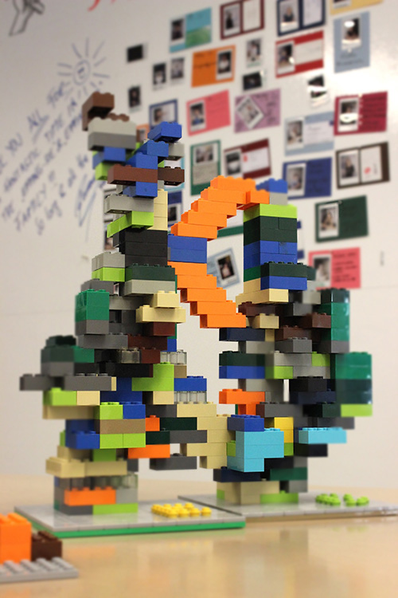

+++
title = "LEGO und Pi-Quadrat-Prozent"
date = "2017-01-20"
description = "Da wir unseren Coworking Space ehrenamtlich als Community betreiben und wir auch Zeit ineinander investieren wollen, haben wir die Idee von π²-% (Pi-Quadrat-Prozent) entwickelt. Jeder Effianer wendet rund 9.869604% seiner Arbeitszeit im Effinger für die Community auf."
image = "lego-mosaik.jpg"
author = "Urs Vögeli"
comments = true
tags = [ "Coworking", "Community" ]
+++

  Da wir unseren Coworking Space ehrenamtlich als Community betreiben und wir auch Zeit ineinander investieren wollen, haben wir die Idee von π²-% (Pi-Quadrat-Prozent) entwickelt. Jeder Effianer wendet rund 9.869604% seiner Arbeitszeit im Effinger für die Community auf.

Damit können wir den Space betreiben und den Gedanken der Gemeinsamständigkeit verwirklichen helfen. Beim Coworken geht es schliesslich darum, nicht nur den Arbeitsort sondern auch die Zeit miteinander zu teilen. Dies ist Ausdruck unserer [Überflussmentalität und Grosszügigkeit](/grundsaetze/grosszuegigkeit/), welche wir im Effinger leben wollen.
Was hat das nun aber auch noch mit LEGO zu tun? Dem aufmerksamen Besucher im Effinger sind vielleicht die seltsamen LEGO-Objekte schon aufgefallen:

LEGO kann helfen, gemeinschaftliches Engagement darzustellen und sichtbar zu machen. Das haben wir hier versucht. Jeder Effianer hat einen LEGO-Stein pro Tag, den er hier arbeitet, erhalten. Die Steine dienen als Symbol und als persönliche Hilfe, sich für den Effinger und die Community die π²-%-Arbeitszeit zu reservieren und zu investieren. Wenn die Zeit von ca. 45 Minuten für einen Stein (berechnet von π²-% einer 42-Stunden-Woche) eingesetzt wurde, soll der Stein auf den Grundplatten frei verbaut werden. In einem Fall als Mosaik und im anderen als Turm. Community-Member durften natürlich auch mit bauen. Es standen beige Steine parat, welche sie verbauen durften, wenn sie in ähnlichem Umfang auch vom Angebot, etwas für die Community beizutragen, Gebrauch gemacht haben. Mit diesen farbenfrohen und kreativen Objekten haben wir somit gemeinsam an unserem Effinger und an unseren Beziehungen gebaut.
