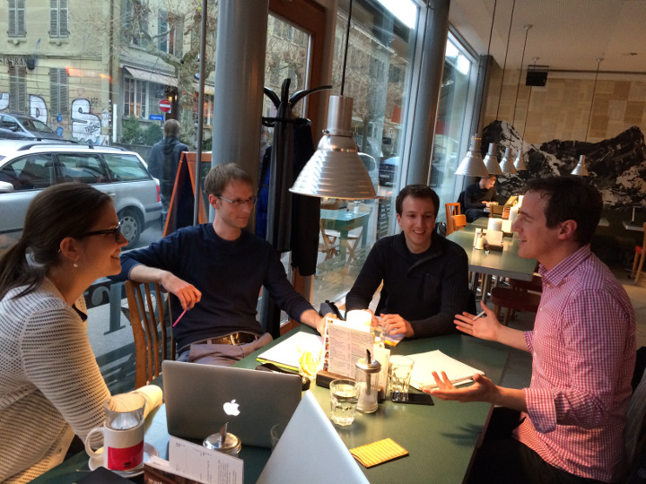

+++
title = "Let's blog"
date = "2014-12-12"
description = "Alte Hasen sind wir noch nicht grad, aber immerhin haben wir nun schon ein paar mal pop-up gecoworked."
image = "wartsaal.jpg"
authors = [ "Domenica Hitz" ]
comments = "popupcoworking"
tags = [ "Coworking" ]
+++

Alte Hasen sind wir noch nicht grad, aber immerhin haben wir nun schon ein paar mal pop-up gecoworked (hm, das ist immer schwierig mit diesen englischen Begriffen). Vier mal haben wir uns jetzt getroffen und zusammen gearbeitet. Während dieser Zeit entstanden Blogeinträge, neue Webseiten wurden kreiert, Ideen geschmiedet, neue Pläne entworfen und viel diskutiert, geträumt und geplant. 

Am letzten Freitag trafen wir uns im [Wartsaal](http://www.wartsaal-kaffee.ch) im Lorrainequartier, wir waren zu fünft und diskutierten unter anderem lange über die Webseite [www.popupcoworking.ch](http://www.popupcoworking.ch). Was ist der Sinn dieser Homepage, wie soll sie gestaltet sein, wen möchten wir damit erreichen? Es waren spannende Fragen und zu einer abschliessenden Antwort sind wir noch nicht gekommen. «under construction» ist wohl der richtige Ausdruck. 

Was sich aber ab sofort ändern soll, ist der Blog. Neu wird ein bis zwei mal pro Woche ein neuer Blogeintrag erscheinen. Ich, Domenica, werde neu das *Oberjuhee* über den Blog haben. Ich freu mich!

Wir möchten unseren Prozess, in dem wir stehen, noch mehr gegen aussen sichtbar machen und so euch, liebe Community, miteinbeziehen. Denn seit dem «How-the-heck» Abend ist schon wieder einiges geschehen. Doch davon habt ihr wahrscheinlich gar nicht viel mitbekommen. Das soll sich nun ändern. Es lohnt sich also regelmässig bei uns vorbei zu schauen.
