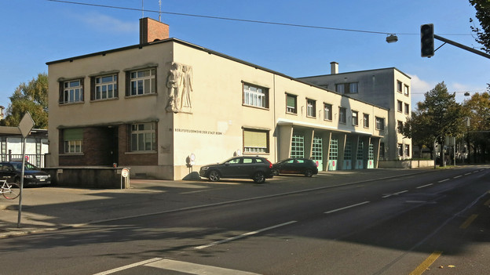
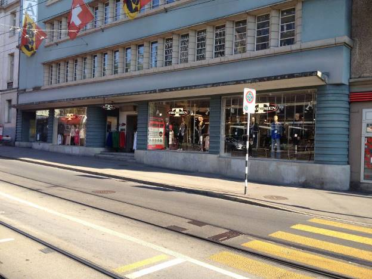

+++
title = "Location: Lage, Lage, Lage"
date = "2014-12-14"
description = "Das wichtigste Kriterium für den richtigen Standort für unseren Coworking Space mit Café/Bar ist die Lage. Es ist ein bisschen wie die Quadratur des Kreises: gute Lage, genügend Platz, zentral und bezahlbar."
image = "feuerwehrkaserne.jpg"
authors = [ "Domenica Hitz" ]
comments = "popupcoworking"
tags = [ "Location" ]
+++

Das wichtigste Kriterium für den richtigen Standort für unseren Coworking Space mit Café/Bar ist die Lage. Es ist ein bisschen wie die Quadratur des Kreises: gute Lage, genügend Platz, zentral und bezahlbar. Klar ist jetzt schon: die perfekte Location gibt es nicht. Die Frage ist jetzt nur: wo können wir Abstriche machen? 

Im Moment sind wir an zwei verschiedenen möglichen Locations dran:
Alte Feuerwehrkaserne beim Viktoriaplatz und ehemaliger Kleiderladen Thommen an der Effingerstrasse.

## Feuerwehrkaserne

Bei der Feuerwehrkaserne würde es sich um eine Zwischennutzung bis 2018 handeln. Die Feuerwehr ist erst vor wenigen Tagen in ihr neues Quartier am anderen Ende der Stadt umgezogen. Das Gebäude gehört der Stadt und sie und der Quartiersverein [DialogNord](http://www.dialognord.ch) bestimmen darüber, wie die Räume genutzt werden. Marco ist unser Mann für die Feuerwehrkaserne, er geht an Besichtigungen, Vereinsversammlungen und Sitzungen, um auf dem Laufenden zu bleiben.

## Effingerstrasse

Die Location an der Effingerstrasse, der ehemalige Kleiderladen «Thommen» gehört ebenfalls der Stadt. Dort sind wir am Abklären, ob uns die Fläche ausreichen würde oder ob allenfalls noch zusätzliche Räume dazugemietet werden müssten. Eine baldige Besichtigung steht an, danach wissen wir wahrscheinlich mehr.

## Eckdaten

Damit ihr uns bei der Location Suche unterstützen könnt, hier mal einige Eckdaten:

<table class="table">
  <tr>
  <td><strong>Lage</strong></td>
    <td>Innenstadt, Quartiere: Weissenbühl, Mattenhof, Länggasse, Breitenrein, Lorraine</td>
  </tr>
  <tr>
    <td><strong>Grösse</strong></td>
    <td>300-350m2</td>
  </tr>
  <tr>
    <td><strong>Preis</strong></td>
    <td>max 7500.- pro Monat, 90’000,- pro Jahr, Kauf auch möglich   </td>
  </tr>
  <tr>
    <td><strong>zwingend</strong></td>
    <td>Erdgeschoss, zentral, gute Passantenlage, Schaufenster,  in der Nähe von ÖV</td>
  </tr>
  <tr>
    <td><strong>wünschenswert</strong></td>
    <td>Möglichkeit für Aussenplätze Gastronomie, Industrial Style</td>
  </tr>
</table>

<small><em>Bildquellen: Feuerwehrkaserne von [SRF]( http://www.srf.ch/news/regional/bern-freiburg-wallis/stadt-bern-aus-alter-feuerwehrkaserne-wird-asylunterkunft), Effingerstrasse auf [homegate](http://www.homegate.ch/mieten/104785212)</em></small>