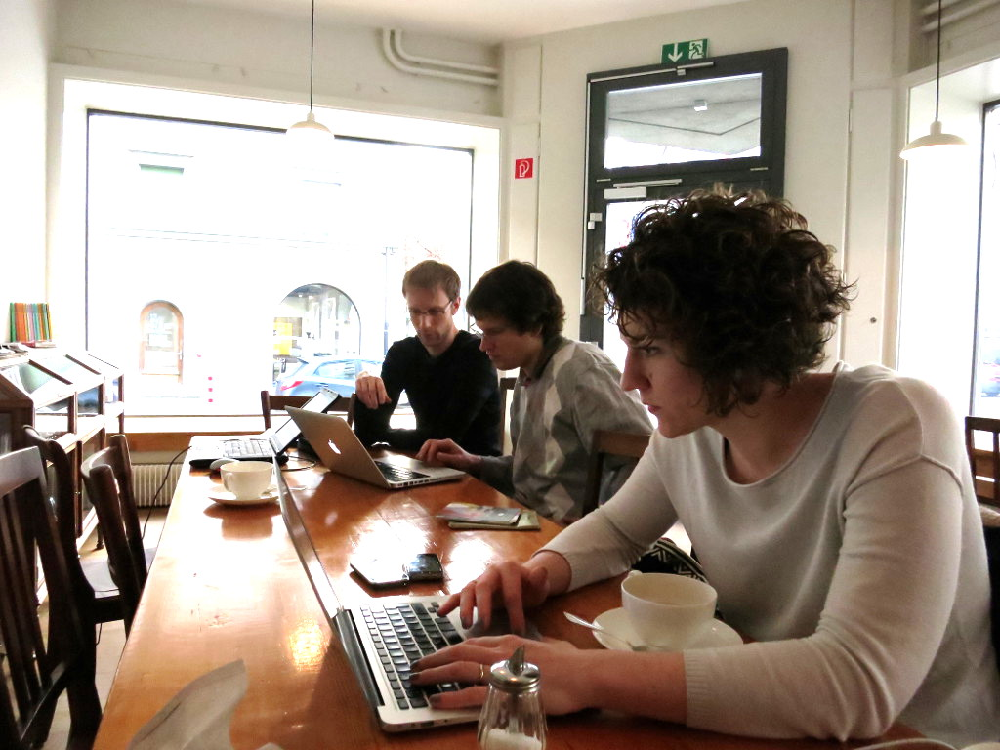
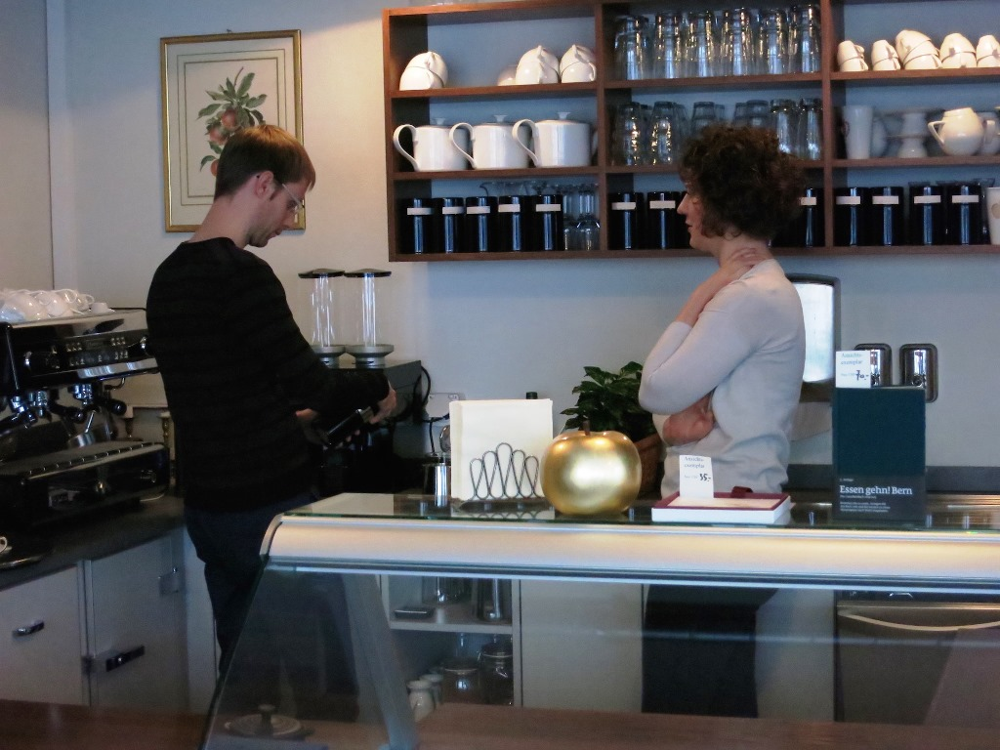
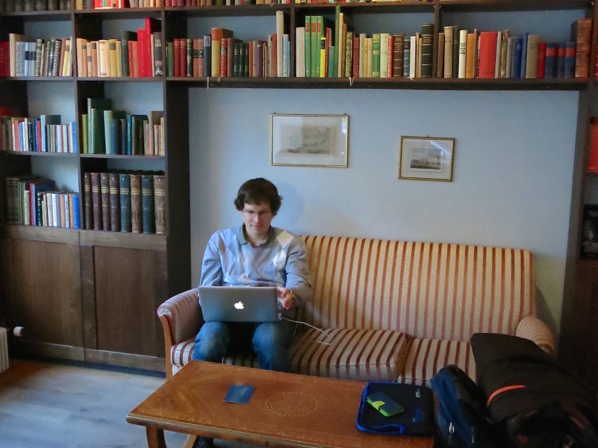
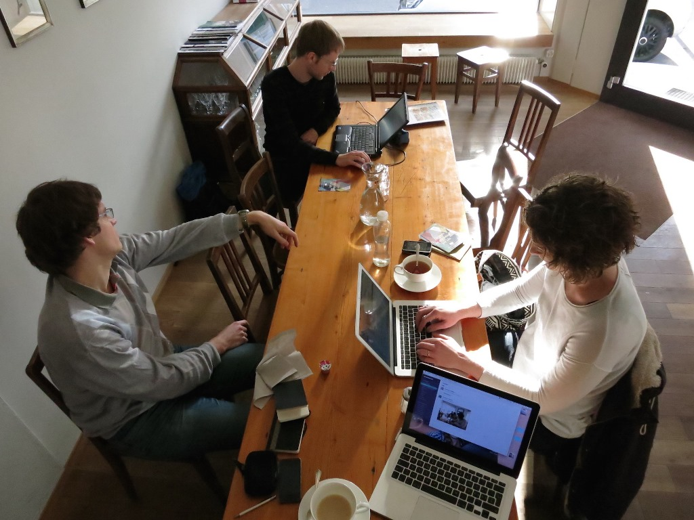
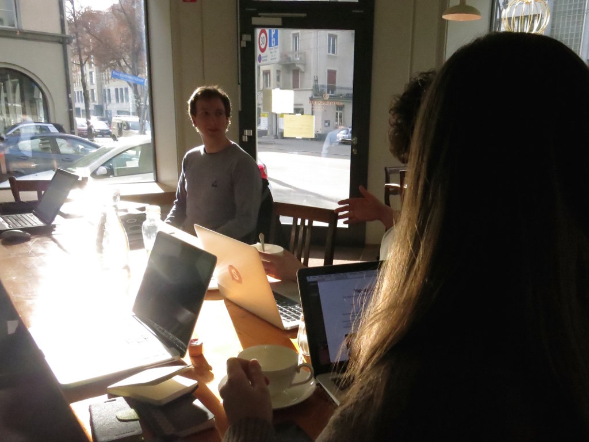
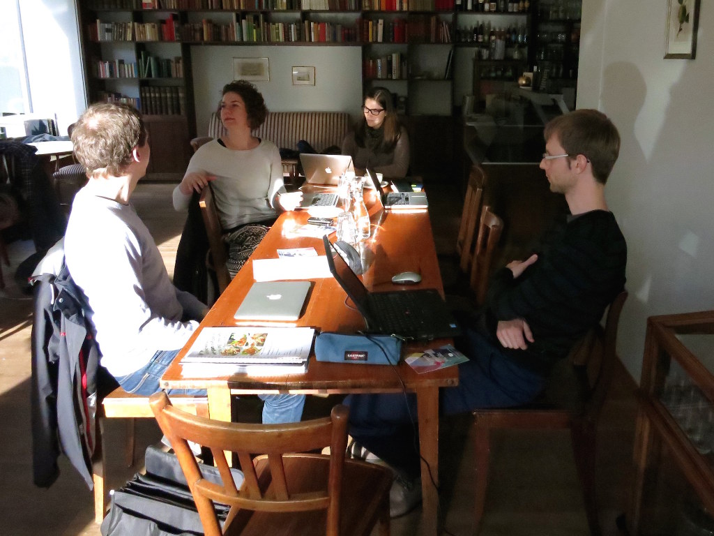

+++
title = "Man lernt nie aus"
date = "2015-01-07"
description = "Coworking Tag im Apfelgold. Das kann ja nur gut werden. Das Schöne an Zusammenarbeit ist ja, dass man unter anderem auch Neues lernt."
image = "coworking-1.jpg"
authors = [ "Domenica Winkler" ]
comments = true
tags = [ "Inspiration" ]
+++

Ich stand heute morgen ziemlich freudig auf: Coworking Tag im Apfelgold. Das kann ja nur gut werden. Das Schöne an Zusammenarbeit ist ja, dass man unter anderem auch Neues lernt.

Also wir haben heute Folgendes gelernt:

* Domenica von Adrian: Bei einer GmbH darf das Gesellschaftskapital unter anderem für Löhne oder Miete gebraucht werden
* Benedikt von Marco: Interessantes über künftige Webtechnologien
* Adrian von Domenica: Kaffeemaschinen sind Zitat «sackteuer»
* Marco von Rebekka: Es gibt schöne Fairtrade Kleider
* Domenica von Donat: ein Baugesuch beantragen ist ziemlich aufwändig
* Donat von Marco: Bedienung von Slack
* Marco von Adrian: iCal Dateien funktionieren auf Android «ein bisschen kompliziert»
* Adrian über Adrian: «Im Homeoffice verbring ich meine Pausen mit Surfen, im Coworking mit einem Schwätzchen mit den Coworkern. Das zweite find ich besser.»

Und hier noch die harten Fakten: 6 Coworker, 8h gearbeitet, 8 Tassen Tee getrunken, 5 Macs und 1 PC, 1,5 Stunden, 18.- und 3400 Schritte fürs Mittagessen

Der Tag hat sich für mich gelohnt, ich freu mich auf die nächsten Coworking Tage.

  

    
  

  

    
  

  

    
  

  

    
  

  

    
  

