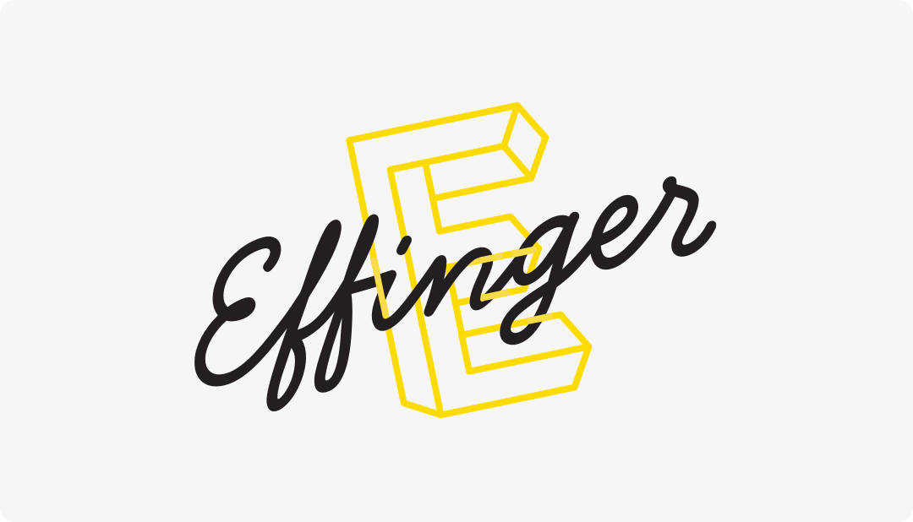

+++
title = "Blick nach vorn mit der Effinger Community und fünf Stockwerken"
date = "2025-06-11"
draft = false
tags = [ "Community" ]
image = "effinger_entscheid_2025.png"
description = "Medienmitteilung vom 11. Juni 2025"
authors = [ "Markus Roos"]
comments = false
+++

Bern, 11. Juni 2025 – Die Schlichtungsbehörde hat dem Einspruch der Effinger Kaffeebar gegen die Kündigung ihres Untermietvertrags stattgegeben. Der ehrenamtlich geführte Verein «Coworking Community Bern» akzeptiert den Entscheid und verzichtet auf weitere rechtliche Schritte.

«Wir investieren seit neun Jahren unzählige Freiwilligenstunden und viel Herzblut in unseren fünfstöckigen Coworking Space», erklärt die Effinger Community. «Statt Energie in Verfahren zu stecken, richten wir den Blick nach vorn und nutzen den Entscheid als Chance, den Effinger weiterzuentwickeln.»

Die Ausrichtung bleibt klar: Effinger ist ein offenes Biotop für frische Ideen, Vielfalt und Beziehungen. Für 2025 leiten zwei Leitgedanken unser Handeln:

<blockquote class="blockquote">«Mehr Spielplatz sein und weniger Institution.»</blockquote>
<blockquote class="blockquote">«Eine lebendige Community ist uns wichtiger als im Jahresrhythmus steigende Umsätze.»</blockquote>

## Ausblick
Koexistenz gestalten – Die organisatorische Entflechtung von Community und Kaffeebar ist bereits im Gang; der Verein arbeitet daran, die Abläufe zu entwickeln.
Lernen & Weitergehen – Aktivitäten, Projekte und Events helfen, Erfahrungen zu verarbeiten und die Community in die Zukunft zu führen.

«Manchmal ist das Festhalten das Ende einer Geschichte – und das Loslassen der Anfang einer neuen», so der Verein. «Mit unserer bunt engagierten Community und fünf Stockwerken Raum gehen wir mutig in diese neue Phase.»

## Kontakt für Rückfragen
Verein Coworking Community Bern 
E-Mail: coworking@effinger.ch | Web: www.effinger.ch
