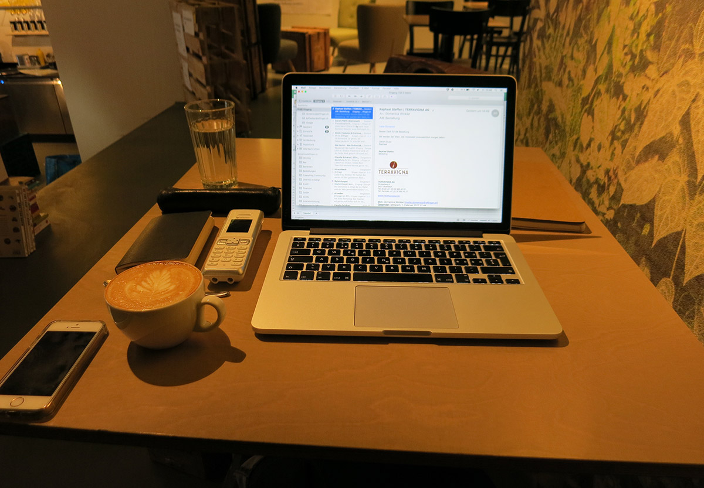

+++
title = "Mein neuer Freitag"
date = "2017-02-07"
description = "Nachdem das letzte Jahr ziemlich anstrengend und vollgepackt mit Arbeit war, muss sich nun im neuen Jahr etwas ändern. Ich möchte neben meiner Arbeit für die Kaffeebar Zeit finden, um mich für den Effinger und meine Community einzusetzen."
image = "mein-neuer-freitag.jpg"
authors = [ "Domenica Hitz" ]
comments = true
tags = [ "Community", "Coworking" ]
+++

Nachdem das letzte Jahr ziemlich anstrengend und vollgepackt mit Arbeit war, muss sich nun im neuen Jahr etwas ändern. Ich möchte neben meiner Arbeit für die Kaffeebar Zeit finden, um mich für den Effinger und meine Community einzusetzen.

 Deshalb hab ich mich entschieden, mein Pensum zu reduzieren um einen Nachmittag pro Woche offiziell Zeit zu haben. Zeit, um kleine und grössere Aufgaben anzupacken, mitzudenken und dazusein, um den Effinger immer mehr in Heimat für uns alle zu verwandeln.

Und heute ist jetzt also mein erster neuer Freitag. Am Morgen mach ich Admin für die Kaffeebar und am Nachmittag stehen verschiedene Aufgaben für die Community an. Ich freu mich richtig darauf, Zeit zu haben, ihr nicht hinterher rennen zu müssen und zu hoffen, dass ich ihr irgendwo ein paar Momente abmühen kann. Sondern zu wissen, der Nachmittag steht zur freien Verfügung. 1. Aufgabe: diesen Blogeintrag schreiben. Ist schon fast erledigt. Als nächstes entwerfe ich ein kleines Konzept, um die Tagesverantwortung im Coworking Space neu zu organisieren. Und danach möchte ich unbedingt noch die Glasscheibe im Workshop Raum putzen, die sieht ziemlich übel aus.

Vielleicht gibt es ja noch andere im Effinger, die sich auch den Freitag Nachmittag für die Community freihalten können. Ich fänds schön, wenn wir gemeinsam und zur selben Zeit am und für den Effinger arbeiten könnten.
