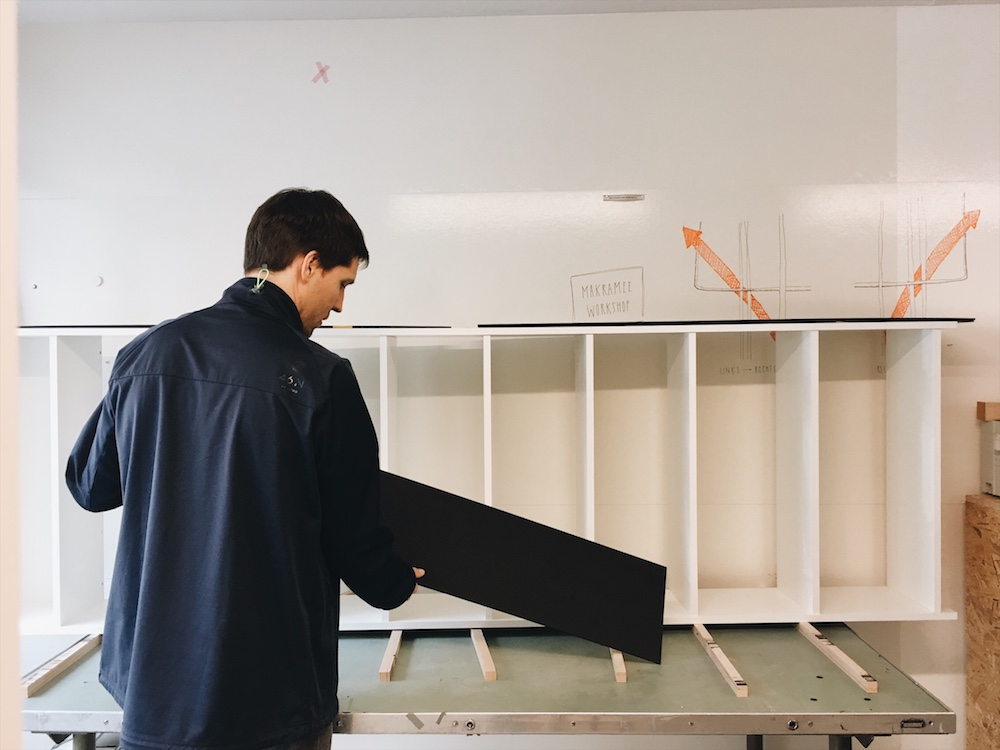
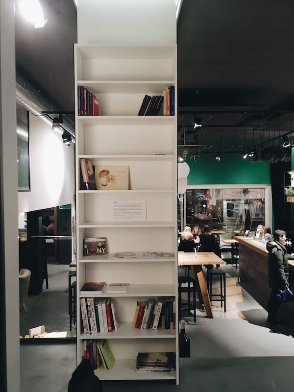

+++
title = "Neues aus dem Atelier"
date = "2017-05-06"
description = "Das Effinger-Atelier bietet verschiedenen Künstlern und Kreativen ein Zuhause. Im Atelier und in der angrenzenden Werkstatt entsteht Handgemachtes, Ausgefallenes, Individuelles, Schönes und Einzigartiges. Das Atelier ist ein Ort, an dem sich Kreativität ganz praktisch ausdrückt."
image = "Bild1.jpg"
author = "Damaris Berger"
comments = true
tags = [ "Atelier", "Community", "Unterhaltung" ]
+++

  Das Effinger-Atelier bietet verschiedenen Künstlern und Kreativen ein Zuhause. Im Atelier und in der angrenzenden Werkstatt entsteht Handgemachtes, Ausgefallenes, Individuelles, Schönes und Einzigartiges. Das Atelier ist ein Ort, an dem sich Kreativität ganz praktisch ausdrückt.

Der neueste Zuwachs im Effinger-Interieur stammt aus dem hauseigenen Atelier:

<small>*Das Bibliotheksregal*</small>

Diese Arbeiten für ein neues Regal sind nun die Grundlage für die Effinger-Gemeinschaftsbibliothek. Timon Marmet zeichnete die Pläne und verschiedene Communitymitglieder haben bei der konkreten Umsetzung geholfen. Dieses Gemeinschaftswerk kann ab jetzt als Buchsammlung in der Lounge im Effinger bestaunt und benutzt werden. Lesespass für Alle!

  

    
  

  

    

      <h4 style="text-align:center;">Hinweis zur Bibliothek</h4>

      
Die Bücher sind alle in privatem Besitz und daher nicht zur Ausleihe gedacht, sondern zum Gebrauch im Effinger. Bei näherem Interesse kann dem Besitzer des jeweiligen Buches eine E-Mail geschrieben werden (siehe Buchdeckel).

      
Bisher sind folgende Kategorien vorhanden: Menschenrechte, Philosophie, internationale Politik, Schweizer Politik, Freiheit/Liberalismus, Zukunftsforschung und LEGO. Geplante Kategorien folgen zu den Themen Unternehmertum und Management/Führung.

      
Besten Dank für einen achtsamen Umgang mit der Literatur und viel Spass beim Lesen und Durchblättern anschauen!

      
Bei Fragen: <a href="mailto:urs@effinger.ch">urs@effinger.ch</a>

    

  

