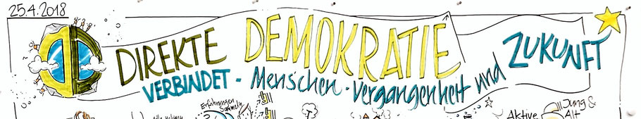
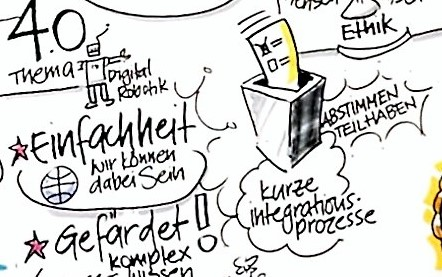
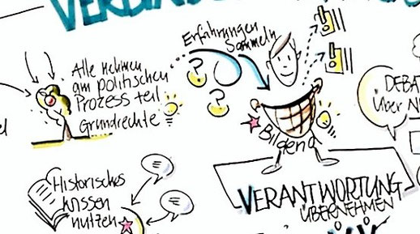
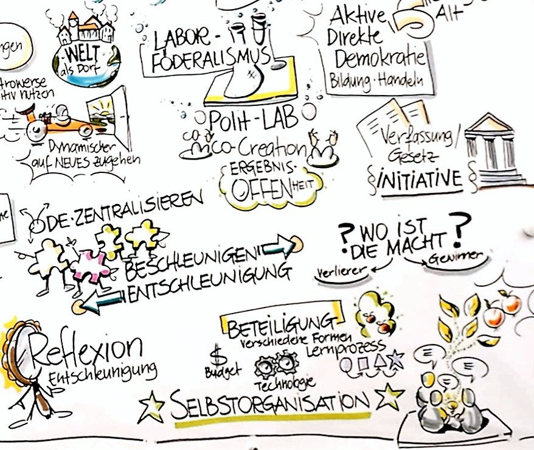
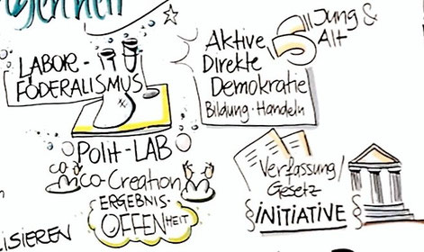
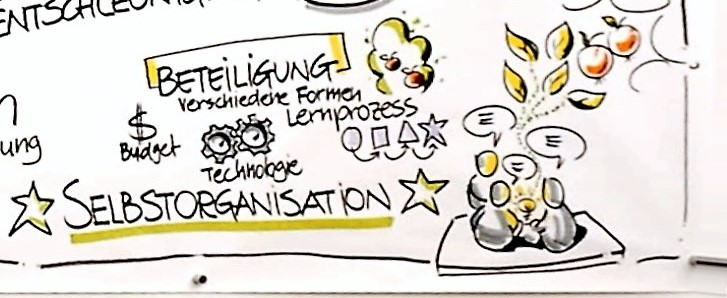
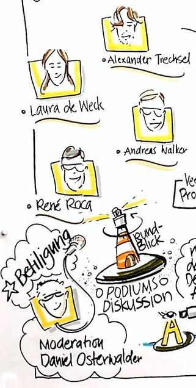

+++
title = "Open Debate - Direkte Demokratie verbindet"
date = "2018-05-02"
description = "Eine interessante Diskussionsrunde zum Thema «Direkte Demokratie verbindet». Ziel war es, die verbindenden Elemente der direkten Demokratie aus unterschiedlichen Perspektiven auszuleuchten. Direkte Demokratie verbindet Vergangenheit und Zukunft, sowie Menschen. Diese Diskussion ist auch im Hinblick auf die Menschenrechte mehr als relevant. Es wurden auch neue und innovative Ideen zum Thema direkte Demokratie diskutiert."
image = "open-debate.jpg"
author = "Urs Vögeli"
comments = true
tags = [ "Inspiration" ]
+++

Der Effinger veranstaltete am 25. April eine interessante Diskussionsrunde zum Thema «Direkte Demokratie verbindet». Ziel war es, die verbindenden Elemente der direkten Demokratie aus unterschiedlichen Perspektiven auszuleuchten. Prof. Dr. Alexander Trechsel stellte das politikwissenschaftliche Gewissen der Runde dar. Dr. René Roca als Historiker betonte die [pluralistischen Wurzeln der direkten Demokratie](https://www.demokratieundmenschenrechte.ch/die-direkte-demokratie-lebt/) der Schweiz. Laura de Weck waren insbesondere die [integrativen Elemente](https://www.bzbasel.ch/kultur/buch-buehne-kunst/laura-de-weck-die-kuenstler-sind-politisch-mobilisiert-131194991) ein Anliegen und [Dr. Andreas Walker](https://weiterdenken.ch/) richtete als Futurologe den Blick in die Zukunft. [Daniel Osterwalder](https://www.visualdynamics.ch/) moderierte die Rund und gleichzeitig illustrierte Patrick Stahel live die Debatte. Anhand dieser Visualisierung fassen wir nun die Open Debate zusammen.

## Direkte Demokratie als konstanter Veränderungs- und Lernprozess

Die historische Betrachtungsweise der direkten Demokratie machte deutlich, dass es sich um ein agiles und bewegliches System handelt. Konstante Lernprozesse haben erst zur Entwicklung der direkten Demokratie geführt, wie wir sie heute kennen. So haben beispielsweise Referenden der katholisch-konservativen Bewegung Blockaden verursacht, die dann zur Einbindung in die Regierung geführt haben. Dies war der Ausgangspunkt unserer Konkordanzregierung, in der keine Partei oder Koalition alleine regiert, sondern der Konsens gesucht wird. Die Schweizer Demokratie lebt davon, dass die Mehrheiten und Koalitionen stets wechseln. Einmal gehört man zu den Verlierern, manchmal zu den Gewinnern, aber immer in anderer Kombination. Historisches Wissen ist für solche Veränderungsprozesse jedoch zentral. So verbindet unsere direkte Demokratie gleichsam Vergangenheit, Gegenwart und Zukunft.

## Einfachheit, Teilhabe und Integration

Mehrfach kam zur Sprache, dass eine gelungene Demokratie einfach sein müsse. Um mitreden, mitentscheiden und mitbestimmen zu können, muss auch jeder die Prozesse verstehen. Die Digitalisierung vereinfache einerseits die Kommunikation und daher auch die Mitbestimmung, andererseits führt die Vernetzung und Globalisierung auch zu Komplexität, die die direkte Demokratie gefährden könnte. Die Einfachheit ist aber wichtig, damit die Demokratie  integrativ wirken kann. Denn nur ein einfaches System wird auch von den unterschiedlichsten Menschen genutzt und akzeptiert. Es wurde als besonderes Merkmal der direkten Demokratie erwähnt, dass gerade die politische Integration von unterschiedlichen Richtungen die Gewalt hemmt und die Schweiz dadurch auch weniger oder keine Probleme mit politischer Gewalt kennt wie andere Länder.

## Verantwortung übernehmen

Die direkte Demokratie fördert das Verantwortungsbewusstsein der Bürger. Sie ist bildend, weil regelmässig und auf unterschiedlichen Stufen demokratische Erfahrungen gesammelt werden können. Anders als beispielsweise beim Brexit in Grossbritannien, wo die Bevölkerung nur sehr selten abstimmen kann, können in der Schweiz die Menschen über die Zeit sehr differenziert ihre Meinung äussern. So wurde zum Beispiel die Masseneinwanderungsinitiative angenommen und ein halbes Jahr später die Ecopop-Initiative abgelehnt. Die Ausschaffungsinitiative wurde gutgeheissen, die Durchsetzungsinitiative nicht. Wenn möglichst viele am politischen Prozess teilhaben, aber auch keine ewig geltenden Entscheide gefällt werden, bleibt der Ausgleich mit den Grundrechten möglich. Die Verantwortung bleibt aber ein zentraler Wert.

## Innovation vs. Reflexion?

Kontrovers wurde diskutiert, ob die direkte Demokratie nun beschleunigt oder entschleunigt. Die direkte Demokratie wurde zuweilen auch als langsam betitelt. Dies schaffe jedoch auch Reflexion und die in einer schnelllebigen Gesellschaft vielleicht nötige Entschleunigung. Andererseits zeigen die Beispiele der Initiative zum Grundeinkommen oder die Vollgeld-Initiative, dass auch Neuerungen mit der direkten Demokratie sehr rasch ins politische System einfliessen  können. Die direkte Demokratie kanalisiert die Diskussion, so dass dynamisch und reflektiert zugleich auf Neues zugegangen werden kann. Die direkte Demokratie hat das Potenzial, Debatten anzustossen und Kontroversen auch positiv zu nutzen. Interessanterweise führt die in der direkten Demokratie wichtige Dezentralisierung auch dazu, dass Neuerungen oder Innovatives auf kleiner Stufe ausprobiert werden kann. Somit werden Beschleunigung und Entschleunigung auf konstruktive Weise verbunden.

## Labor-Föderalismus und Co-Creation

Sinn macht die direkte Demokratie nur, wenn sie auch aktiv genutzt wird und zum Handeln motiviert. Somit wird ein Verständnis von Politik, direkter Demokratie und auch Föderalismus gefördert, welches Kreativität und Innovation begünstigt oder zumindest zulässt. Politik könnte als [Labor](https://www.demokratieundmenschenrechte.ch/laborf%C3%B6deralismus/) verstanden werden, wo in kleinem Rahmen Ideen und Massnahmen gemeinsam und gemeinschaftlich ausgearbeitet und getestet werden. Dies verlangt aber danach, dass der Prozess ergebnisoffen und eher vom kleinen ins grosse, als umgekehrt aufgebaut ist. Dies knüpft auch an die Genossenschaftsidee an. Aus der Gesellschaft heraus, intrinsisch motiviert müssten demnach politische Visionen und Ideen um- und durchgesetzt werden.

## Direkte Demokratie als Selbstorganisation

Es scheint ein menschliches Bedürfnis zu sein, die Welt um sich herum gestalten, Einfluss nehmen und sich einbringen zu wollen. Dieser Umstand, verbunden mit einem gemeinschaftlichen Politikverständnis führt dazu, dass wir direkte Demokratie als gesellschaftliche Selbstorganisation verstehen können. Dabei sollen verschiedene unterschiedliche und kreative Strukturen möglich sein. Vielleicht braucht es auch neue Formen der Beteiligung, die es noch zu entdecken und entwickeln gibt. Gerade neue Formen der unternehmerischen und sozialen Selbstorganisation könnten hierbei richtungsweisend sein, wie wir verschiedene Menschen, verschiedene Ansichten und politische Strömungen wieder fruchtbar zusammenbringen können und zu gemeinsamen Lösungen kommen.

*Urs Vögeli*
