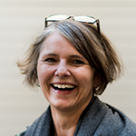

+++
title = "Kaffeepause mit Claudia Schären"
date = "2017-03-06"
description = "Der Effinger wird geprägt durch die verschiedenen Menschen, die hier ein- und ausgehen. Wir möchten euch einige von ihnen näher vorstellen. Diesmal im Gespräch mit Claudia Schären, Office Managerin."
image = "effinger_blog_claudia-draussen.jpg"
author = "Graziella Bärtsch"
comments = true
tags = [ "Coworking" ]
draft = true
+++

Der Effinger wird geprägt durch die verschiedenen Menschen, die hier ein- und ausgehen. Wir möchten euch einige von ihnen näher vorstellen. Diesmal im Gespräch mit Claudia Schären, Office Managerin.

### Warum arbeitest du im Effinger?
Ich hab einfach ein Büro gesucht. Nur ein Büro. Eines Morgens in Spanien in den Ferien bin ich aufgestanden, habe meinem Mann gesagt, ich will nicht mehr zuhause arbeiten, nahm meinen iPad und googelte: Gemeinschaftsbüro Bern. Es erschien der Zeitraum (Vorläufer des Effinger) und so kam es dazu. Coworking.
Ich wollte geschäftlich und zuhause trennen, es ging mir nicht ums Netzwerk. Der Effinger, einfach weil alles passte. Er liegt zentral, und Kaffeebar/Restauration hat mich immer schon fasziniert. Der Standort hat sich als ideal erwiesen und die Leute sind mir sehr sympathisch.

### Nur ein Büro gesucht: Das heisst, du hast viel mehr gekriegt?
Ja, eine grosse Bereicherung ist das. Das hätte ich mir nie träumen lassen. Die Kaffeebar, die Raumvermietungen... Seit ca. 17 Jahren betreue ich die Geschäftsstelle eines Informatikvereins. In dieser Rolle war ich immer auf der anderen Seite der Akteure. Ein grosser Teil meiner Arbeit für sie beinhaltet die Suche nach Räumlichkeiten für die Fachtagungen.
Die Vielfalt an Personen, Handwerk, Metiers, das ist für mich eine grosse Bereicherung. Das Engagement für den Effinger ist mit der Zeit gewachsen. Ich investiere mich in Dinge, die ich gerne mache.

### Was machst du im Moment gerade?
Administration und Organisation für die Informatikorganisation. Tagungen organisieren, den Flyer organisieren, den Vorstand à jour halten, Onlinekanäle aktualisieren, Fachpresse koordinieren, Anmeldungen entgegennehmen, etc.

#### Claudia Schären, Office Managerin
Ist Multi-Tasking geprüft und wird auch «die gute Seele vom Effinger» genannt.

[Webseite von Claudia Schären](http://www.a-und-o.ch/)
