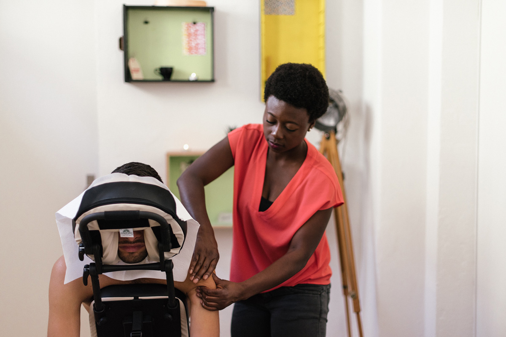
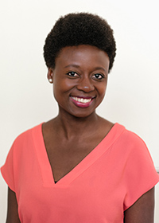

+++
title = "Kaffeepause mit Faustina Kromah"
date = "2017-10-08"
description = "Der Effinger wird geprägt durch die verschiedenen Menschen, die hier ein- und ausgehen. Wir möchten euch einige von ihnen näher vorstellen. Hier  ein Einblick in den Alltag von Faustina Kromah, dipl. Masseurin und Bewegungspädagogin."
image = "faustina-draussen.jpg"
authors = [ "Graziella Bärtsch" ]
comments = true
tags = [ "Portrait" ]
+++

Der Effinger wird geprägt durch die verschiedenen Menschen, die hier ein- und ausgehen. Wir möchten euch einige von ihnen näher vorstellen. Hier  ein Einblick in den Alltag von Faustina Kromah, dipl. Masseurin und Bewegungspädagogin.

### Was machst du im Effinger?

Ich biete im Effinger als Masseurin Massagen an. Mein Anliegen ist es, Menschen, die in Büros arbeiten, die Möglichkeit zu geben sich eine kurze Auszeit zu gönnen. Die ganzheitliche Sicht auf den Menschen in den Berufsalltag hineinzubringen, ist mir ein Anliegen.

### Wie muss ich mir das vorstellen: Massagen in einem Coworking-Space?

Ganz unkompliziert. Man kommt für 15 Minuten (oder nach Wunsch länger)  in einen kleinen Raum, wo ich einen Massagestuhl installiert habe. Je nach Wunsch kann man sich oben frei machen oder angezogen bleiben. Dann darf man sich hinsetzen und entspannen. Ich ertaste die Punkte oder Spannungen im Kopf-Nacken-Schultern-Rücken-Bereich und versuche durch Streichungen, Kneten, Mobilisation, Dehnen Entspannung und Lösung der Verspannungen zu bewirken. Teilweise mache ich auf die Atmung aufmerksam.

### Wie bist du dazu gekommen im Effinger Massagen anzubieten?

Ich habe schon bevor der Effinger da war, die Vision mitgekriegt. Es begeisterte mich der Community-Gedanke und darum habe ich mir schon damals überlegt, wie ich mich einbringen könnte. Zusätzlich weiss ich von Vielen, die im Büro arbeiten, dass sie unter Verspannungen leiden. Darum kam ich auf die Idee, die Möglichkeit zu bieten, aus dem Businessalltag auszubrechen und das Bewusstsein für den eigenen Körper zu stärken.

### Wann genau bietest du die 15-Minuten-Massagen an?

Grundsätzlich bin ich an zwei Donnerstagen im Monat im Effinger. Am 1. Donnerstag des Monats bin ich über Mittag im Effinger, am 3. am Feierabend. Infos und Anmeldemöglichkeit gibt es über meine Website [3-bewegt.ch](http://www.3-bewegt.ch/).

#### Faustina Kromah

Masseurin und Bewegungspädogin, hat Hände, die Wunder wirken und liebt tiefgründige Gespräche – am liebsten bei einer Tasse Tee.

[www.3-bewegt.ch](http://www.3-bewegt.ch/)
