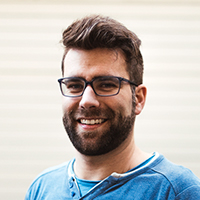

+++
title = "Kaffeepause mit Joni Hess"
date = "2017-02-25"
description = "Der Effinger wird geprägt durch die verschiedenen Menschen, die hier ein- und ausgehen. Wir möchten euch einige von ihnen näher vorstellen. Diesmal im Gespräch mit Joni Hess, Filmemacher und Webprogrammierer."
image = "effinger_blog_joni-draussen.jpg"
author = "Graziella Bärtsch"
comments = true
tags = [ "Portrait" ]
+++

Der Effinger wird geprägt durch die verschiedenen Menschen, die hier ein- und ausgehen. Wir möchten euch einige von ihnen näher vorstellen. Diesmal im Gespräch mit Joni Hess, Filmemacher und Webprogrammierer.

### Warum arbeitest du im Effinger?
Weil die geilen Leute da sind. Nein, ich bin zum Effinger gekommen, weil ich ein Gemeinschaftsbüro gesucht habe. Ich wollte nicht mehr alleine zuhause arbeiten. Zuerst wollte ich mit branchenähnlichen zusammen co-worken. Als ich auf Matthias getroffen bin, hat er mir vom Effinger erzählt, ich war beim ersten How-the-Heck-Abend mit dabei...

### Was machst du im Effinger?
Filme planen, aufnehmen, schneiden, Websites erstellen.
Meine momentanen Projekte sind ein Infofilm für ein Hilfswerk, ein Werbefilme für IVP NMS Bern, die Programmierung eines Webshops und dem UG im Keller Leben einhauchen.

### Dein Geheimtipp im Effinger?
Was mich fasziniert ist, das Potenzial das zusammenkommt, die verschiedenen Menschen und was daraus entsteht. Im Moment sind viele noch Einzelkämpfer, ich glaube, das kommt noch näher zusammen. Auch zu sehen, wie das wahrgenommen wird, beeindruckt mich.
Ich bin Effinger, weil Grossartiges nur gemeinsam entsteht.

#### Joni Hess, Filmemacher und Webprogrammierer
Liebt es, ausgiebig zu Frühstücken und schwört auf sein treues Cargo-Velo.

[Webseite von Jonathan Hess](http://movingwater.ch/)
