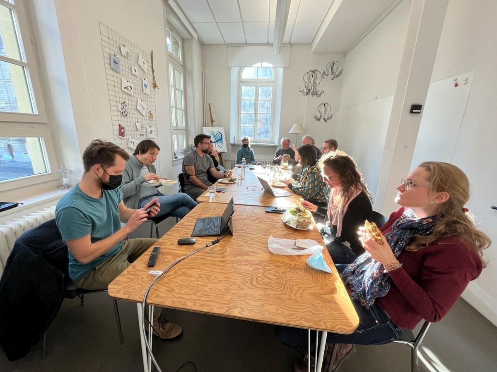
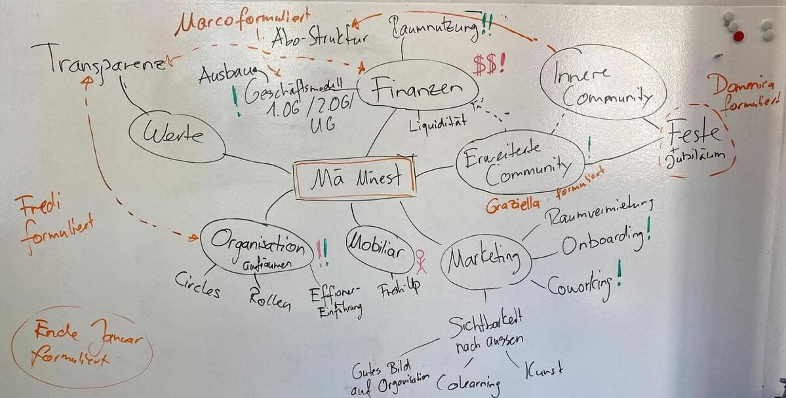

+++
title = "Viele Probleme, wer hat Lust darauf?"
date = "2022-02-03"
draft = false
tags = ["Community" ]
image = "community-treffen.jpg"
description = "Nach 2 Jahren Pandemie sind viele erschöpft. Und doch wollen wir gerade jetzt ein paar Probleme im Effinger ansprechen und gemeinsam anpacken."
authors = ["Domenica Hitz", "Graziella Bärtsch", "Fredi Zumbrunn", "Marco Jakob", "Manuel Bürli"]
comments = true
+++

Nach 2 Jahren Pandemie sind viele erschöpft. Und doch finden sich einige in unserer Community, die gerade jetzt ein paar Dinge im Effinger anpacken wollen. Es ist uns wichtig, dass wir aus dem Krisenmodus rausfinden und uns vorbereiten auf neue Abenteuer.

Inspiriert durch den Systemtheoretiker [Gerhard Wohland](https://dynamikrobust.com/) haben wir im Community-Treffen vom Januar folgende Aktivität durchgeführt:

1. Im Gespräch gemeinsam auf die Suche nach Problemen gehen.
2. Die Grössenordnung definieren, denn manchmal entscheidet man sich, lieber mit dem Problem zu leben, als es zu lösen.
3. Probleme beschreiben und veröffentlichen. 
4. Warten, bis sich Leute melden, die genau auf eines dieser Probleme gewartet haben und sich zutrauen, es zu lösen.

Es ist gar nicht so einfach, nicht schon sofort in die Lösungsfindung zu gehen, sondern das Problem in den Raum zu stellen und zu warten. Hier unser Versuch:

## Problem 1: Draht zur erweiterten Community verloren

Ich weiss nicht, warum du diesen Blogeintrag liest oder den Effinger-Newsletter in deiner Inbox hast. Möglicherweise warst du Unterstützer*in der ersten Stunde, wohnst weit weg und hast vor sieben Jahren einmal jemanden gekannt, der/die den Effinger mitgegründet hat. Tausend andere Gründe hier nicht aufgezählt.

Regelmässig machen wir uns Gedanken darüber, wie wir das Interesse aufrecht erhalten und die Verbundenheit mit dem Effinger pflegen können. Effianer*innen (Menschen, die den Effinger am Laufen halten) haben meist schon einige Jöblis, Co-Workende sind mit ihren unternehmerischen Herausforderungen beschäftigt, Community-Mitglieder haben vielleicht einfach themenspezifisch eine Rolle... da bleibt der Draht zu dir schnell auf der Strecke.

Wie würdest du gerne informiert werden? Welche Zeichen der Wertschätzung von unserer Seite her würden dich freuen? Welche Form von Mittragen kannst du dir vorstellen?

👉 Kannst du dir vorstellen, uns zu unterstützen? Wir suchen Menschen, die Ideen und Lust haben uns beim Unterwegs-Sein mit der erweiterten Community zu helfen? Melde dich bei [graziella@effinger.ch](mailto:graziella@effinger.ch) mit Ideen, Rückmeldungen, Konzepten oder für einen Schwatz über das Thema bei einem Kafi.

## Problem 2: Das Geld wird knapp

Recht früh in der Corona-Krise haben wir den Bereich Raumvermietung redimensioniert, da sowieso fast nichts mehr lief und damit wir mehr Platz hatten für die grossen Abstände im Coworking. Auch sonst haben wir unsere Ausgaben auf ein Minimum reduziert.

Trotzdem sind nach zwei Jahren Pandemie unsere Reserven aufgebraucht. Corona-Hilfe haben wir leider im Coworking keine erhalten. Nur dank den vier guten Jahre zuvor und mit viel ehrenamtlichen Einsatz der Effianer konnten wir die Krisenzeit überleben.

Jetzt müssen wir dringend das Geschäftsmodell überarbeiten, um wieder in die Gewinnzone zurückzufinden. Einfach wird es nicht: Wir sollten unser Mobiliar nach 6 Jahren auffrischen. Gleichzeitig erhalten wir als Community die Gelegenheit, in das 2. OG zu expandieren. Auch das braucht Investitionen. Und dann hat sich während der Pandemie etwas Wild-West-Nutzung etabliert, für die wir wieder eine für alle faire Lösung finden müssen.

👉 Interessieren dich diese Themen? Dann melde dich bei [marco@effinger.ch](mailto:marco@effinger.ch)

## Problem 3: Wir haben verlernt zu feiern

Corona bringt seit 2 Jahre alles durcheinander. Vieles, was bisher gut funktionierte und Spass machte, kann nicht mehr in gewohnter Form stattfinden. Etwas, das uns als Community besonders schmerzt: wir können keine Feste mehr feiern, insbesondere unsere geliebten Jubiläen jeweils im März. Das 4. Jubiläum im März 2020 fiel zu knapp nicht ins Wasser, das 5. Jubiläum war dann im 2021 mitten im 2. Lockdown und das 6. Jubiläum, das vor der Tür steht, wagten wir nicht zu planen, weil so vieles unsicher ist. 

👉 Hast du Ideen, wie wir Feste feiern können? Meld dich bei [domenica@effinger.ch](mailto:domenica@effinger.ch)

## Problem 4: Wenig Transparenz und Übersicht in der Organisation

Wenn es funktioniert, dann funktioniert’s. Und wenn nicht? Dann funktioniert es gleichwohl  - irgendwie. Effinger Organisations-Kultur. Alles gut? Wir finden: Nicht ganz. Nicht, dass wir undankbar wären, auf diese Weise durch die ersten Jahre und jetzt auch einigermassen durch die Jahre der Pandemie gekommen zu sein. Es gibt uns noch! Und das soll so bleiben. Doch wir merken: Die langen Monate der Ungewissheit, der Einschränkungen, der Anpassungen sind auch uns an die Substanz gegangen. Nicht nur finanziell. Wir haben es geschaukelt, bis jetzt, pragmatisch, kreativ, einander unterstützend, mit Augenmass. Was kommt jetzt? Verlängerung der Vergangenheit? Nicht unser Ding. Obschon. Lernen aus Erfahrungen und Bewährtes bewahren und optimieren ist sicher ein Anfang. Und gibt etwas Sicherheit und schafft eine gewisse Verlässlichkeit. Doch wir fühlen uns unserer Community und uns verpflichtet, jetzt, wo der Pandemie-Tsunami abzuflachen scheint, aktiv zu werden, aufzuräumen, Dinge und Abläufe zu überprüfen und wieder in eine passende und Raum lassende Laborordnung zu bringen. Genau das ist es. Ordnung und Labor. Schwer zu fassen und noch trickreicher zu gestalten. Eine Organisation und eine Community, einladend und offen für Experimente, für das Notwendige Halt gebend und absichernd.

Auch wenn das für uns vielleicht etwas „hoch“ gegriffen ist, es taucht das Bild der Trapezkünstler auf,  die ihre Künste befreiter zeigen können, wenn ein Netz bei einem eventuellen Fehlgriff das Schlimmste verhindert.

So stellen wir uns auch das Funktionieren unserer Organisation vor. Das mit den Trapezkünstler:innen bringen wir hin. Smile. Doch das Netz? Die Maschen nicht zu eng, reduziert auf das Wesentliche und viel Freiraum lassend? Ausprobiert haben wir schon einiges. Wir sind soziokratisch orientiert, haben es mit Kreisen, Rollen und Aufgaben versucht. Verbindlich unverbindlich.  „Wir wollen Menschen über Funktionen stellen, fördern schöpferisches Denken und Handeln und den Mut, Neues zu wagen.“ Das steht so in unseren Grundsätzen. Dem wollen wir auch weiterhin nachleben. „Wir leben Einheit in Vielfalt und nicht Konformität, pflegen eine Kultur des Schenkens, setzen auf Vertrauen und Transparenz anstatt auf Kontrolle.“

Doch wir merken: Es fehlt an Klarheit, Übersicht und Transparenz. Wie kriegen wir das hin, ohne Eigeninitiative und Lust auf Engagement einzuschränken? Ohne aufwändig eine Organisationsstruktur aufzubauen, die dann doch nicht gelebt wird?

👉 Ideen für schlanke und halt gebende Strukturen sind gefragt. Fühlst du dich angesprochen? Dann melde dich bei [fredi@effinger.ch](mailto:fredi@effinger.ch)
