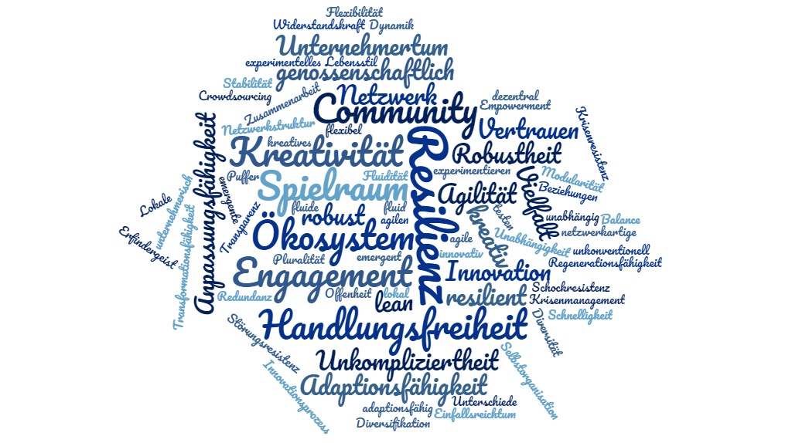

+++
title = "Resilient durch die Krise"
date = "2020-05-26"
description = "Heute spricht man viel über das Schlagwort «Resilienz». Aber was steckt dahinter? Am Fallbeispiel Effinger möchte ich einige konkrete und praktische Elemente und Aspekte von Resilienz beleuchten."
image = "resilienz.png"
authors = [ "Urs Vögeli" ]
comments = true
tags = [ "Gemeinsamständig" ]
+++

Der Effinger hat glücklicherweise und dank der Hilfe von vielen Mittragenden die Corona-Krise bisher sehr gut überstanden. Heute spricht man viel über das Schlagwort «Resilienz». Aber was steckt dahinter? Am Fallbeispiel Effinger möchte ich einige konkrete und praktische Elemente und Aspekte von Resilienz beleuchten.

Der Effinger scheint von aussen betrachtet sehr anfällig für solch grosse Krisen zu sein, wie die Corona-Krise eine ist. Wir haben sehr viele Selbständige, Kreative, eine Kaffeebar und sind auch von Raumvermietungseinnahmen abhängig. Alle diese Bereiche sind an sich stark betroffen von den Massnahmen zur Eindämmung der Epidemie.

## Netzwerkstruktur macht resilient

Der Effinger scheint jedoch mehr und stärker zu sein als die Summe aller Einzelteile. Wir sind bewusst als Community organisiert mit einem hohen Selbstorganisationsgrad und weitergestreuten Beziehungsnetzwerken. Klassisch würde man von Diversifikation sprechen. Die Vielfalt der im Effinger ansässigen Firmen, Kunden und Partnern ist enorm. Das heisst es, sind nicht alle in gleichem Mass und in der gleichen Phase einer Krise betroffen. Das schafft Puffer. So haben beispielsweise alle Fixmieter während der Krise ihre Miete bezahlt. Einige haben mit ihren Firmen teilweise von staatlichen Unterstützungsmassnahmen Gebrauch gemacht. Aber als Ganzes konnten und mussten wir nicht auf staatliche Hilfe zurückgreifen. Das Ökosystem funktioniert auch daher, weil viele Unternehmerinnen und Unternehmer im Effinger genügend finanzielle Reserven hatten, finanziell unabhängig sind und/oder auch den Lebensstil an veränderte Bedingungen oder beschränkte Mittel anpassen konnten. Aber auch der Effinger ist finanziell unabhängig und genossenschaftlich durch das Engagement der Community getragen. Das lässt Spielraum für rasche und unkonventionelle Lösungen offen und erhöht die Handlungsfreiheit.

## Gemeinschaft und Beziehungen schaffen Vertrauen

Ein Schlüsselfaktor um krisenresistent und resilient zu sein heisst Vertrauen. Vertrauen entsteht durch Beziehungen und regelmässige Zusammenarbeit. So konnte die Effingercommunity beispielsweise rasch auf virtuelle Treffen und Räume umstellen und dabei von den bereits existierenden Beziehungen und Vertrauensverhältnissen profitieren. Es ist einfacher virtuell ins Gespräch zu kommen, zu diskutieren und Entscheidungen zu fällen, wenn man sich bereits sehr gut kennt. Unsere dezentrale Kultur Entscheidungen zu fällen und selbstorganisiert zu agieren hat ebenfalls sehr geholfen. Das schafft eine gewisse Dynamik und Engagement, die durch Transparenz und Unkompliziertheit mit der Community rückgekoppelt bleiben. Lieber etwas anreissen, testen und dann wieder anpassen, als nichts zu tun ([Lean-Ansatz von build, measure, learn](/blog/build-measure-learn-praxistest/)).

Es gab aber auch Hilfsangebote und Entgegenkommen, weil die Beziehungen schon lange aufgebaut waren und langfristig ausgerichtet sind. So zum Beispiel mit dem Vermieter, Zulieferern und Partnern. Es sind sogar neue Projekte entstanden, etwa das [Coworking Radio](https://www.coworkingradio.ch/), oder neue Geschäftsmodelle werden aufgegleist (Effinger Services). So konnte relativ rasch der [Innovationsmodus](/blog/vom-krisen-zum-innovationsmodus/) wieder eingeschaltet werden.

## Kreativität und Adaptionsfähigkeit

Letztendlich hat die Krise nach der ersten Phase auch das Unternehmertum geweckt. Es standen die Fragen im Raum, was können wir tun, wie können wir helfen, was braucht die Gesellschaft? Das belebte sogleich die Kreativität. Die unkomplizierte Art im Effinger hat dazu geführt, dass kurzerhand Coworking-Bereiche für die Kaffeebar zur Verfügung stehen konnten oder Parkplätze in Kaffeebar-Aussenfläche umfunktioniert wurden. Gleichzeitig haben wir Räume, die ansonsten für Kreativ- und Innovationsworkshops und Sitzungen gebucht werden können, in Coworking-Zonen umgebaut. Es haben Workshops mit künstlerischen Methoden zur Überwindung der Corona-Krise stattgefunden. Alles in allem hat uns unsere innovative und beziehungsorientierte Kultur adaptionsfähig und robust gemacht. Sie schafft Motivation für unternehmerisches, kreatives und gesellschaftliches Engagement. Diese Verbindung und Offenheit für unkonventionelle Lösungen könnte auch der Schlüssel sein, um die Resilienz in der Gesellschaft und Wirtschaft zu stärken.

*Urs Vögeli*