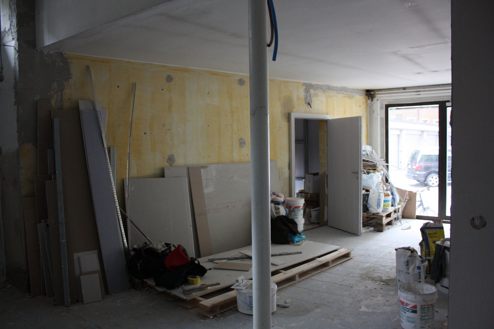
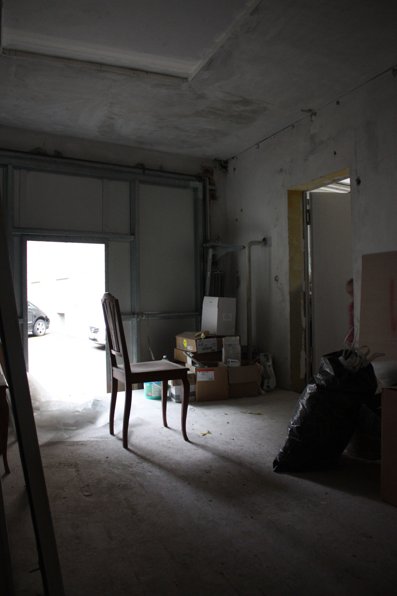

+++
title = "Ein Ruf aus dem Atelier"
date = "2015-11-25"
description = "Früh entstand der Wunsch nebst Kaffee, Coworker an Büroarbeitsplätzen auch Künstler und Handwerker zu vereinen. Der Austausch soll über Berufsgrenzen hinaus stattfinden und Vernetzung entstehen lassen."
image = "atelier.jpg"
authors = [ "Graziella Bärtsch" ]
comments = true
tags = [ "Coworking", "Atelier" ]
+++

Früh entstand der Wunsch nebst Kaffee, Coworker an Büroarbeitsplätzen auch Künstler und Handwerker zu vereinen.

Der Austausch soll über Berufsgrenzen hinaus stattfinden und Vernetzung entstehen lassen. Dies ergibt neue Möglichkeiten und eine breite Palette neuer Gedanken.

Kreative und Musische treffen auf Strategen und Finanzgenies....

Eine Bildschirmpause kann gut im Atelier erfolgen.

Es soll bewusst Raum entstehen für Kunst und Handwerk. Die Anwesenheit von Künstlern und Handwerkern ist sehr wohltuend und sehr wertvoll. Ihre Arbeit hat etwas Schöpferisches und holt die virtuelle und kopflastige Welt zurück in das Fassbare.
Im hintersten Teil des Effingers haben sich schon drei Kreativlinge eingenistet, zumindest virtuell.

Eingezogen ist im Atelier zwar noch niemand, aber sobald wie möglich, wird das der Fall sein. Auf einigen Quadratmeter richten wir unsere Arbeitsplätze ein, die uns neben der Arbeit am Computer auch erlauben sollen, Ideen zu entwickeln, Gedrucktes auszubreiten, Moodboards aufzuhängen, Modelle zu bauen und Objekte zu gestalten.

## Werkstatt

Die angrenzende Werkstatt bietet die Möglichkeit auch sofort Hand anzulegen.

Es entsteht Neues und Altes wird aufgefrischt oder verändert.
Wir mögen den Austausch über Krimskrams, gute Ausstellungen und schöne Bücher. Und das beste kommt noch: Wir haben noch Platz frei!

Melde dich bei [coworking@effinger.ch](mailto:coworking@effinger.ch) oder sag es weiter.