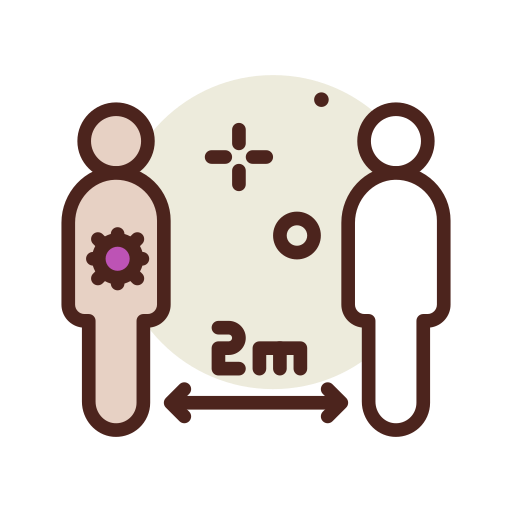
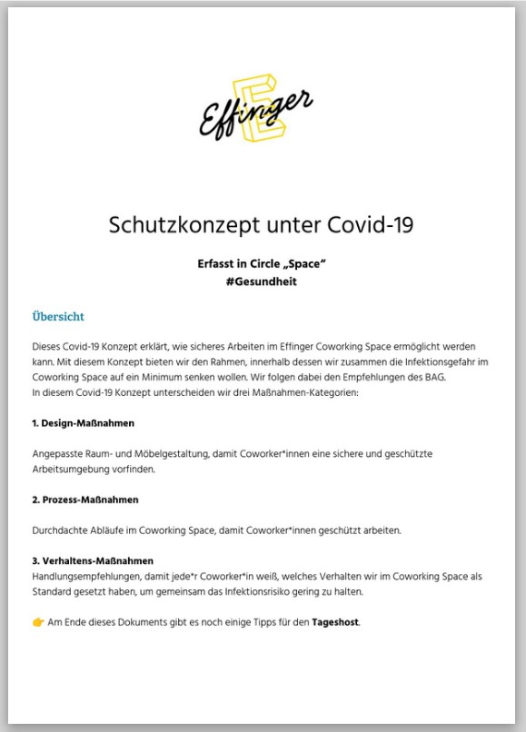

+++
title = "Sicher mit Abstand"
date = "2020-09-11"
description = "Wir senken zusammen die Infektionsgefahr im Coworking Space auf ein Minimum und folgen Empfehlungen von Public Health"
image = "headline.png"
authors = [ "Oleg Lavrovsky" ]
comments = true
tags = [ "Gesundheit" ]
+++

Seit Februar haben wir besorgt für die Gesundheit unseren Coworkers und Tagesgäste eine Reihe von Massnahmen entwickelt. Unseres COVID-19 Konzept, erstellt im Circle Space, erklärt wie sicheres Arbeiten im Effinger Coworking Space unterstützt wird. Mit diesem Konzept bieten wir den Rahmen, innerhalb dessen wir zusammen die Infektionsgefahr im Coworking Space auf ein Minimum senken. Wir folgen eng dabei den [Empfehlungen des BAG](https://bag-coronavirus.ch/).

In diesem Covid-19 Konzept unterscheiden wir drei Maßnahmen-Kategorien:

1. **Design**-Maßnahmen,
2. **Prozess**-Maßnahmen,
3. **Verhaltens**-Maßnahmen

Am Ende des Dokuments gibt es noch einige Tipps für den Tageshost. Eine gedrückte Kopie ist immer vorhanden bei Fragen, und wir haben diverse ausgedrückte Hinweise im Haus und in unsere Prozesse eingebaut.

Bei Fragen oder Kommentaren, wendet euch bitte auf uns in der Kanal #Gesundheit auf Slack oder einfach per [Kontaktformular](/kontakt).

### [Herunterladen](Schutzkonzept_Effinger_V3.pdf) (PDF)

Icons by <a href="https://www.flaticon.com/authors/darius-dan" title="Darius Dan">Darius Dan</a> from <a href="https://www.flaticon.com/">Flaticon</a>.
