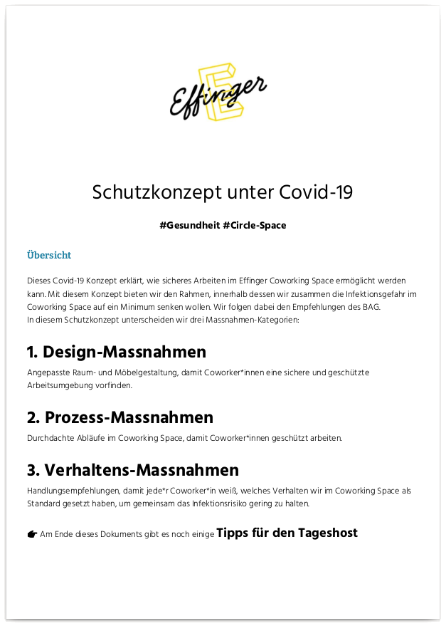
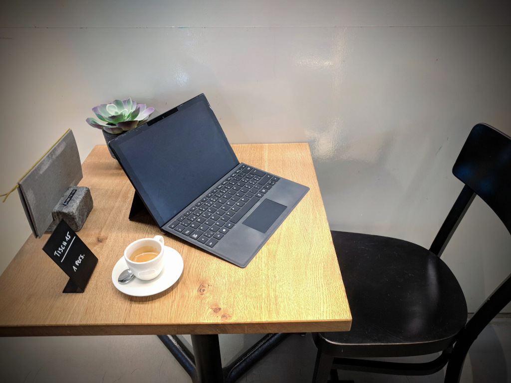

+++
title = "Sicher mit Abstand"
date = "2020-09-11"
description = "Wir senken zusammen die Infektionsgefahr im Coworking Space auf ein Minimum und folgen Empfehlungen von Public Health"
image = "headline.png"
authors = [ "Circle Space" ]
comments = true
tags = [ "Coworking", "Gesundheit" ]
+++

Seit Februar haben wir besorgt für die Gesundheit unserer Coworker und Tagesgäste eine Reihe von Massnahmen entwickelt. Unser Covid-19 Konzept, welches im Circle Space erstellt wurde, erklärt, wie Arbeiten im Effinger Coworking Space ist sicherstellt. Mit diesem Konzept bieten wir eine Struktur an, mit welcher wir zusammen die Infektionsgefahr im Coworking Space auf ein Minimum senken. Wir folgen dabei eng den [Empfehlungen des BAG](https://bag-coronavirus.ch/).

### [Herunterladen](Schutzkonzept_Effinger.pdf) (PDF)

Im Schutzkonzept unterscheiden wir drei Maßnahmen-Kategorien:

1. **Design**-Massnahmen,
2. **Prozess**-Massnahmen, und
3. **Verhaltens**-Massnahmen

Besonders zu beachten sind aktuelle empfohlene Begrenzungen in die Räume:

| Raum | Maximale Personenbelegung |
|------|---------------------------|
| Aquarium | 6-7 Arbeits/Sitzplätze * |
| Atelier | 4-5 Arbeitsplätze * |
| Monbijou | 2 Arbeits/Sitzplätze |
| Pläfe | 6 Arbeits/Sitzplätze |
| Matte | 8 Arbeits/Sitzplätze |
| Rosengarten | 6 Arbeits/Sitzplätze |
| Gr. Schanze | 4 Fixarbeitsplätze   8-10 Arbeits/Sitzplätze * |
| Kl. Schanze | 10-15 Sitz-& Stehplätze |
| Labor | 4 Fixarbeitsplätze |

_* je nach Platzierung_

Am Ende dieses Dokuments gibt es noch einige Tipps für den Tageshost. Eine ausgedruckte Kopie ist immer vorhanden für allfällige Fragen, zudem haben wir diverse Hygiene-Hinweise im Haus angebracht und neues Material in unsere Prozesse eingebaut.

Bei Fragen oder Kommentaren, könnt ihr uns im Kanal `#gesundheit` auf Slack oder einfach per [Kontaktformular](/kontakt) erreichen.

_Danke für ihre Aufmerksamkeit_ 🌼

