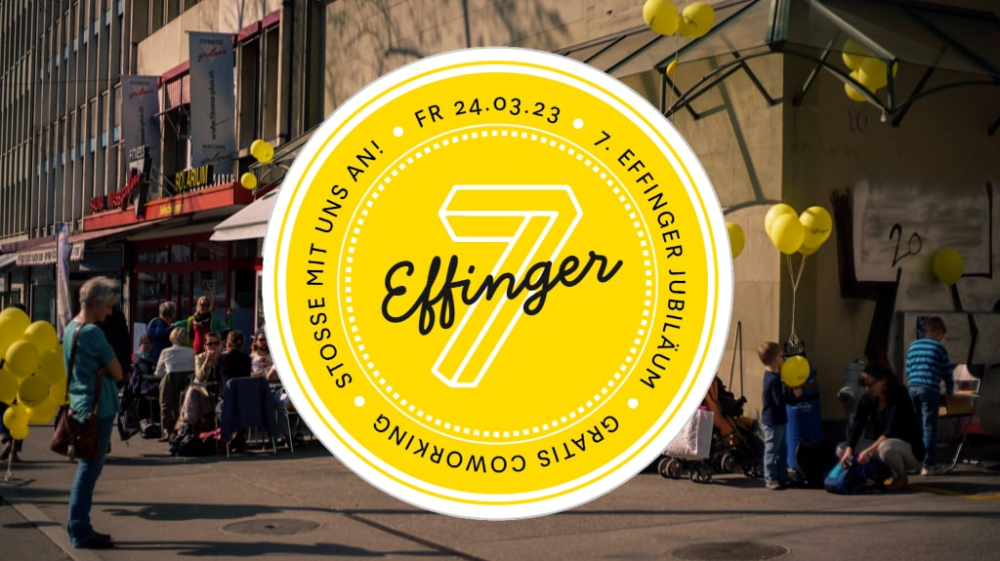

+++
title = "Sieben Jahre Effinger – Ein Rückblick und ein Fest"
date = "2023-02-20"
draft = false
image = "effinger-eroeffnung.jpg"
description = "In Kürze gibt es uns bereits seit 7 Jahren. Wir blicken zurück auf die Höhepunkte des vergangenen Jahres und voraus auf unser Jubiläumsfest am 24. März 2023."
authors = ["Jrene Rolli", "Stefan Niederhauser"]
comments = true
aliases = ["/7-jahre"]
+++

In Kürze gibt es uns bereits seit 7 Jahren. Allein im vergangenen Jahr ist viel Neues passiert:

* [Eröffnung des 2. OG ](/blog/teamplaetze/)mit Wohnzimmer, grosser Gemeinschaftsküche, Kunst-Atelier, zusätzlichen Coworking-Plätzen und als Ort für Events
* [Das Effinger Kunstfestival mit 24 Künstler:innen](/blog/effinger-kunstfestival/) sorgte für ein volles Haus
* Gründung des [Lernunternehmens Pilzfarm](http://pilzfarm.be)
* Ukraine-Flüchtlinge erhalten Coworkingpässe zu Solipreis
* [Kochgruppe von 8 Coworker:innen](https://www.linkedin.com/posts/herrbuerli_experiment-bedarfswirtschaft-activity-6960838902668533760-z8LL/), zweimal pro Woche, ohne Geldfluss
* [Brownbag Sessions](http://brownbag.effinger.ch), zum Beispiel zum Thema «Einfache Sprache» 
* Rekordverkauf von Coworking-Tagespässen im November
* Update unserer [soziokratischen Organisationform mit neuen «Circles»](/circles/)
* [Unsere Finanzen](/finanzen/) erholen sich nach Pandemie-Durststrecke

Hinter alledem stecken viele Stunden, die unsere [Community-Member](/community) ehrenamtlich leisten. Sei dies, damit auf der Website immer die neusten Informationen stehen, das 2. OG so hübsch und praktisch eingerichtet ist, aber auch für ganz viele weitere Dinge im Hintergrund wie Hosting, Finanzen etc.

Wir sind unendlich dankbar und stolz auf all das, was in den vergangenen sieben Jahren zusammen entstanden ist. Das wollen wir feiern und laden alle Community-Member, Kaffeebar-Besucher:innen, Coworker:innen und Neugierigen ein zu unserem 

### **[Jubiläumsfest am Freitag, 24. März 2023 im Effinger, 14:00 – 23:00](/fest)**

<a href="/fest" class="btn btn-mod btn-round  btn-small">Programm anschauen <i class="fa fa-angle-right"></i></a>

    

### Werde Community-Member und gestalte den Effinger mit

Ehrenamtliches Engagement und die Membership-Beiträge sind wichtige Säulen für unser stabiles Bestehen. Mit einer Membership setzt du ein Zeichen, dass es einen Ort wie den Effinger in Bern auch zukünftig braucht. Und du kannst ihn mitgestalten. Zum Beispiel kannst du als Community-Member im 2. OG öffentliche Events veranstalten und vieles mehr. Aber schau selbst:

  

    

      

        

          

            
          

          

            Folgendes gehört zur Membership
          

          <ul class="sf-list pr-list">
            <li>&frac12; Tag Coworking pro Monat</li>
            <li>Online-Community auf Slack</li>
            <li>2. OG für öffentliche Veranstaltungen nutzen</li>
            <li>Teilnahme am monatlichen Community-Treffen</li>
            <li>Community-Events besuchen (Filmabende, Konzerte, Apéros …)</li>
            <li>Mehr Mitgestaltungsmöglichkeiten</li>
            <li>Vereinsmitgliedschaft</li>
          </ul>
          <a href="/community/member-werden/" class="btn btn-mod btn-round btn-small">Als Member anmelden <i class="fa fa-angle-right"></i></a>
        

      

    

  

