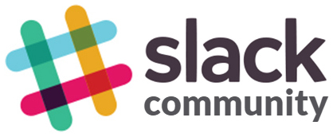
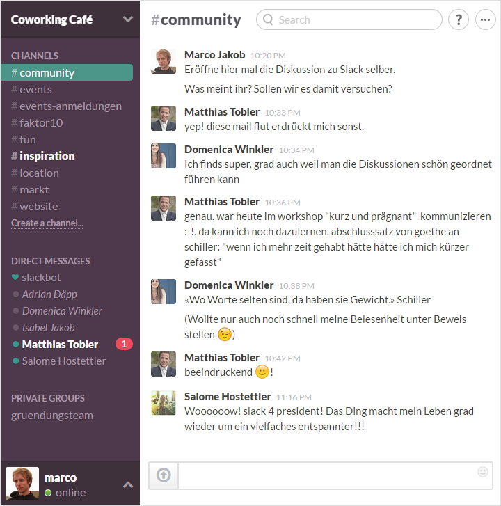

+++
title = "Slack-Community"
date = "2015-01-02"
description = "Ja, wir wünschen uns einen Coworking Space mit Café/Bar. Aber es geht um weit mehr als um ein Gebäude mit Arbeitstischen und Kaffeetassen. Es geht um Menschen und Beziehungen. Slack bietet uns dazu ganz neue Möglichkeiten für den Austausch."
image = "slack-community.jpg"
author = "Marco Jakob"
comments = "popupcoworking"
tags = [ "Community" ]
+++

Ja, wir wünschen uns einen Coworking Space mit Café/Bar. Aber es geht um weit mehr als um ein Gebäude mit Arbeitstischen und Kaffeetassen.

> Wir träumen von einer Community, in der innovative und kreative Menschen ihre Ideen und Visionen in Firmen und soziale Aktionen umsetzen.

Alleine etwas umzusetzen ist schwierig und macht einfach wenig Spass. Wir wollen gemeinsam Erfolge feiern können! 

## Community

Damit eine solche Community entstehen kann, braucht es Möglichkeiten für Begegnung und Kommunikation.

Über diesen Blog und den Newsletter können wir zwar einige Leute erreichen, aber es bleibt mehrheitlich bei einseitiger Kommunikation. Wir möchten aber, dass **Dialoge** entstehen können, nicht nur mit uns Initianten, sondern vor allem auch **zwischen beliebigen Personen in der Community**.

## Slack

Wir haben einige Wochen lang Slack getestet und dabei zu viert bereits über 1'000 Nachrichten verschickt! Wir sind begeistert davon und denken, dass Slack ganz neue Möglichkeiten bietet für den Austausch.

Hier ein Einblick, wie Slack bei uns aussieht:

Auf der linken Seite sieht man die *Channels* (Diskussionskanäle). Wenn in einem Channel neue Nachrichten vorhanden sind, wird der Channel hervorgehoben. Sobald mich jemand mit Namen anspricht oder mir eine Direktnachricht schickt, erscheint eine rote Nummer und ich erhalte nach einer Weile ein Mail, wenn ich nicht reagiere. So verpasse ich keine Nachrichten, die direkt an mich gerichtet sind.

Slack braucht übrigens keine Installation. Man kann es bequem über den Browser oder über iOS/Android Apps aufrufen. 

## Worüber wird geredet

Auf Slack reden wir einerseits über Dinge, die das Projekt *Coworking und Café/Bar* betreffen. Andererseits geht es generell um den Austausch über Inspirierendes zu Coworking, über Events, über Teilen von Wissen, Zeit und Ressourcen.

Hier ist eine Liste der Channels und was darin diskutiert wird:

* **#community:** In diesem Channel werden alle automatisch hinzugefügt. Er ist für die allgemeine Kommunikation innerhalb der gesamten Slack-Community. Hier können ausserdem neue Mitglider begrüsst werden.
* **#events:** Über Pop-up Coworking, Diskussionsabende und andere Events und Meetings.
* **#events-anmeldungen:** Wenn sich Leute für [Events](/events/) an- oder abmelden, erscheint in diesem Channel automatisch eine Nachricht (natürlich ohne E-Mail-Adresse).
* **#faktor10:** Hier geht es darum, Know-how, Ressourcen und Zeit anderen zur Verfügung zu stellen. Der Name *Faktor10* stammt daher, dass wir versuchen, 10 Prozent unserer Arbeitszeit in andere zu investieren.
* **#fun:** Ein Ort für Links, spannende und lustige Artikel, Humor oder sonst irgendwelche Themen, die nirgendwo reinpassen.
* **#inspiration:** Inspirierendes Artikel und Gedanken zu den Themen Coworking, Gastronomie, Entrepreneurship und Community.
* **#location:** Hier geht es um News über mögliche Orte für Coworking mit Café/Bar in Bern.
* **#markt:** In diesem Channel können Aufträge und Jobs angeboten und gesucht werden.
* **#website:** Diskussionen über diese Website.

Man kann bei den Channels beitreten, die einem interessieren und dort mitreden.

Neben den Channels kann man **eigene private Gruppen** erstellen mit ausgewählten Personen oder **private Direktnachrichten** an eine einzelne Person senden. 

## Mitglied werden

Damit echter Austausch stattfinden kann, wollen wir die Slack-Community im Moment eher lokal und überschaubar halten. Deshalb kann es sein, dass wir die Teilnehmerzahl irgendwann beschränken.

Wenn du zur Community beitragen möchtest und Mitglied werden willst, komm persönlich auf uns zu. Dann können wir dich gleich anmelden und kurz einführen.

## Kosten

In der Testphase haben wir die Mitgliedschaft in unserer Slack-Community kostenlos gehalten. Neu ist der Zugang zu Slack an eine [Community Membership](/ueber/#community) geknüpft. 

