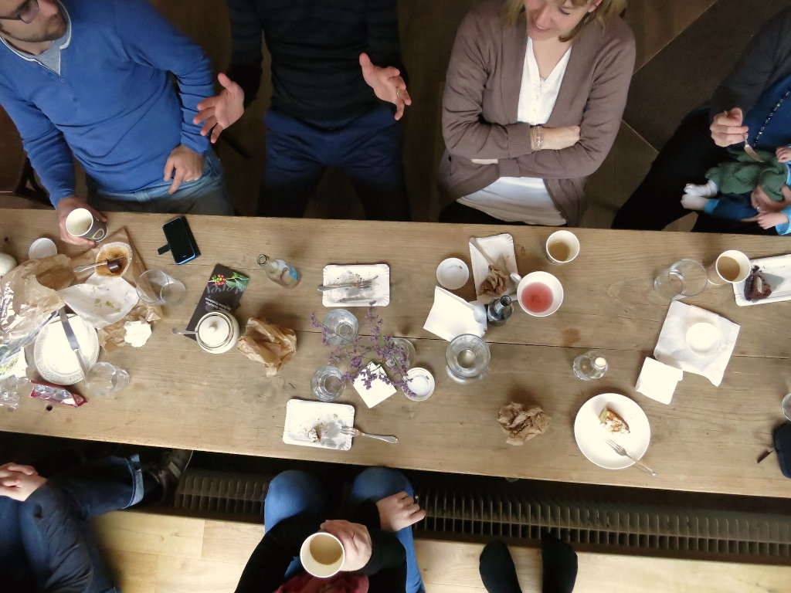
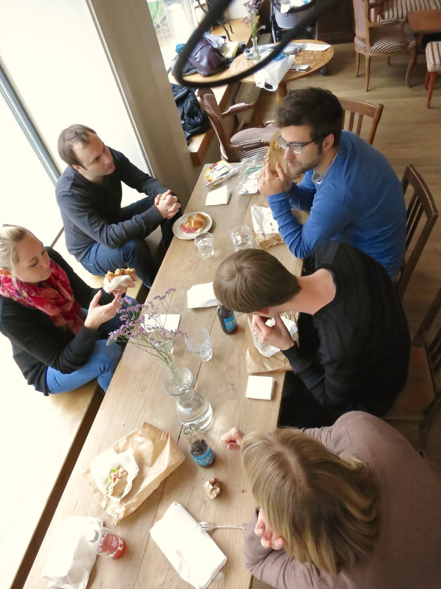
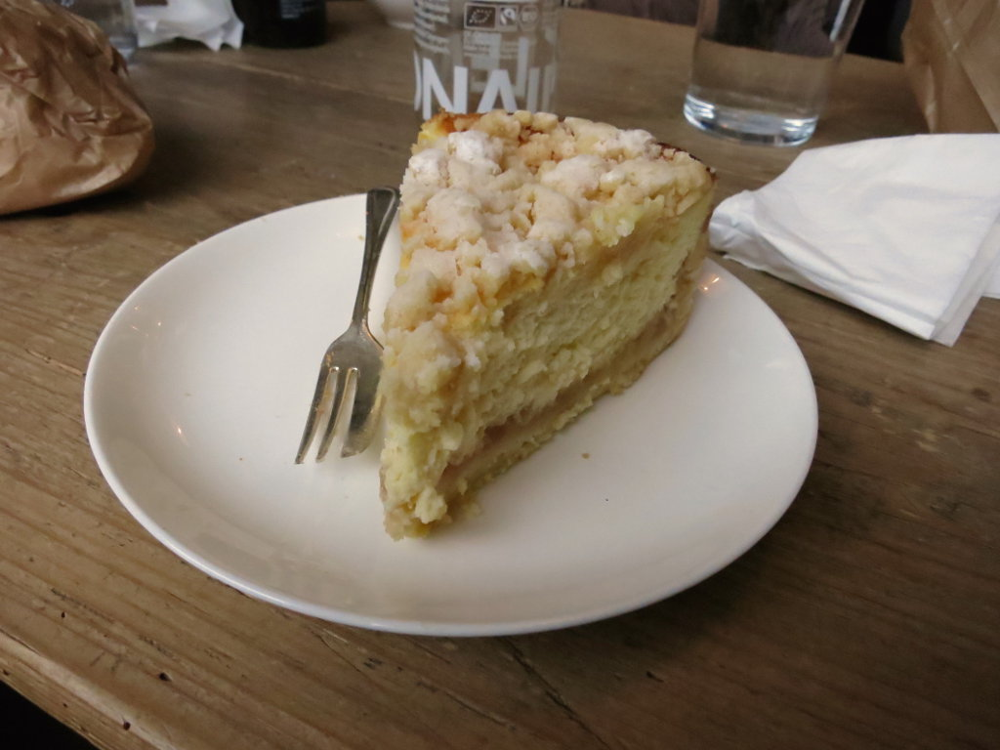
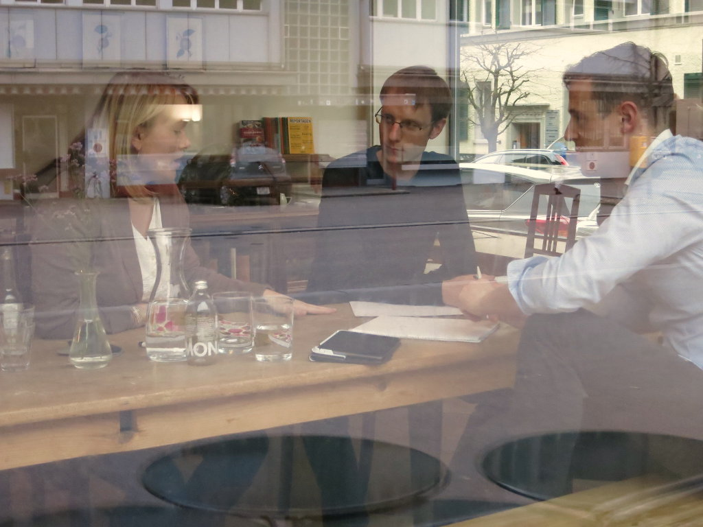

+++
title = "Super-Combo"
date = "2015-01-16"
description = "Wieder haben wir einen tollen Coworking Freitag erlebt. Dieser Tag war ein kleiner Vorgeschmack auf das, was wir in Zukunft im Coworking Space mit Café/Bar erreichen möchten: Die gute Kombination zwischen konzentriertem Arbeiten und gemütlichem, gemeinsamen Mittagessen."
image = "mittagessen.jpg"
authors = [ "Domenica Winkler" ]
comments = "popupcoworking"
tags = [ "Coworking" ]
+++

Wieder haben wir einen tollen Coworking Freitag erlebt. Dieser Tag war ein kleiner Vorgeschmack auf das, was wir in Zukunft im Coworking Space mit Café/Bar erreichen möchten: Die gute Kombination zwischen konzentriertem Arbeiten und gemütlichem, gemeinsamen Mittagessen.

Der Morgen begann mit der Diskussion übers Thema «Transparenz»: Wie transparent wollen wir gegen aussen sein? Welche Infos, Ideen und Pläne wollen wir mit der Community und der Öffentlichkeit teilen? Fazit: ALLES. Wir wollen so transparent und offen wie möglich sein. Es wird ein Experiment und eine Herausforderung, denn wir Schweizer sind doch eher geübt im «Kleinkariert-Sein» und «Ich behalt meine Idee schön für mich, nicht dass sie jemand noch klaut». Doch wir möchten ja auf ganz viele verschiedenen Arten neue Wege gehen. Voilà. Wenn dich also etwas brennend interessiert, du dich bis jetzt aber - aus welchen Gründen auch immer - nicht getraut hast zu fragen: Trau dich!

Nachdem unsere Köpfe schon fast zu rauchen begannen, entschieden wir uns, unsere prähistorischen Instinkte für die Jagd nach einem Mittagessen einzusetzen. Wir waren ziemlich erfolgreich und genossen unsere Beute alle zusammen an einem grossen Tisch. Das war echt toll. Beim gemütlichen Essen erfährt man persönliches von den anderen Coworkern und lernt sich so besser kennen. Wie üblich ist die Mittagspause zu schnell vorbei und es geht weiter. Der Nachmittag verging auch wie im Flug.

Mir gefiel an diesem Tag besonders, dass wir den ganzen Tag zusammen waren, über geschäftliches, aber auch persönliches gesprochen haben, dass sich Arbeiten und Pausen abgewechselt haben und das alles an einem Ort. Es hat sich also gezeigt: Coworking und Gastronomie ist die Super-Combo!

Ich bin echt begeistert vom Coworking und die Vorfreude auf den eigenen Coworking Space mit Café/Bar wächst von Tag zu Tag.

