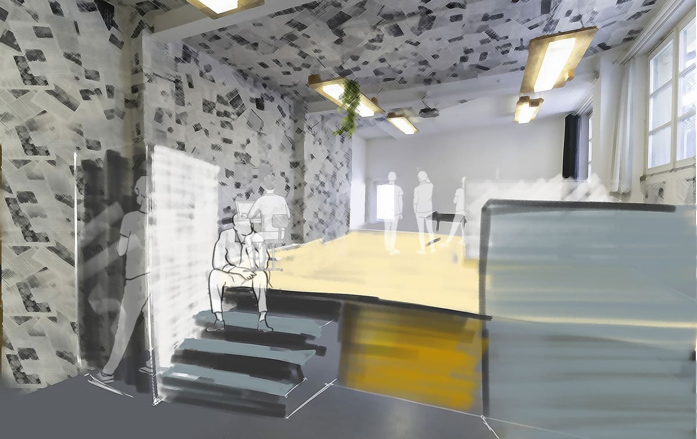
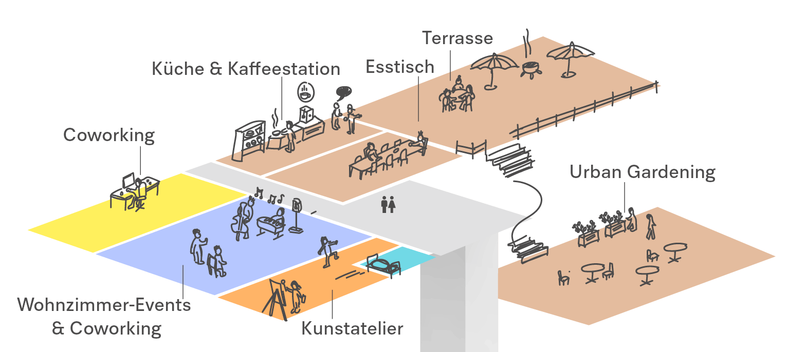
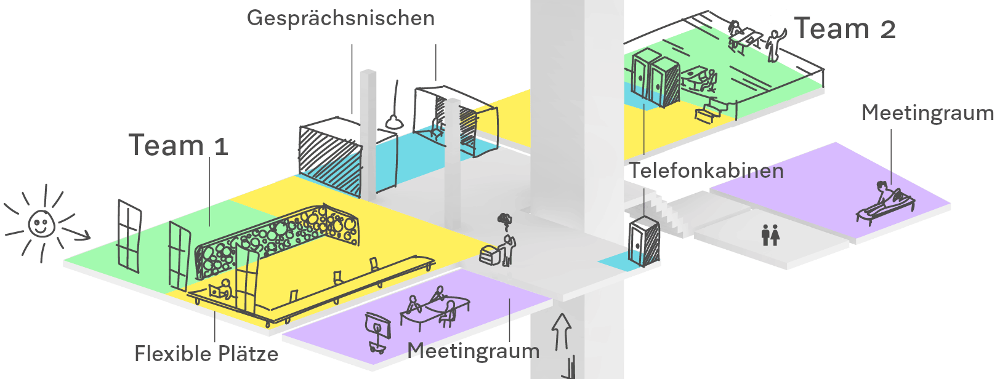

+++
title = "Neue Teamplätze im Effinger"
date = "2022-03-25"
draft = false
tags = [ "Coworking", "Community", "Kunst" ]
image = "teamplatz-matte-visualisierung.jpg"
description = "Dank der Expansion in ein weiteres Stockwerk können wir im Effinger neu Team-Arbeitsplätze anbieten."
authors = ["Fabian Steiner", "Domenica Hitz", "Marco Jakob", "Reto Eberhard" ]
comments = true
+++

Der Effinger erhält ein Upgrade: wir können das 2. OG neu zum Coworking Space dazumieten und nach unseren Vorstellungen bespielen. Durch die zusätzliche Fläche gibts Raum für neue Ideen und Konzepte.

Nach 6 Jahren werden wir zum 1. Mal **Team-Arbeitsplätze** anbieten. Hast du ein kleines Startup, das wächst und deshalb brauchst du mehr Platz? Willst du mit deinem Team aus deinen jetzigen Büroräumlichkeiten raus? Oder sind alle deine Mitarbeiter*innen im Homeoffice aber einmal pro Woche möchtet ihr euch als ganzes Team für einen Tag treffen?

Da haben wir für dich spannende Angebote. Ganz Effinger-like ist vieles bei uns möglich. Wir haben nun Platz für 2 Teams mit 2-8 Personen, die gerne in den Effinger ziehen möchten.

Hier ein paar Aspekte, für alles weitere melde dich bei uns, wir können vieles diskutieren.

- Ein **fixer Bereich für dein Team** von 4-8 Mitarbeitenden gibt es ab ca. CHF 2'000 im Monat.
- **Übertragbare Arbeitsplätze** im Coworking Space können für Teamtage flexibel gebucht werden.
- Fix und Flex können kombiniert werden.
- Meetingräume in verschiedenen Grössen können stundenweise oder in einem Meeting-Paket dazugebucht werden.
- Im neuen 2. OG gibt's eine grosse Küche mit Esszimmer, das frei genutzt werden kann.
- Kaffee a gogo in den zwei Selbstbedienungsstationen
- Telefonboxen und Zweier-Meeting Boxen zur freien Verfügung auf ‘fair use’-Basis
- Podcast und Filmstudio im 2. UG zum Mieten
- Druckkosten auf ‘fair use’-Basis inklusive
- 2 Terrassen, die frei zugänglich sind und für ein Mittagessen oder Feierabendbier genutzt werden können.
- Dusche im 2. OG frei zugänglich
- dynamische Community mit regem Austausch zwischen Generationen und Berufen
- Coworker*innen in den Bereichen Finanzen, Grafik, Webentwicklung, Farbgestaltung, Kunst, Branding, Game, Holz-Handwerk, Bildung, Film und Foto, Politik im Haus. Wir freuen uns über eine Erweiterung der Berufsfelder.
- Eine eigene Pilzfarm im Keller und vieles mehr.

👉 Bist du interessiert? Dann melde dich bei Marco, [marco@effinger.ch](mailto:marco@effinger.ch) und vereinbare einen Besichtigungs- und Besprechungstermin.

**Bewerbungsfrist**: 14. April 2022 für fixe Teamplätze\
**Einzugstermin**: 1. Juni 2022 für fixe Teamplätze, Flex ab sofort
