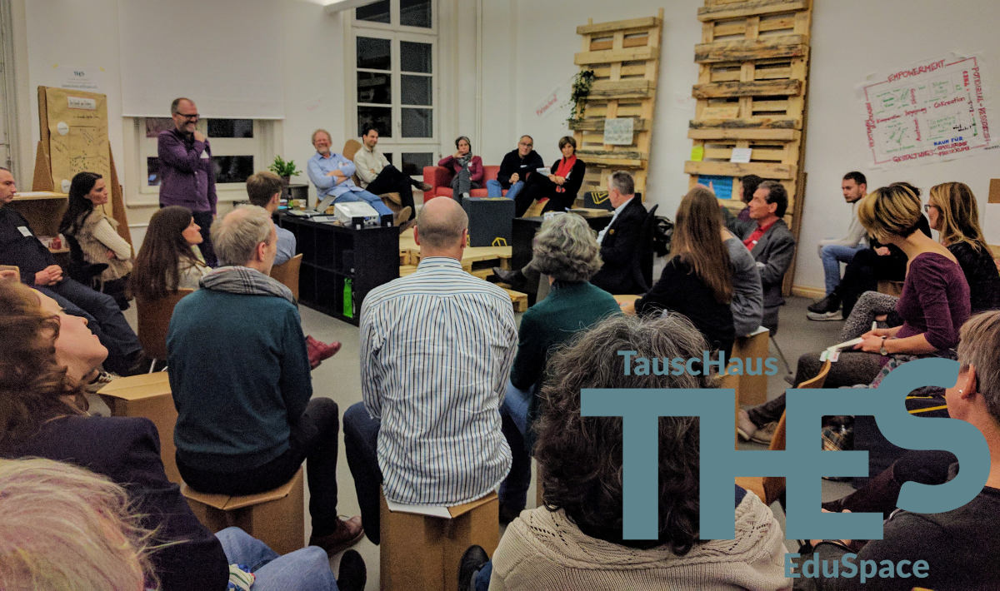
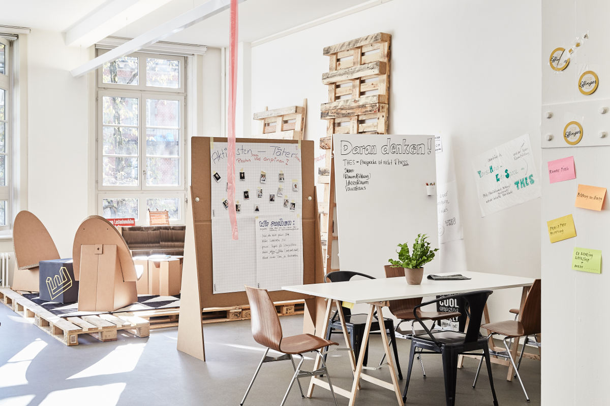

+++
title = "THES im Effinger"
date = "2016-11-28"
description = "Über 70 Bildungsinteressierte haben im Effinger im ersten Stock auf den Start vom TauscHaus/EduSpace angestossen."
image = "thes-eroeffnung.jpg"
author = "Marco Jakob"
comments = true
tags = [ "Coworking", "Colearning" ]
draft = true
+++

  Wow, das war eine Eröffnungsparty! Über 70 Bildungsinteressierte haben im Effinger im ersten Stock auf den Start vom TauscHaus/EduSpace angestossen.

## Was ist THES?

THES bedeutet TauscHaus/EduSpace. Es ist ein offener Raum, wo sich Menschen treffen, die miteinander in der Bildung etwas bewegen wollen.

Der THES ist eingebettet im Effinger - ganz bewusst an einem schul-neutralen Ort. So wird er zu einem Treffpunkt, wo man Bildung hinterfragen darf, sie weiterentwickelt und mit neuen Formen experimentiert. Dafür kommen ganz unterschiedliche Menschen zusammen und werden sich gegenseitig inspirieren und zum Handeln motivieren.

## Warum THES im Effinger?

Im April 2016 trafen sich Leute vom heutigen Vorstand von [RaumBildung](http://www.raumbildung.ch/) im Effinger. Sie waren interessiert, etwas über die Hintergründe vom Effinger zu erfahren und so kam es zur ersten Begegnung.

Nach einem Workshop und einigen Gesprächen war klar, dass es in Bern ein Bedürfnis nach einem Ort für Austausch über Bildung gibt. Bildung darf aber nicht zu eng oder losgelöst gedacht werden. Es braucht Austausch und Vernetzung mit Leuten, die gerade nicht aus dem Bildungsbereich kommen und sich auch sonst gewohnt sind, ausserhalb von Normen zu denken. Deshalb war es naheliegend, THES im Effinger anzusiedeln.

Ich freue mich persönlich sehr, dass wir im Effinger durch THES eine ganz grosse Vielfalt hinzugewonnen haben. Die THES Community ist eine enorme Bereicherung für uns! Natürlich freue ich mich auch als Lehrer ganz besonders, dass das Thema Bildung im Effinger stärker verwurzelt wird. Coworking wird erweitert durch Colearning.

## Sei dabei!

Wenn dich das Thema von THES interessiert, du selber mitmachen oder einfach diese Initiative unterstützen willst, dann schau dir unbedingt die [Crowdfunding Kampagne von THES](https://wemakeit.com/projects/thes-cokreationsraeume) an und mache mit!

  <iframe class="embed-responsive-item" src="https://player.vimeo.com/video/190779508" frameborder="0" allowfullscreen></iframe>

*Tipp:* Am besten löst du gleich eine <strong class="text-nowrap"><i class="fa fa-user"></i> THES-Membership <i class="fa fa-user"></i></strong> (bei der Jahresmitgliedschaft über das Crowdfunding werden dir zwei Monate geschenkt). Damit kannst du Coworken im THES, KollegInnen mitnehmen für Diskussionen oder Workshops Rund um Bildung durchführen. Und wenn dir ein Vorstandsmitlied, als Zauberfee verkleidet, deine Wünsche erfüllen soll, dann schnappe dir eine <strong class="text-nowrap"><i class="fa fa-magic"></i> THES-Fördership <i class="fa fa-magic"></i></strong>.

<a href="https://wemakeit.com/projects/thes-cokreationsraeume" class="btn btn-mod btn-medium btn-round mb-10">&rarr; Zur Crowdfunding Kampagne</a>

Weitere Informationen findest du auf [raumbildung.ch](http://www.raumbildung.ch) oder du schaust einfach spontan bei THES im Effinger im ersten Stock vorbei!
