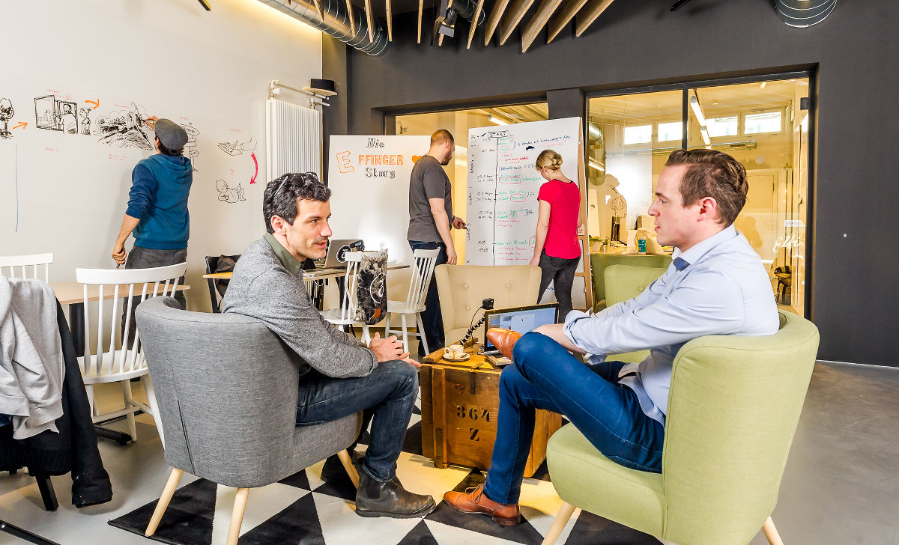
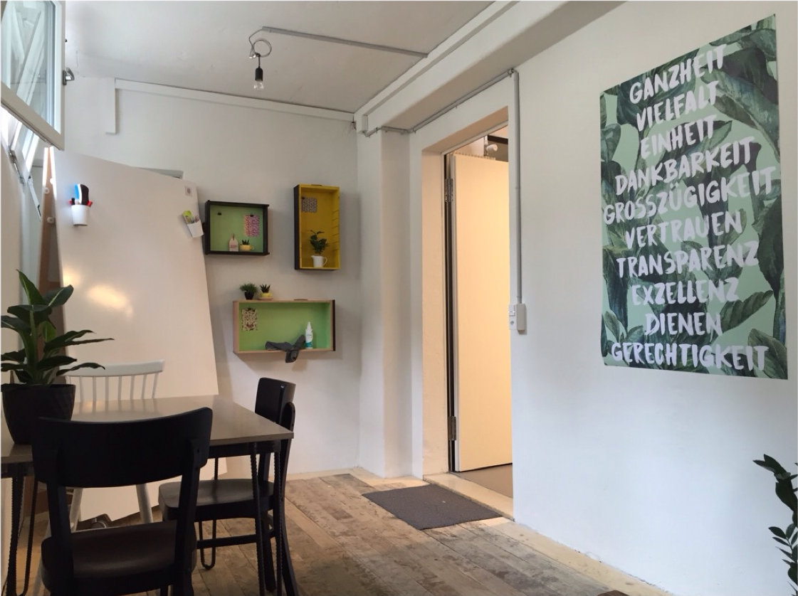

+++
title = "Unser Effinger wird mit Leben gefüllt"
date = "2016-07-19"
description = "Das Projekt Effinger nimmt Fahrt auf. Jeden Monat seit Eröffnung, jede Woche, fast jeden Tag kommen neue Leute dazu, finden mehr Initiativen und Events statt. Unsere Räume füllen sich. Der Space wird so mit einer wachsenden Community bereichert."
image = "coworking.jpg"
authors = [ "Urs Vögeli" ]
comments = true
tags = [ "Coworking", "Community" ]
+++

  Bild:<a href="http://rolandjuker.ch/">Roland Juker</a>

Das Projekt Effinger nimmt Fahrt auf. Jeden Monat seit Eröffnung, jede Woche, fast jeden Tag kommen neue Leute dazu, finden mehr Initiativen und Events statt. Unsere Räume füllen sich. Der Space wird so mit einer wachsenden Community bereichert.

Dass die Kaffeebar seit Beginn so hervorragend läuft, ist nicht selbstverständlich, aber Realität. Erfreulich ist ebenfalls, dass unser Workshopraum rege intern und von Externen genutzt wird, was auch finanziell Luft schafft. Inzwischen fühlt sich jedoch trotz Sommerferien auch unser Coworking-Bereich immer voller an. Fast täglich erscheinen neue Jungunternehmer, Kreative und Weltverbesserer, um hier zu arbeiten. Es entstehen Kontakte und Gespräche. Es beginnt zu leben. Dasselbe gilt für das Atelier, wo besonders Künstler, Designer und Handwerker willkommen sind. Für mich ist es enorm bereichernd, dass bei uns so viele verschiedene Leute, Berufe und Branchen eine Heimat finden können. Als Politikberater und Sozialwissenschaftler ist es sehr inspirierend – und auch gar nicht akustisch störend-, dass im Rücken gleich Handwerker und Künstler handfest an ihren Werken arbeiten. Als Tüpfchen auf dem i ist inzwischen noch der hinterste Raum im Space und der Werkstattbereich fertig geworden und eingerichtet. Die Vielfalt an Arbeits- und Gestaltungsmöglichkeiten ist somit mit den vorhandenen Mitteln und Räumen komplettiert.

  Der kleinste Raum im Effinger ist eingerichtet. Er wird vor allem für Telefongespräche und kleinere Besprechungen gebraucht.

Was vielleicht bisher noch wenig an die Öffentlichkeit gelangt ist, ist auch die Zunahme an Community-Aktivitäten. Es finden inzwischen regelmässig Workshops, Diskussionsabende, Filmabende, Community-Treffen, Ping-Pong-Spiele, Aare-Schwimmen am Mittag, gemeinsame Mittagessen und Feste statt. Schon diesen Monat kann man am 25. Juli an einer [Lesung](/events/2016/100067/) teilnehmen, oder man kommt bei Interesse einfach am 4. August an unser nächstes [Community-Treffen](/events/100060/). In der Kaffeebar beehrt uns am 29. August zudem ein Liedermacher mit seiner Musik. Über das eher lockere Zusammensein entsteht auch Neues, Zusammenarbeit und Freundschaften, interessante Diskussionen und eben Gemeinschaft. Und dies ist gerade unsere Identität als Effinger Kaffeebar und Coworking: Wir wollen keine Infrastruktur sein, sondern eine Community, wo Kreativität und Innovation, Unternehmertum und soziale Initiativen entstehen und wachsen können.
