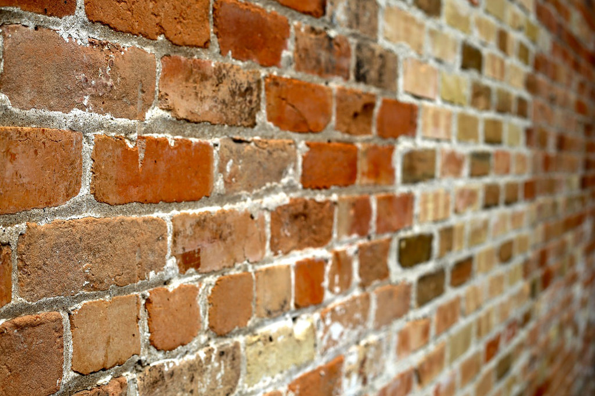
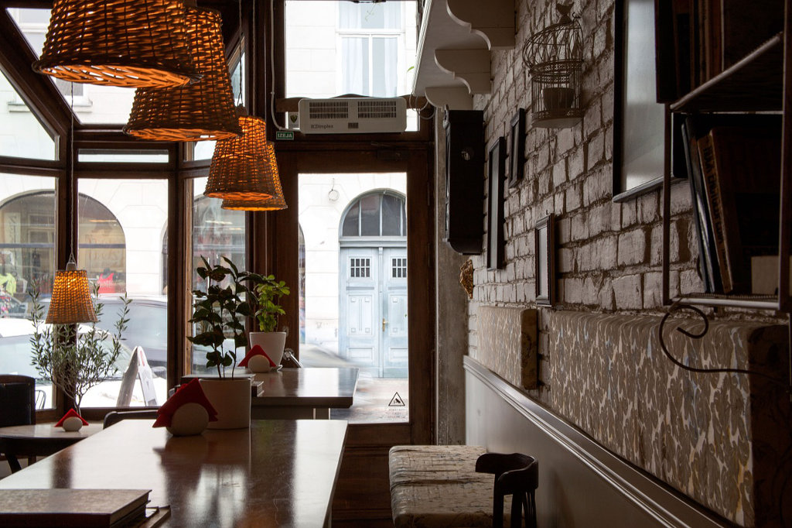
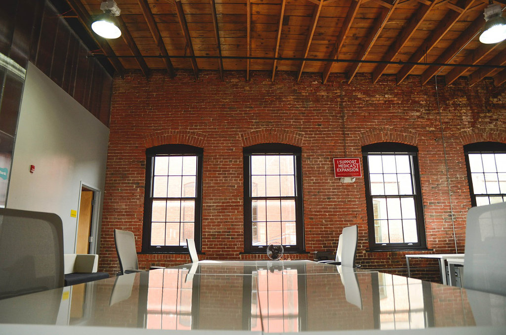
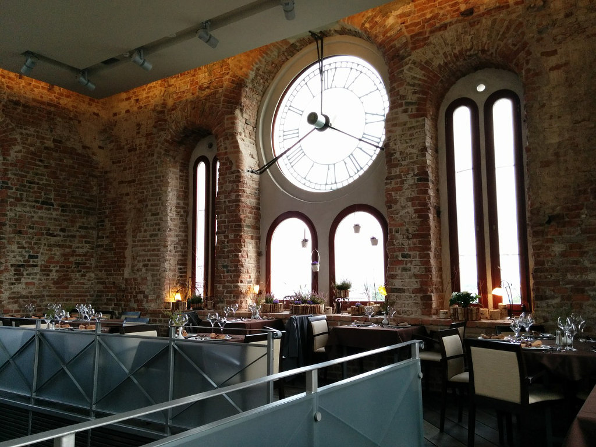

+++
title = "Urbaner Backstein-Chic"
date = "2015-01-12"
description = "Seit wir uns für die Location an der schönen Effingerstrasse beworben haben, schwirren meine Gedanken rund um die Frage: Wie soll die Inneneinrichtung dieser Räume aussehen?"
image = "wall-of-bricks.jpg"
author = "Domenica Winkler"
comments = "popupcoworking"
tags = [ "Einrichtung" ]
+++

Seit wir uns für die Location an der schönen Effingerstrasse beworben haben, schwirren meine Gedanken rund um die Frage: Wie soll die Inneneinrichtung dieser Räume aussehen?

Seit Anfang der Planung eines eigenen Cafés träume ich von einer Backstein-Wand. Der Charme und das Flair, das Backsteine ausstrahlen, ist einfach unübertroffen. Wenn man nicht das Vorrecht hat in einer tollen, alten Location zu sein, gibts ja zum Glück die Möglichkeit eine solche Wand nachträglich einzubauen.

Weitere «must’s» für mich: dreibeinige Tische (damit die nicht immer kippeln), eine italienische Kaffeemaschine, schönes, warmes Licht und bequeme Stühle. Und noch etwas, was ich auf keinen Fall will: IKEA Geschirr.

Was ist für dich ein absolutes Muss in einem Café/Bar oder einem Coworking Space? Schreib es unten in die Kommentarfunktion.

A propos: Über das Design der Räume werden wir auch am nächsten [«How-the-heck» Abend](/events/AvjyGh7Lo0/), Donnerstag 29. Januar, diskutieren. Es gibt auf dem Gebiet des Bürodesigns und der innovativen Lern- und Arbeitsumgebung ganz tolle Ideen und Konzepte. Wenn du dich dafür interessierst, dann solltest du den nächsten «How-the-heck» Abend auf keinen Fall verpassen.

