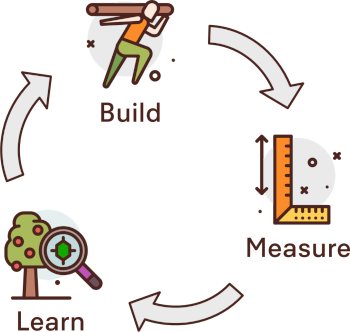

+++
title = "Vom Krisen- zum Innovationsmodus"
date = "2020-05-01"
description = "Wie kommen wir vom Krisenmodus wieder in unternehmerische Kreativität? Wir schaffen einen Schutzraum für Experimente, wo Ideen sehr schnell zur Umsetzung gebracht werden können."
image = "innovationsmodus.png"
authors = [ "Marco Jakob" ]
comments = true
tags = [ "Gemeinsamständig", "Community", "Coworking" ]
+++

Ein Virus fegt über die Welt und plötzlich funktionieren ganz viele Geschäftsmodelle nicht mehr. Wir hatten schon einige Wochen Zeit, um dem nachzutrauern, was vorher so gut eingespielt war. Jetzt gilt es wieder aufzustehen, dankbar zu sein für das viele, was immer noch da ist und die Lust am Kreativen und Unternehmerischen wieder zu entdecken.

## Neue Ideen

Im Effinger sind unsere Geschäftsmodelle auf verschiedenen Ebenen betroffen: Kaffeebar, Coworking, Raumvermietung und natürlich ganz viele Personen in der Community mit ihrer eigenen Arbeit. Auch wenn wir vielleicht in den nächsten Wochen wieder schrittweise öffnen können, wird es nicht oder nicht so schnell wieder sein wie vorher. Mehr Abstand bedeutet weniger Personen und weniger Umsatz. Der Aufwand bleibt aber vielleicht gleich oder wird sogar höher wegen den zusätzlichen Massnahmen.

Das ist die Herausforderung vieler Betriebe - speziell in Gastronomie und Tourismus: Das gleiche Geschäftsmodell einfach in reduzierter Form heisst, dass es in zahlreichen Bereichen finanziell nicht mehr aufgehen wird.

Ich finde, das können wir besser, kreativer und unternehmerischer. Es kann sein, dass sich in der Krise plötzlich ganz andere Möglichkeiten auftun. Zumindest haben wir uns in den letzten Wochen doch erhofft, nicht in jedem Bereich wieder in das Vorherige zurückzufallen. Also kann es nicht schaden, den Zeitpunkt zu nutzen und auch unkonventionelle Alternativen zu prüfen.

**⇒ Was wir brauchen sind neue Ideen!**

## Hohe Dynamik

Eine Idee allein reicht jedoch nicht. Denn Woche für Woche sind wir in der Krise überrascht, was um uns herum passiert. Das könnte noch eine Weile so weitergehen. Das heisst, wir sind umgeben von einer ungewöhnlich hohen Dynamik. Eine Idee, die heute noch funktioniert, muss vielleicht morgen schon geändert werden.

Der Zyklus von Build-Measure-Learn, wie er in «Lean Startups» eingesetzt wird, könnte uns nun helfen.

**⇒ Ideen sehr kurzfristig umsetzen (Build). Während der Umsetzung beobachten, was passiert (Measure). Dann auswerten und entweder verbessern oder aufhören, wenn es nicht funktioniert (Learn).**

## Build-Measure-Learn als Community

Schnell und dezentral als Community Entscheidungen zu fällen ist nicht neu für uns. Unser **Beratungsprozess** hat sich dafür bewährt:

> Beim Beratungsprozess muss die Person, welche eine Entscheidung fällen will, betroffene Kollegen sowie Experten um Rat fragen. So lernt er/sie Einwände, Fragen und Ideen von Kollegen kennen. Nachdem die Person sich offen die Ratschläge angehört hat, fällt diese selbständig eine Entscheidung. Schliesslich wird transparent kommuniziert, was entschieden wurde und welche Personen um Rat gefragt wurden.
> <small>[Effinger Organisation](https://www.effinger.ch/organisation/)</small>

Grosse Entscheide werden normalerweise ins Community-Treffen gebracht. Das ist in hoher Dynamik und in Krisen jedoch zu langsam. Deshalb schlage ich vor, dass wir möglichst viele Entscheide durch den Beratungsprozess laufen lassen. Wenn die Entscheide in der Community transparent kommuniziert werden, so haben auch die Leute noch die Möglichkeit, sich zu melden, die auch betroffen sind, aber die man vielleicht vergessen hat, um Rat zu fragen. Wenn sich nach einem Tag niemand meldet mit einem [«schwerwiegenden Einwand»](https://www.effinger.ch/organisation/soziokratie/), dann kann man davon ausgehen, dass man es umsetzen kann (Build). Wichtig ist, dass die Auswirkungen beobachtet werden (Measure). Dann sollte mindestens **alle zwei Wochen** berichtet, ausgewertet und angepasst werden (Learn). Falls nötig kann ein Experiment durch die Community so auch wieder gestoppt werden.

## Ressourcen-Pool nutzen

Im Effinger und im Umfeld der Community steckt ein reicher Schatz an Ressourcen. Viel davon liegt im Moment brach (Räume, Terrasse, Mobiliar, digitale Tools, Know-How, Arbeitskräfte, Netzwerk, Vertrauen,Geld, Social Media, Reichweite, etc.).

In der aktuellen Krise haben Unternehmer\*innen und Selbständige sehr schnell nach Staatshilfe gerufen. Formulare ausfüllen und abwarten ist natürlich sehr lähmend.

Was es braucht, um die wertvollen Ressourcen zu nutzen, sind neue Ideen und unternehmerischen Mut. Die Bausteine sind vorhanden, wir müssen sie aber nutzen und neu zusammenstellen.

## Schutzraum für Experimente

Man darf nicht erwarten, dass jemand in kürzester Zeit ein komplett ausgeklügeltes Geschäftsmodell entwickelt. Das würde Monate dauern. So viel Zeit haben wir nicht, um Gelegenheiten zu nutzen, die genau jetzt funktionieren, in zwei Wochen aber vielleicht schon nicht mehr. Es bedeutet aber auch, dass einige Fragen nicht im Vornherein geklärt werden können und Fehler passieren werden. Wir werden einander auf die Füsse treten. Ohne geht es gar nicht.

Dabei ist besonders wichtig, dass wir die Personen unterstützen und ermutigen, die etwas wagen. Dafür braucht es einen Schutzraum. Es braucht Grosszügigkeit, Einheit und Vertrauen (siehe auch [unsere Grundsätze](https://www.effinger.ch/grundsaetze/)). Ohne diesen Schutzraum wird niemand bereit sein, sich einzusetzen und etwas zu riskieren. Gleichzeitig muss nach Build und Measure die Learn-Phase genutzt werden, um Dinge wieder in Ordnung zu bringen und Beziehungen zu klären.

## Entschädigung

Im Effinger haben wir eine [10%-Schenkzeit](https://www.corelated.ch/#merkmale), die wir ineinander und in den gemeinsamen Betrieb investieren. Wenn die eingesetzte Zeit diese 10%-Schenkzeit übersteigt, kann man sich und andere bezahlen. Dafür braucht es ein Geschäftsmodell. Das kann in dieser Geschwindigkeit nicht komplett durchdacht sein. Erst in der Umsetzung wird man feststellen können, ob etwas funktioniert oder nicht.

## Woher kommen die Ideen?

Zuerst sollten wir herausfinden, was in dieser Zeit noch läuft und was nicht mehr. Das sollten wir ehrlich kommunizieren, damit die Community auch weiss, wo sie aktiv werden kann. Gleichzeitig können wir den Ressourcen-Pool sichtbar machen. Das heisst, wenn Leute Ressourcen sehen oder selber Ressourcen haben, die nicht genutzt werden, sollten wir einander davon erzählen.

Kreative Unternehmer\*innen werden durch Probleme und freie Ressourcen provoziert. Sie fangen an zu überlegen, was man tun könnte.

Aber für neue Lösungen braucht es Inspiration. In den letzten Wochen ist eine Initiative gestartet, die genau für diese Inspiration sorgen könnte: «Effinger Services». Das sind interdisziplinäre Teams, die speziell für knifflige Probleme zusammengestellt werden. Diese Querdenker und Problemlöser helfen, dass man aus gewohnten Bahnen ausbrechen kann und so unerwartete Ideen entstehen.

> Something about that environment where you have lots of different ideas that are together, different backgrounds, different interests, jostling with each other, bouncing off each other -- that environment is, in fact, the environment that leads to innovation.  
> <small>[Steven Johnson, «Where good ideas come from», TED 2010](https://www.ted.com/talks/steven_johnson_where_good_ideas_come_from)</small>

Aus den Effinger Services werden ungewohnte Gedankenanstösse kommen. Dann können wir dort, wo wir uns begegnen diese Gedanken einander zuspielen bis jemand aufsteht und sagt: «Das setzen wir jetzt um.»

## Ideen müssen raus

Ich werde ermutigen, so viele Ideen wie möglich auf verschiedenen Kanälen zu veröffentlichen. Wir laden auch alle, die möchten, zu unseren [Community-Treffen](https://www.effinger.ch/events/) ein. Die Ideen sollen ruhig auch von anderen Leuten kopiert und weiterentwickelt werden.

Um das auch formell klar auszudrücken gibt es eine schöne Lizenz, die wir an alle veröffentlichten Ideen hängen können ([Creative Commons Attribution ShareAlike](https://creativecommons.org/licenses/by-sa/4.0/)). Das heisst, jede und jeder, der in einer Idee Potenzial sieht, kann sie packen und zur Umsetzung bringen. Das kann entweder im oder auch ausserhalb vom Effinger sein. Wir haben uns in unseren Grundsätzen das Ziel gesetzt, dass wir [Transparenz](https://www.effinger.ch/grundsaetze/transparenz/) als Mittel einsetzen wollen, anderen zu helfen. Gerade in dieser Zeit kann dies ein Beitrag sein, um einer angeschlagenen Gesellschaft [zu dienen](https://www.effinger.ch/grundsaetze/dienen/). Wer hilft mit?

*Marco*   
(Icons by [Darius Dan](https://www.flaticon.com/authors/darius-dan))
