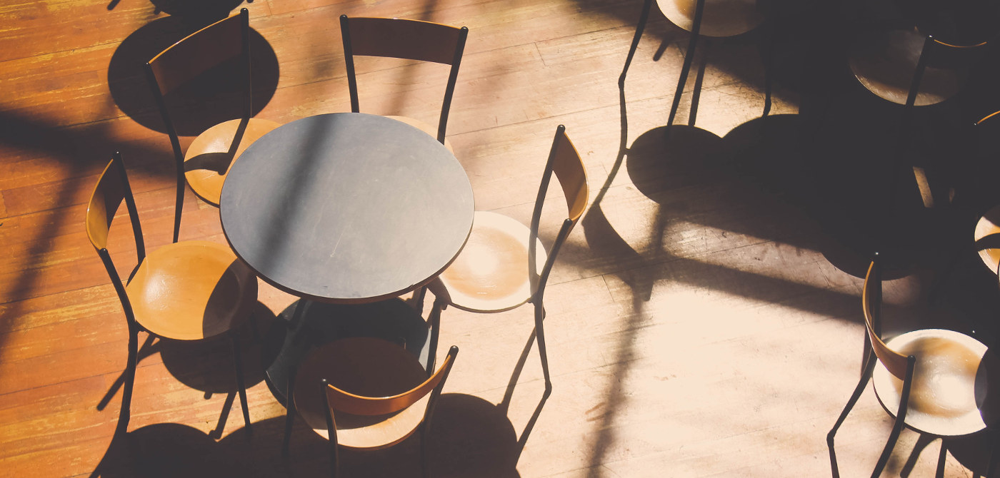

+++
title = "Wann können wir denn eröffnen?"
date = "2015-09-22"
description = "«Wenn isch jetzt ändlich Eröffnig vom Effinger?» Diese Frage verfolgt uns auf Schritt und Tritt. Ein grosses Dankeschön an dieser Stelle an alle, die mit uns mitfiebern. Leider können wir noch immer nicht sagen, wann wir genau eröffnen. Dies hängt von vielen Faktoren ab, die wir nicht selber in der Hand haben."
image = "table.jpg"
authors = [ "Domenica Hitz" ]
comments = true
tags = [ "Location", "Einrichtung" ]
+++

  «Wenn isch jetzt ändlich Eröffnig vom Effinger?» Diese Frage verfolgt uns auf Schritt und Tritt. Ein grosses Dankeschön an dieser Stelle an alle, die mit uns mitfiebern. Leider können wir noch immer nicht sagen, wann wir genau eröffnen. Dies hängt von vielen Faktoren ab, die wir nicht selber in der Hand haben. 

Das Baugesuch wurde im August eingereicht. Es mussten noch einige Anpassungen gemacht werden, vor allem wegen der vorgeschriebenen Anzahl Parkplätze. Nun sollte das Gesuch einen Schritt weiter kommen. Wir rechnen allerdings nicht mehr mit einer Eröffnung in diesem Jahr, aber hoffentlich früh im 2016.

Gerne geben wir einen Einblick, was inzwischen bei uns so läuft.

## Planung der Bar

Mich beschäftigt zurzeit vor allem der ganze Bereich des Innendesigns. Natürlich primär das, was die Kaffeebar betrifft. Die grobe Aufteilung des Raumes ist bereits vorhanden, jetzt geht es um die Details wie ...   
... welche Stühle passen zu welchen Tischen,   
... welche Lampen sollen auf welcher Höhe aufgehängt werden,   
... welcher Boden dient uns am meisten und ist am wenigsten heikel. 

Zudem bin ich an der ganzen Planung der Bar: Kommt die Abwaschmaschine neben die Kaffeemaschine und daneben grad der Abfall oder ist es besser den Abfall neben die Bierzapfanlage zu nehmen und neben der Kaffeemaschine genügen Ablagefläche zu planen? Ich habe einen Plan der Bar im Verhältnis 1:10 gezeichnet, die einzelnen Geräte und Maschinen ebenfalls und jetzt kann ich die frisch fröhlich auf dem Plan herumschieben, um die optimale Aufteilung zu finden.

Wenn diese mal steht, geht es darum, den richtigen Anbieter für die Geräte zu finden. Gar nicht so einfach bei so vielen Anbietern und einer doch recht grossen Preisspanne.

## Möblierung Coworking

Auch im Coworking-Bereich sind wir fleissig am Erarbeiten, wie der werden soll. Es gibt verschiedene Überlegungen, die Einfluss auf die Möblierung haben:   

* Arbeiten Tagesgäste lieber an Tischen mit harten Holzstühlen oder auf bequemen Sofas mit dem Laptop auf den Knien?   
* Wie flexibel muss die Einrichtung sein, damit sie eventuell für Events umgestellt werden kann?   
* Sollen die Wände wild und farbig werden, um die Kreativität zu fördern oder lieber etwas ruhiger, damit man nicht vom Arbeiten abgelenkt wird?

Phu, Fragen über Fragen. Trotz allem Planungsstress und Uneinigkeit über gewisse Dinge, ist es wunderbar, seinen zukünftigen Arbeitsort mitgestalten zu dürfen, Farben und Formen zu bestimmen und eine Atmosphäre zu kreieren, die  für unsere Kombination von Gastronomie und Coworking förderlich ist. 

## Atelier

Auch am Atelier wird fleissig gewerkelt, oder besser, geplant. Die Einrichtung dieses Raumes überlassen wir ganz den Künstlern. Sie sollen sich dort eine Umgebung schaffen, die sie inspiriert und sie zu künstlerischen Höhenflügen antreibt. Ich freu mich schon jetzt, während eines Arbeitstages ab und zu beim Atelier vorbei zu schauen und mitzuerleben wie Kunst und Design entsteht. 