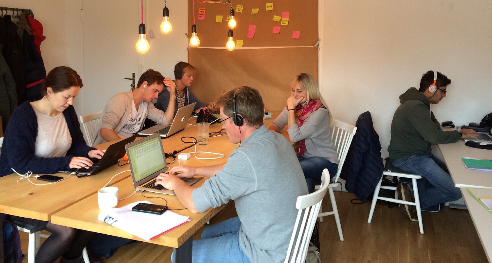
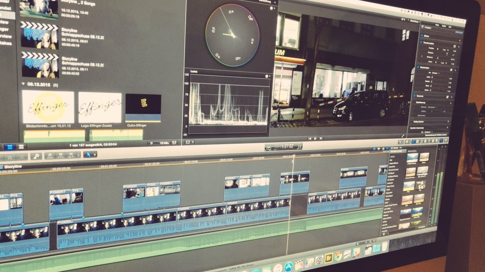

+++
title = "Warten auf den Parkplatz"
date = "2015-12-23"
description = "Es wir langsam eng im ZeitRaum, unserem kleinen Coworking Space. Deshalb ist es bald Zeit, dass wir an die Effingerstrasse ziehen und uns dort auf 10 mal so viel Quadratmeter ausbreiten."
image = "space-full.jpg"
authors = [ "Domenica Winkler" ]
comments = true
tags = [ "Location", "Finanzen" ]
+++

Es wir langsam eng im ZeitRaum, unserem kleinen Coworking Space. Deshalb ist es bald Zeit, dass wir an die Effingerstrasse ziehen und uns dort auf 10 mal so viel Quadratmeter ausbreiten. 

## Der Countdown läuft

Das letzte Telefonat mit dem Bauinspektorat hat ergeben, dass wir unsere Baubewilligung leider nicht wie angekündigt vor Weihnachten bekommen. Für den Innenausbau (Lüftung, neue Wasser- und Stromanschlüsse, Brandschutz) ist soweit alles klar und die entsprechenden Fachstellen haben ihr OK gegeben.

Der ganze Bewilligungsprozess wird von dem Parkplatz vor unserem Schaufenster verzögert. Wir möchten dort gerne Stühle und Tische aufstellen, um eine Aussenfläche für die Kaffeebar zu schaffen. Jedoch ist die Verschiebung dieses Parkplatzes zur Staatsaffäre (es fühlt sich jedenfalls so an) geworden. Eine Kommission, die erst wieder im Januar tagt, spricht eine Empfehlung aus, ob eine Verschiebung möglich ist. Falls nicht, gäbe es noch die Möglichkeit, sich für schlappe CHF 8'700 "rauszukaufen". Wir wären froh, wenn es nicht soweit kommt. Damit wir mit dem Innenausbau definitiv beginnen können, haben wir ein Gesuch um vorzeitiges Bauen beim Bauinspektorat eingereicht. Dieses würde es uns ermöglich, im Effinger mit den Bauarbeiten zu beginnen und die Parkplatzgeschichte gleichzeitig zu lösen.

Wir peilen eine Eröffnung des Effingers für anfangs März an. Wie wir aber mittlerweile alle wissen, kommt das vor allem auf das Tempo der Behörden an.

## Stand Finanzierung

Immer wieder werden wir gefragt, wie es mit unseren Finanzen so steht, und ob wir das benötigte Kapital bereits zusammen haben. Hier eine kleine Übersicht:

### Kaffeebar

**Total Bedarf: CHF 240'000**

* CHF 170'000 vertraglich zugesichert
* CHF 40'000 in Verhandlung
* **CHF 30'000 noch gesucht** &rarr; gerne melden bei [domenica@effinger.ch](mailto:domenica@effinger.ch)

### Coworking Space

**Total Bedarf: CHF 140'000**

* CHF 41'000 Darlehen der Coworker
* CHF 62'000 Darlehen von anderen Privatpersonen
* CHF 25'000 sind in Verhandlung (Stiftungen & Private)
* **CHF 35'000 noch gesucht** &rarr; gerne melden bei [matthias@effinger.ch](mailto:matthias@effinger.ch)

## Money, money, money it's a rich man's world

Seit knapp einem Jahr jagen wir Geld hinterher und ich bin langsam etwas müde. Viel lieber würde ich mich nur mit der Auswahl der richtigen Getränke, mit der Frage, wie wir den Coworkinge Space und die Kaffeebar optimal miteinander verbinden und wie wir unsere Grundsätze in Tat umsetzen können, beschäftigen. Doch stattdessen drehe ich mich fast nur um die Frage, wen wir noch für Geld anfragen könnten, ob ich mal versuchen sollte, welches zu pflanzen oder wen ich in den geheimen "Selber Geld drucken"-Plan einweihen soll. 
Das Geld und die Frage, ob wir genügend zusammenbringen, bleibt entscheidend für den Start des Effingers. Jedoch hoffe ich, dass nach der Eröffnung die Gedanken wieder freier werden. 

## Crowdfunding

Vom 1. bis am 31. Januar 2016 führen wir eine Crowdfunding Kampagne durch. Crowdfunding ist die Idee, dass viele Personen mit kleineren Beiträgen ein Projekt unterstützen und im Gegenzug dafür kleinere oder grössere "Belohnungen" erhalten. Unsere Kampagne wird auf einer Plattform aufgeschaltet sein, auf der man direkt Geld für den Effinger geben kann. Die Kampagne läuft 30 Tage. Wenn innerhalb dieser Zeit der gewünschte Betrag nicht zusammen kommt, kommt es nicht zu einer Auszahlung an uns. Wir sind deshalb auf eure Hilfe angewiesen!

Hier entsteht das Crowdfunding Video

Das Video für unsere Crowdfundig Aktion wurde am Baustellenfest im November gedreht und wurde jetzt von Jonathan zu einem wahnsinnig tollen, professionellen und beeindruckenden Trailer zusammengeschnitten. Ihr dürft euch wirklich darauf freuen!

**Wir zählen auf euch**, um im Januar die Kampagne überall bekannt zu machen, damit diese richtig erfolgreich wird. Danke, dass ihr uns im 2015 begleitet habt. Wir freuen uns auf das noch aufregendere 2016. 

Schöne Festtage &ndash; ihr hört wieder von uns am 1. Januar ... 

