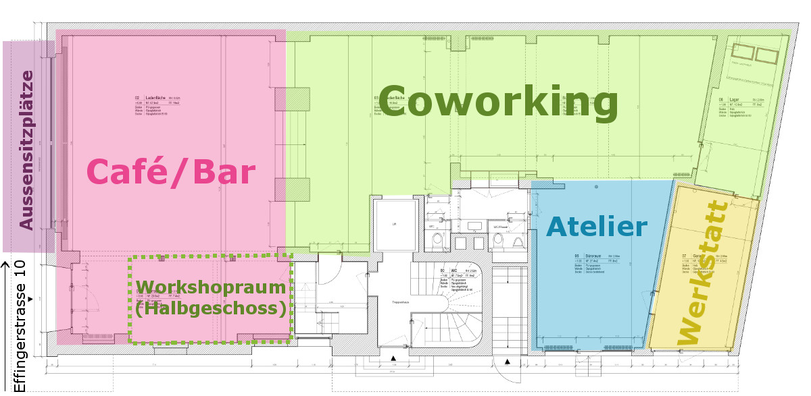

+++
title = "Wir haben unser Lokal!"
date = "2015-07-13"
description = "Wir haben eine Location für Coworking und Café/Bar! Unsere neue Heimat wird die Effingerstrasse 10 in Bern."
image = "effingerstrasse-10.jpg"
authors = [ "Domenica Winkler" ]
comments = true
tags = [ "Location" ]
+++

Wir haben eine Location für Coworking und Café/Bar! Unsere neue Heimat wird die Effingerstrasse 10 in Bern.

Nach etlichen Rückschlägen und Phasen der Verzweiflung und Frustration können wir nun stolz verkünden: Wir haben eine Location! Unsere neue Heimat wird die Effingerstrasse 10, 3011 Bern. In unmittelbarer Nähe zum Hirschengraben und Bahnhof (siehe <a href="https://www.google.ch/maps/dir/46.9483772,7.4369811/Effingerstrasse+10,+3011+Bern/@46.947319,7.436671,17z/data=!4m14!4m13!1m5!3m4!1m2!1d7.437563!2d46.9464993!3s0x478e39b9124277e3:0x993790c53d83fd24!1m5!1m1!1s0x478e39b980145355:0xf9167b7299bdbdd6!2m2!1d7.4358085!2d46.9460364!3e2" target="_blank">Lageplan</a>) befindet sich das alte Sandsteingebäude, dessen Erdgeschoss bald uns gehört, respektive von uns in Anspruch genommen wird.

## Vorvertrag unterschrieben

Diese Woche haben wir den Vorvertrag unterschrieben. Es steht also fest, dass wir - unter der Bedingung, dass mit den Bewilligungen alles klappt - unser eigenes Lokal beziehen werden. Wann dies genau der Fall sein wird, hängt ebenfalls von den Bewilligungen ab, wir hoffen, dass noch in diesem Jahr die grosse Eröffnungsfeier stattfinden kann.

## Aufteilung der Fläche

Im vorderen Bereich des 260m2 grossen Ergeschosses wird das Café/Bar einziehen. Auf etwa 80m2 mit grossen Schaufenstern, gemütlicher Leseecke, einer zentralen Theke und vielem mehr entsteht der eine Teil von der Coworking-Gastro Kombination. Zur Liegenschaft gehört ein grosser Aussenbereich, den wir für Sitzplätze an der Sonne nutzen können. Abgetrennt durch eine kleine Treppe befinden sich hinter dem Café die Räumlichkeiten des Coworking Space. Besonders freut uns, dass wir ein eigenes Atelier für Kunstschaffende einrichten können. Im hintersten Teil haben wir in einer alten Garage Platz, um eine kleine Werkstatt einzurichten.

## Was geht bis zur Eröffnung...

Nachdem wir erst einmal gefeiert haben, stehen jetzt unendlich viele grössere und kleinere Aufgaben vor uns, es wird also ein spannender Sommer werden.

Wir freuen uns riesig, dass es nun endlich ganz konkret losgehen kann und wir brennen darauf, all unsere verrückten Ideen umzusetzen. Wenn du dich in irgendeiner Form bei uns engagieren möchtest &ndash; es gibt so einiges zu tun: Suche nach Investoren, Corporate Identity designen, Businesspläne fertigstellen, Ausfüllen von Baugesuchsformularen, Schreiben eines Hygiene- und Abfallkonzept,  Lieferanten anfragen, Handwerker anstellen und noch vieles mehr.