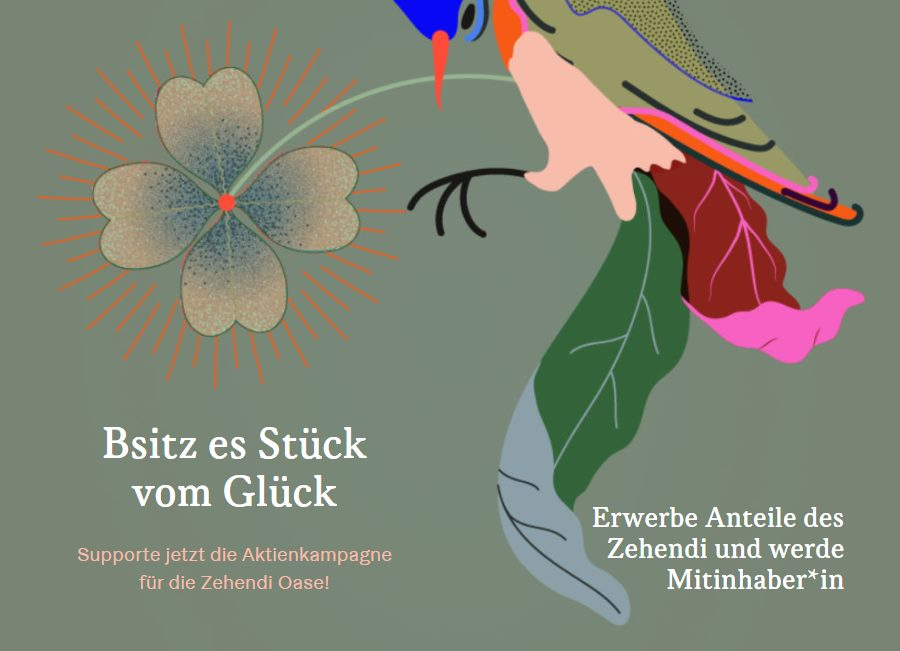

+++
title = "Zehendermätteli – Bsitz es Stück vom Glück"
date = "2023-03-16"
draft = false
image = "zehendi.jpg"
description = ""
authors = ["Simon Tauber"]
comments = false
+++
Schon vor der Effinger-Eröffnung im 2015 hatte Simon Tauber unsere Community eingeladen für ein Popup-Coworking und hat uns bekocht. Seitdem stehen wir im Kontakt mit ihm und der Crew vom [Zehendermätteli](https://www.zehendermaetteli-imglueck.ch/) (siehe z.B. [diesen Brownbag](https://brownbag.effinger.ch/wagen-zum-glueck)).

Grossartig, was in dieser Zeit entstanden ist. Nun geht ihre Geschichte weiter und sie sind gestartet mit einer Kampagne «es Stück vom Glück», bei der man Anteile des Zehendi erwerben kann.

&rarr; [zum Kampagne «es Stück vom Glück»](https://www.zehendermaetteli-imglueck.ch/stueck-vom-glueck/)

*Hier der Brief vom Zehendi:*

---

Mit der Kampagne «es Stück vom Glück» möchten wir unseren Kunden, Fans, Berner und Bernerinnen eine neue Form der Partizipation ermöglichen in unser Unternehmen.

Die Kampagne ermöglicht euch, Anteile des Zehendi zu erwerben und somit Mitinhaber:in und Mitgestalter:in zu werden von einem innovativen, einzigartigen Berner Startup-Unternehmen welches Pionierarbeit leistet, sich für Kreislaufwirtschaft und mehr Vielfalt und Chancengleichheit im Arbeitsmarkt einsetzt.

Mit unserem Unternehmen schaffen wir ein eigenes Ökosystem bestehend aus der Wechselwirkung von Gastronomie, Landwirtschaft, Kultur und Soziales. Eine Oase des Lebens.

Wir leben Solidarität, geben Menschen eine Chance und leben Inklusion in unserem Betrieb. Damit setzten wir sozialer Ausgrenzung und Parallelgesellschaften entgegen. Wir setzten ein Zeichen für ein wertschätzendes und würdevollen Miteinander.

Mit dem Erwerb eines Stück des Glücks investierts du in Menschen welche einen erschwerten Zugang zu Arbeit und Gesellschaft haben – es ist ein Investment ins Glück.

Gerne lade ich ein, euch einen Moment Zeit zu nehmen und einzutauchen: 

[stueckvomglueck.ch](https://stueckvomglueck.ch) 

Herzlichen Dank für euren Support. Es würde mich freuen in euch begeisterte Besitzer:innen eines Stück des Glücks zu finden.

*Simon Tauber*