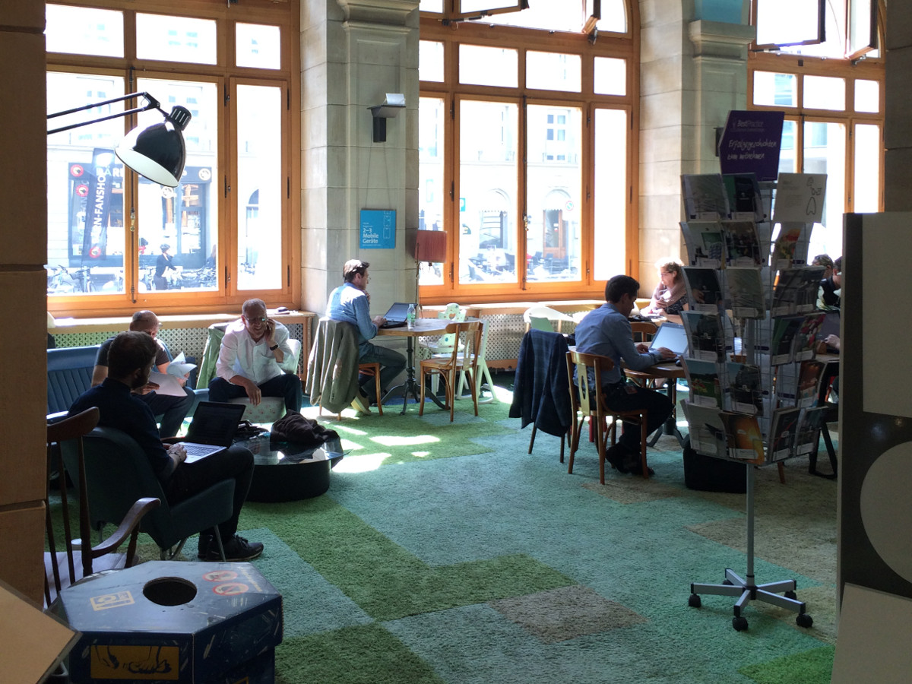
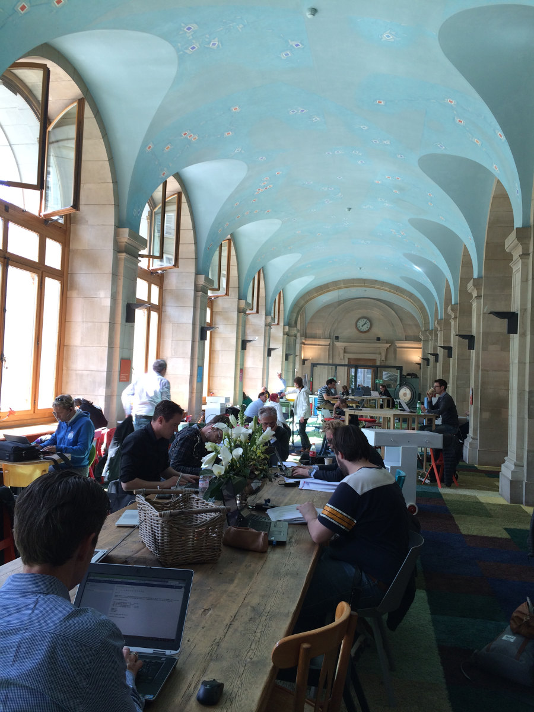
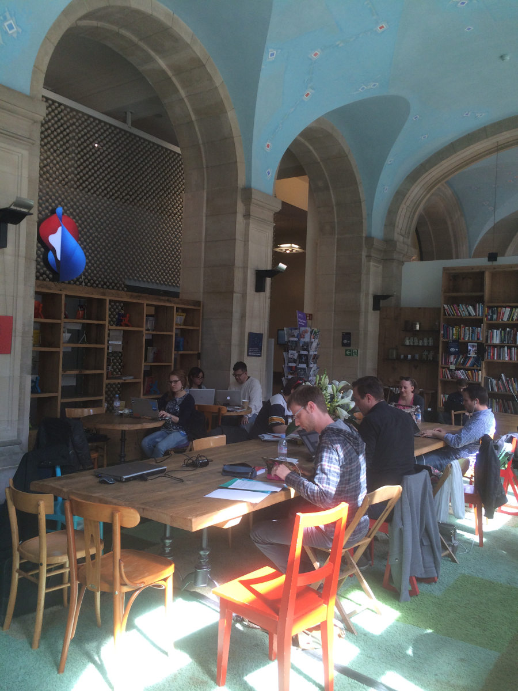
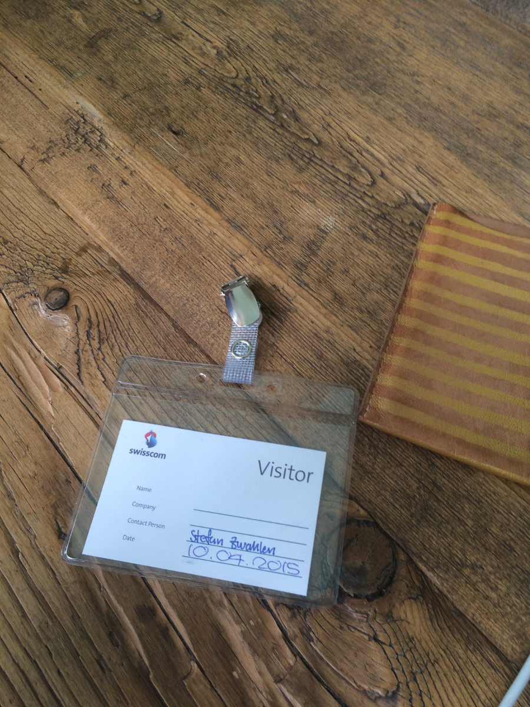
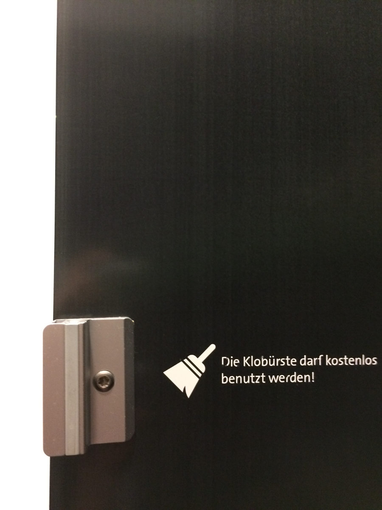

+++
title = "Zu Gast im BrainGym"
date = "2015-04-10"
description = "3 Wochen vor Einzug in unsere Base waren wir heute zu Gast im BrainGym der Swisscom. Wir entwickelten die Einrichtungsideen für die Aarbergergasse weiter, tauchten ein in die arbeitsame Atmosphäre und tranken Kaffee."
image = "braingym.jpg"
authors = [ "Salome Hostettler" ]
comments = true
tags = [ "Coworking" ]
+++

  3 Wochen vor Einzug in unsere Base waren wir heute zu Gast im BrainGym der Swisscom. Wir entwickelten die Einrichtungsideen für die Aarbergergasse weiter, tauchten ein in die arbeitsame Atmosphäre und tranken Kaffee.  

Heute in 3 Wochen ist der 1. Mai 2015. Und ab diesem Datum können wir offiziell unsere Basis an der Aarbergergasse beziehen! Yay!!! Bevor wir dort mit unseren Coworking- und Event-Experimenten beginnen, hiess es heute noch einmal ‚it’s Pop-up Coworking Day!‘. Und auch der war heute nicht einfach ein weiterer von vielen, denn wir waren zu Gast im BrainGym der Swisscom.

Um 8:00 Uhr wurden wir von Stefan mit Visitor-Badges ausgestattet und tauchten dann sofort in die unkonventionelle aber genauso konzentrierte Arbeitsatmosphäre ein. Zum Start durften wir gerade eines der Sitzungszimmer mit Beschlag belegen und starteten mit der Konkretisierung von bereits gehabten, aber auch ganz neuen Einrichtungsideen für die Aarbergergasse. Timon brachte Holzmuster mit, hatte die beim letzten Aarbergergasse-Talk besprochenen Ideen auf Papier gebracht und bot uns ganz nebenbei 3 Eschenstämme als Material zum Bau unserer Möbel an. Matthias präsentierte seine innovative Idee des Tische-Fächers (Ja nämlich!) und es wurde einmal mehr klar, dass 25m2 Fläche und eine normale Raumhöhe definitiv zu wenig ist um auch nur ansatzweise alle Ideen umzusetzen, die noch in unseren Köpfen rumturnen oder sich in unseren Pinterestboards sammeln. Es bleibt also dabei: Die Aarbergergasse wird ein Zwischenhalt auf dem Weg zur Heimat unserer Community. Aber ein guter.

Nach der Sitzungssession gönnten wir uns eine kurze Kaffeepause bevor wir uns im grosszügigen Arbeitsbereich niederliessen und alle fleissig auf ihren Laptops rum zu tippen oder auf good-old Papers rum zu kritzeln begannen. Die Stimmung ringsum war echt so, wie ich es mir in einem Coworking Space vorstelle: hier und da eine gedämpfte Unterhaltung, viele konzentrierte Gesichter, ein ungezwungenes Kommen und Gehen, Kaffeebecher auf den Tischen, ein Filmdreh am Tisch nebenan und herumtigernde Telefonierende. Dies alles in einem grosszügigen, lichtdurchfluteten Raum dessen Interieur mehr an ein Wohnzimmer als an cleanes Business erinnert. Einfach toll!

Abgeschlossen haben wir den Tag mit spannenden Gedanken über Werte, die unsere Community prägen sollen. Dies sowieso ein Thema, das mich unglaublich beflügelt, fasziniert und begeistert.  Alles in allem hat also der Tag in mir einmal mehr viel viel Vorfreude auf alles ausgelöst, was in naher und klein wenig fernerer Zukunft noch kommen wird. Danke Stefan & BrainGym, you have been good to us!!!

