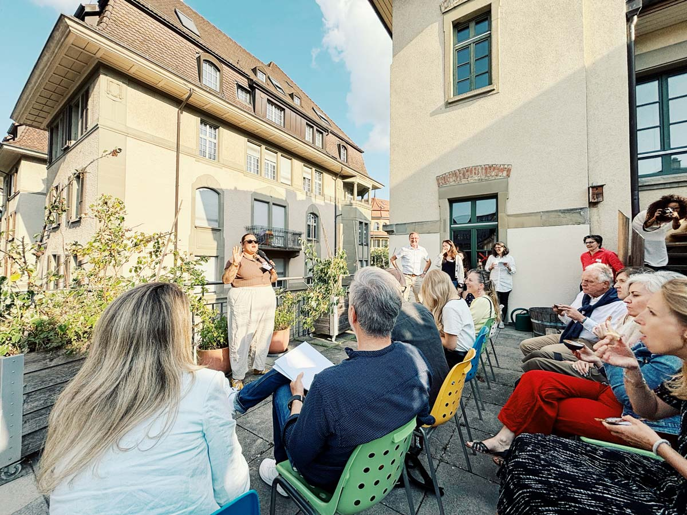

+++
title = "Zukunft gestalten – am Salon für Zukunftswirtschaft 2025"
date = "2025-06-17"
draft = false
tags = ["Community"]
image = "salon_202500001_.jpg"
description = "Der Salon 2025 versammelte Menschen, die Wirtschaft als Werkzeug für gesellschaftlichen Wandel verstehen. Statt leerer Visionen standen konkrete Projekte im Fokus: Ob Food Waste, Eigentumsmodelle, Kommunikation, Leadership oder Peer-Coaching – die Speaker:innen gaben Einblicke in ihre Arbeit, die heute schon Zukunft möglich macht."
comments = true
+++

Der Salon 2025 versammelte Menschen, die Wirtschaft als Werkzeug für gesellschaftlichen Wandel verstehen. Statt leerer Visionen standen konkrete Projekte im Fokus: Ob Food Waste, Eigentumsmodelle, Kommunikation, Leadership oder Peer-Coaching – die Speaker:innen gaben Einblicke in ihre Arbeit, die heute schon Zukunft möglich macht.

## Coworking-Kultur als Gastgeberin

Der Salon ist mehr als eine Bühne – er ist Treffpunkt, Austauschraum und Denkwerkstatt. Möglich gemacht wird das Event vom Impact Hub Bern und dem Effinger Coworking, zwei Coworking Spaces, die die neue Wirtschaftskultur täglich leben. Chananda (Impact Hub) führte mit Leichtigkeit durch den Abend, Michelle Studer begrüsste die Gäste mit Wärme und Offenheit.

## Durchmischung statt Elfenbeinturm

Jung und alt, Startup und Verein, Beraterin und Aktivist – die Mischung war bunt, das Interesse spürbar. Gerade diese Offenheit macht den Salon aus: Zukunft entsteht dort, wo verschiedene Perspektiven aufeinandertreffen.

Auf der Bühne standen:

* Lucy von Ässbar – gegen Food Waste, für genussvolles Retten
* Lukas von Purpose Schweiz – Eigentum neu gedacht
* Gianni von brandSTIFT – Markenkommunikation mit Wirkung
* Liliane & Pia – Struktur für Macher:innen
* Bettina von Firefly Management – wie man Krisen vorbeugt
* Nalyn von Mindrs – Ernährung revolutionär gedacht
* Raphael von Restful GmbH – Peer-Coaching für Pflegende
* Valérie von Rflect – Bildung mit Tiefe

Das Wetter trug seinen Teil zur Dynamik bei. Kurz vor Beginn hob ein Sonnenschirm ab – wie Mary Poppins schwebte er durch den Innenhof. Zum Glück blieb alles heil, und die Szene sorgte für herzhaftes Lachen unter dem Team.

## Genuss, Gespräche und Zukunft

Beim leckere Apéro von Ginger & Noosh GmbH wurde weiterdiskutiert, gelacht und ausgetauscht. Der Salon für Zukunftswirtschaft 2025 zeigt: Die Lösungen für morgen entstehen dort, wo Menschen heute ins Handeln kommen – mit Haltung, Humor und einem klaren Blick auf das Gemeinwohl.

https://www.salon-zukunft.ch/
