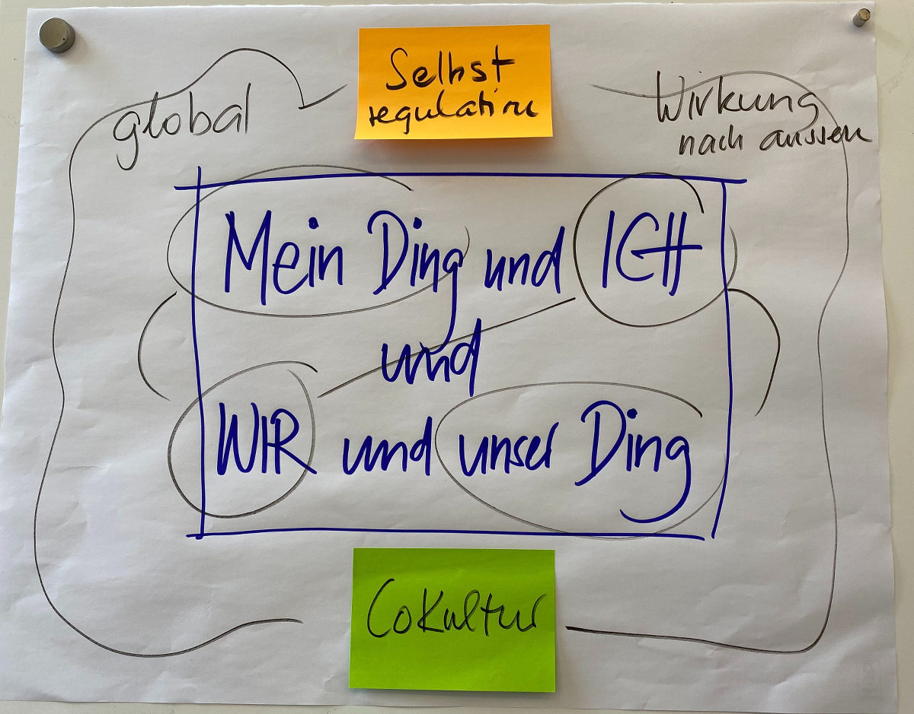
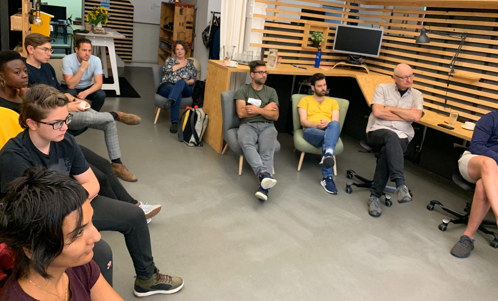
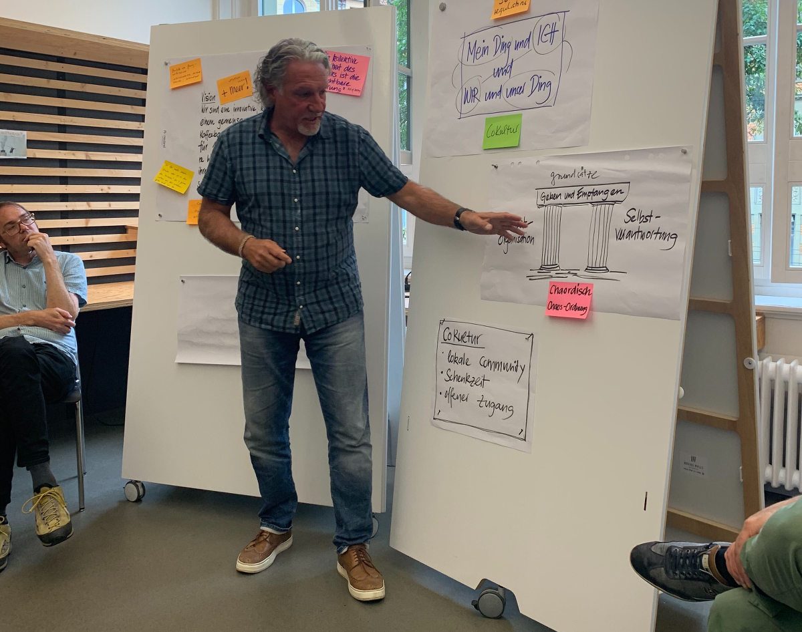
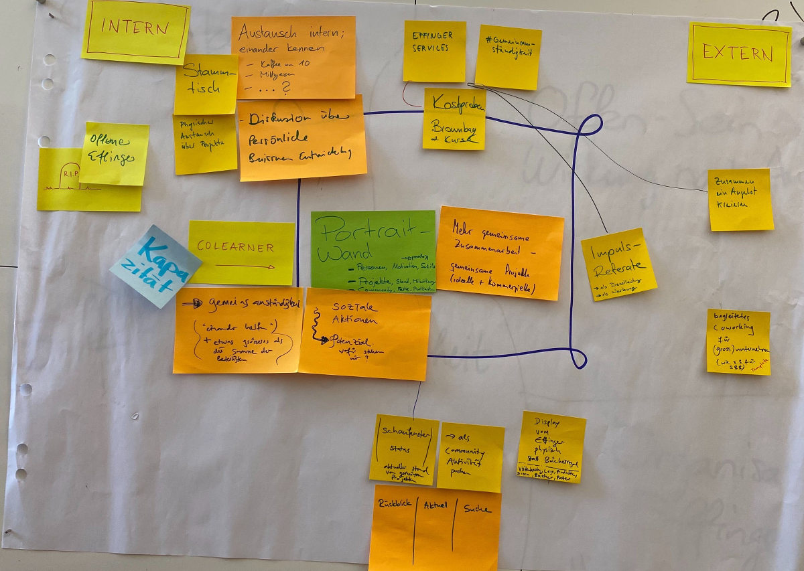
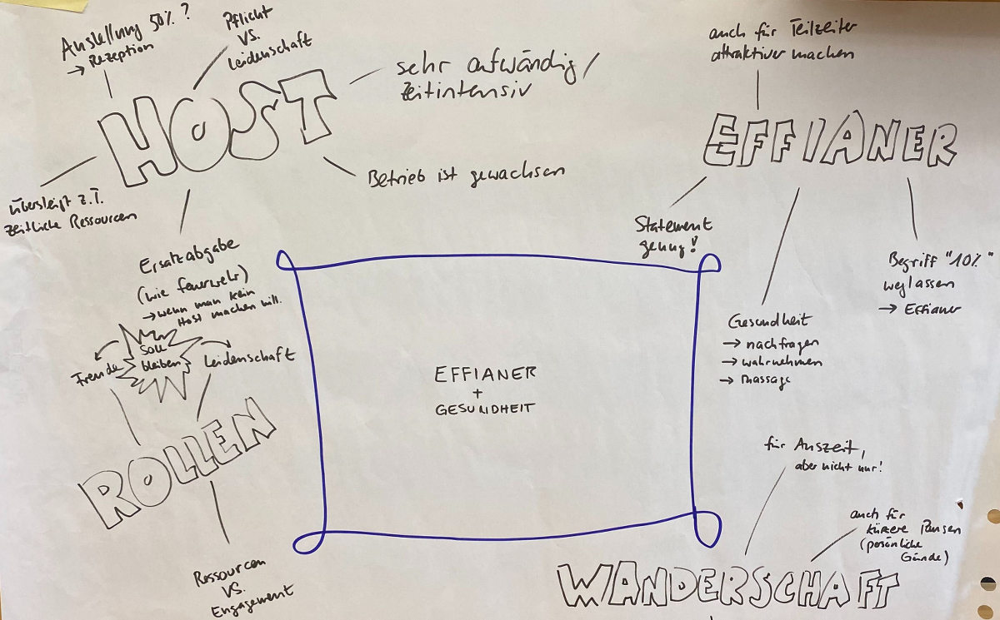
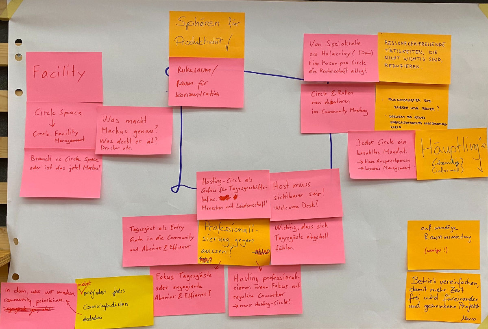
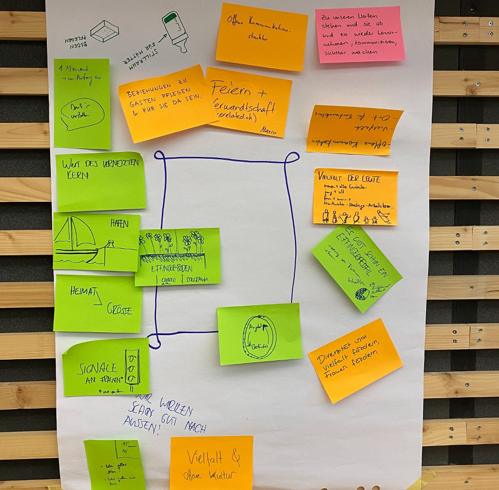

+++
title = "Effinger Zukunftsworkshop"
date = "2020-08-29"
draft = false
tags = ["Community", "Coworking", "Effianer"]
image = "mein-ding-unser-ding.jpg"
description = "Unsere Vision begleitet uns nun über 5 Jahre. Im Zukunftsworkshop fragen wir uns, ob sich sich das, was wir tun, noch richtig anfühlt und wie wir selbst zum Effinger und seiner Community stehen."
authors = ["Fredi Zumbrunn", "Marco Jakob"]
comments = true
+++

> «Wir sind eine innovative, kreative Community mit einem gemeinsamen Coworking Space und Kaffeebar in Bern. Wir sind eine Heimat für Jungunternehmer, Kreative und andere Weltveränderer, die einander helfen, ihre Ideen in Firmen, Innovationen und soziale Aktionen umzusetzen.»

Diese Vision begleitet uns nun über 5 Jahre. Manchmal bewusster, manchmal weniger. Der Effinger und seine Community haben sich entwickelt. Leute kommen und gehen. Mit ihnen die vielfältigsten Ideen, Angebote, Projekte. Der Effinger hat sich als Coworking Space mit einer kultigen Kaffeebar etabliert. In gemeinschaftlicher Verantwortung steuert die Community das Schiff in innovativer, soziokratischer Form. Rund ums Coworking ist mit Coliving, Colearning, Cocreating eine lebendige **CoKultur** entstanden.

## Alles bestens! Bleib wie du bist!

Vieles hat gut funktioniert. Gleichwohl war uns schon gegen Ende des letzten Jahres bewusst, dass wir im Hinblick auf die anstehende Verlängerung des noch bis Januar 2021 laufenden Mietvertrages nicht einfach so weiterfahren wollten. Routinen geben Sicherheit, versperren jedoch oft auch den Blick auf andere Möglichkeiten. Wir machten uns Gedanken.. und wurden unsanft von Corona in eine neue Realität katapultiert.

## Herausforderung und Chance

Bei der gemeinsamen Bewältigung dieser Herausforderung und dem Erkennen der sich bietenden Chancen wurden in der Community viel Kraft, Energie und Zuversicht wach. Der mit dieser Entwicklung angestossene Veränderungsprozess nahm Fahrt auf: Neue Projekte sind im Entstehen, aus den Ressourcen der Gemeinschaft schält sich ein angepasstes Betriebsmodell heraus, Angebote und Rollen werden neu definiert.

**Doch: Fühlt sich das, was wir tun, noch richtig an? Was wollen wir beibehalten? Was sollte verstärkt beachtet werden? Was weniger?**

**Und: Stehe ich noch zum Effinger und zu seiner Community? In welcher Form werde ich mich engagieren** (**können)?**

## Zukunftsworkshop anstelle Weekend

Eigentlich war ja unser jährliches Effinger-Weekend geplant. Wir wollten uns mit Fragen wie diesen beschäftigen. Wir haben es abgesagt, weil die organisatorischen Auflagen mit der Beachtung aller Schutzmassnahmen vieles verunmöglicht hätten.

Mit dem Zukunftsworkshop vom Samstag, 29. August haben wir eine Möglichkeit gefunden, uns in gewohnter und sicherer Umgebung zu treffen. Es kamen ca. 20 Personen.

## Einstieg mit GedankenGang

Am Morgen sind wir im Osten, Westen, Norden und Süden der Stadt in kleinen Gruppen gestartet und sind auf einer selbst gewählten Route zum Effinger spaziert. Dabei haben wir uns Gedanken zur Vision und zu den oben aufgeführten Fragen gemacht.

## Gespräche über unsere Vision

Nach einem Kaffee haben wir uns als ganze Gruppe ausgetauscht über die Vision, ob sie eingetroffen ist, ob sie noch passt und wie stark unser Commitment ist dazu.

## Themen, die uns beschäftigen

Dann gab es in wechselnden Gruppen (World-Café) Diskussionen zu Themen, die uns aktuell beschäftigen. Es ging vor allem darum, miteinander ins Gespräch zu kommen und nicht gerade konkrete Entscheidungen zu treffen. Konkrete Aktionen sparen wir uns für die nächsten [Community-Treffen](/events/). Hier sind ein paar Eindrücke.

#### Thema: Zusammenarbeit & gemeinsame Projekte

#### Thema: Effianer & Gesundheit

#### Thema: Organisation & Betrieb

#### Thema: Vielfalt & offene Kultur

## Unsere Positionierung im Effinger

Zum Schluss ging es vor allem um uns selbst und wie wir uns im Effinger positionieren möchten. Dazu stellten wir uns im Raum auf - entweder näher oder weiter weg vom Effinger-Zentrum. Dann haben wir uns zu unserer Position ausgetauscht. Es war sehr hilfreich, voneinander zu hören, in welcher Position es uns in der aktuellen Lebens- und Arbeitsphase wohl ist. Dies hilft, einige Spannungen zu lösen, indem wir die Erwartungen aneinander angleichen können. Einige haben gesagt, dass sie sich eher in äussere Kreise oder auf Wanderschaft begeben möchten. Andere möchten bald näher zum Zentrum und Effianer werden.

## Wunderbares Essen

Etwas vom Wichtigsten an so einem Tag ist das Essen. Wir wurden so richtig verwöhnt von Béatrice und Thomas Eggimann von [Munderlebnis](https://www.munderlebnis.ch/). Sie haben das Essen rund um das Thema "Vision" gestaltet und es war einfach grossartig! Herzlichen Dank.