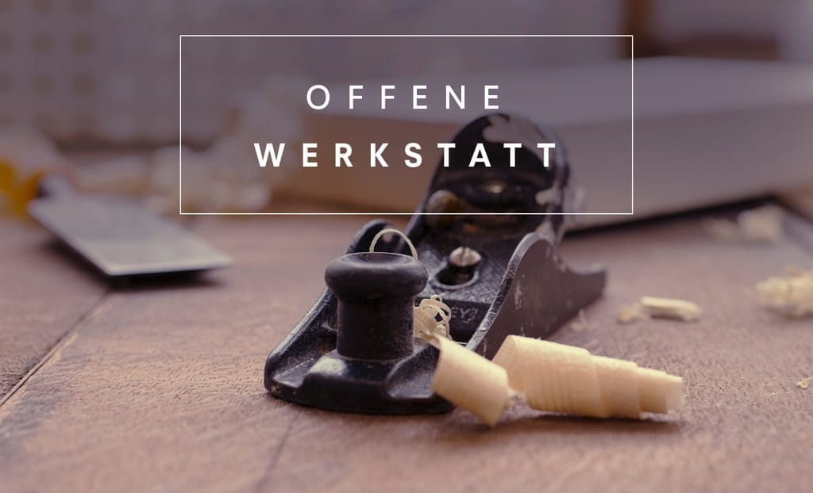

+++
title = "Offene Werkstatt"

startdate = 2017-04-20T18:30:00Z
enddate = 2017-04-20T22:00:00Z
categories = [ "Atelier" ]
location = "Effingerstrasse 10, Bern"
address_link = "https://www.google.ch/maps/place/Effinger+-+Kaffeebar+%26+Coworking+Space/@46.94604,7.4336198,17z/data=!3m1!4b1!4m2!3m1!1s0x478e39bf613a53f7:0x30f7464656fbe3b2"
image = "offene_werkstatt.jpg"
draft = "true"
+++

Hast du Pläne für ein Möbelprojekt? Steht bei dir Zuhause ein angefangenes Bastelprojekt unfertig rum? Willst du dein Velo für den Sommer auf Vordermann bringen?
Ab April 2017 ist die Werkstatt im Effinger immer am dritten Donnerstag im Monat offen.
Bring dein angefangenes Projekt mit oder deine Ideen und Material für ein neues Vorhaben. 
Du kannst die vorhandenen Maschinen benutzen (teils mit Einführung) und bei Bedarf Unterstützung vom Schreiner und Wohnberater [Timon Marmet](/blog/portrait-timon-marmet/) erhalten.

**Vorhandene Maschinen**:
- Schleifmaschine
- Stichsäge
- Handhobelmaschine
- Dekupiersäge
- Kippfräse
- Drehbank (Holz)
- Oberfräser
- Holzverbinder (wie Lamello und Mafell)
- Kompressor
- Bohrmaschinen

- Diverses Werkzeug
- ...

**Öffnungszeit**: 18:30 – 22:00 Uhr

**Preis**:
- Einlass: 10.- (pauschal pro Abend)    
- Material: Individuell nach Verbrauch
- Maschinenbenutzung: ab Fr. 5.-/Stunde (je nach Aufwand)
**Leitung**: [Timon Marmet](/blog/portrait-timon-marmet/)  
**Anmeldung**: Nicht nötig. Fragen an: [timon.m@effinger.ch](mailto:timon.m@effinger.ch)
