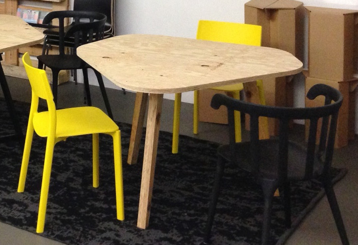

+++
title = "Einweihungsfeier Gemeinsame Werkstatt Belpberg"

startdate = 2017-04-30T10:00:00Z
enddate = 2017-04-30T15:00:00Z
categories = [ "Werkstatt" ]
location = "Familie Staub, Hof 24, Belpberg"
address_link = "https://www.google.ch/maps/place/Hof+24,+3124+Belp/@46.8713873,7.526429,397m/data=!3m2!1e3!4b1!4m5!3m4!1s0x478e49ed7c7b00fb:0x512f8411579c2e1d!8m2!3d46.8713873!4d7.5273549"
image = "hof-belpberg.jpg"
description = "Wir feiern die Einweihung der gemeinsamen Werkstatt auf dem Belpberg. Schon seit Jahrzehnten wird auf diesem Bauernhof gebaut und repariert. Neu gibt es dort eine CNC-Maschine, welche computergesteuerte Arbeiten mit Holz und Alu ermöglicht."

[registration]
event_id = 100127
folder_id = "0BxUuL-tU5pi2a21Eak51dDNnSE0"
api_url = "https://script.google.com/macros/s/AKfycbzM-0WOT43rWxBRe7z-O0T8bNWDFUIhivv0GNnC3IqcX1EC7dze/exec"
+++

Auf dem Bauernhof von Marina und Roger Staub auf dem Belpberg ist eine gemeinsame Werkstatt entstanden. Schon seit Jahrzehnten wird auf diesem Hof gebaut mit Holz, Metall und Elektrik. Auch Timon Marmet (Effianer und Schreiner) benutzt die Maschinen und den Platz auf dem Belpberg, wenn er grössere Möbel anfertigt und es in der Effinger-Werkstatt zu eng wird.

Nun wurde die Werkstatt erweitert durch eine [CNC-Maschine](http://sudar.ch/cnc/shg1212/). Als erstes Produkt werden 5 Tische für das Effinger-OG dort hergestellt. Dass es dazu kam, war eine echte Gemeinschaftsleistung: Tische hat Matthias ausgesucht. Die CNC-Maschine und viel CNC-Know-How ist von Lukacs, seinem Schwager. Roger und Marina bieten den Platz für die Maschine und stellen Werkzeuge zur Verfügung. Nachbar Philipp bedient als gelernter Mechaniker die Maschine und Timon gibt Tipps für die Holzverarbeitung.

### Einladung zu Einweihung und Grill

Zusammen wollen wir diesen Moment feiern! Alle Interessierten, die den wunderschönen Belpberg und die Werkstatt sehen möchten, sind herzlich eingeladen. Auch Kinder sind willkommen auf dem Bauernhof.

#### Das Programm

* Wir treffen uns **am Sonntag, 30. April um 10 Uhr zum Kaffee** direkt auf dem [Hof von Roger und Marina Staub, Hof 24, Belpberg](https://www.google.ch/maps/place/Hof+24,+3124+Belp/@46.8713873,7.526429,397m/data=!3m2!1e3!4b1!4m5!3m4!1s0x478e49ed7c7b00fb:0x512f8411579c2e1d!8m2!3d46.8713873!4d7.5273549) (gibt bestimmt Fahrgemeinschaften ab Effinger).
* Anschliessend gibt es von Roger und Philipp eine *Führung* durch den Hof, die Werkstatt und eine Demonstration der CNC-Maschine.  
* Um ca. 12 Uhr gibt es ein *gemeinsames Mittagessen mit Grill*. Für Grillwürste direkt vom Hof ist gesorgt.
* Open End

### Anmelden

**Bitte meldet euch mit dem Formular unten bis zwei Tage vorher an.** Nicht vergessen anzugeben, wie viele Personen ihr seid. Das Mitbringen einer Beilage wie Brot, Salat, Getränke oder ein Dessert ist erwünscht, aber nicht zwingend. Bitte Mitbringsel als Kommentar bei der Anmeldung vermerken.

Für Fragen zum Event wende dich an [marco@effinger.ch](mailto:marco@effinger.ch).

*Wir freuen uns auf deinen Besuch!*
