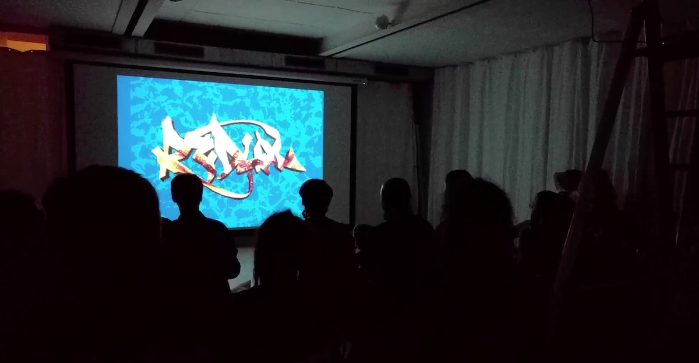

+++
title = "Demonights 003"
description = "We hereby invite you to the third incarnation of the Demonights. As it is short notice, summertime's running short and the days are busy,  we plan to just gather up, snack and drink, hang on a sofa or a comfy chair, and watch demos."
startdate = 2017-09-08T19:00:00Z
enddate = 2017-09-08T22:00:00Z
categories = [ "Labor" ]
location = "Effingerstrasse 10, Bern"
address_link = "https://www.google.ch/maps/place/Effinger+-+Kaffeebar+%26+Coworking+Space/@46.94604,7.4336198,17z/data=!3m1!4b1!4m2!3m1!1s0x478e39bf613a53f7:0x30f7464656fbe3b2"
image = "demonights.jpg"
+++

We hereby invite you to the third incarnation of the Demonights. As it is short notice, summertime's running short and the days are busy,  we plan to just gather up, snack and drink, hang on a sofa or a comfy chair, and watch demos. Adventurous participants may dive deeper and work on a production, discuss demo effects, or share some tips on making a 1k, 4k, 64k,... prod.

This is a meetup and electronic arts performance organized by Echtzeit - Digitale Kultur, the Swiss association in support of the [demoscene](https://en.wikipedia.org/wiki/Demoscene). Memories of our previous events in the Labor (E-0010) space are [here](http://showmethedemo.buenz.li/) and [here](https://www.facebook.com/demodays).

### All your details
**When**: Friday, September, 8th 2017  
**Doors**: 19:00 - Midnight  
**Entrance**: CHF 10.- to cover costs (please deposit in tip-jar)  
**Where**: Effingerstrasse 10, Bern. Underground -2  
Ideally reachable by public transport, 5 minute walk from the main station in Bern; No parking on site: please use nearby designated city parking houses.
There will be a few drinks & snacks available on location (tip-jar to cover the costs again).

Please sign up and let us know you're coming on our [Facebook event page](https://www.facebook.com/events/1882487658744186) ~ or by email to [info@echtzeitkultur.org](mailto: info@echtzeitkultur.org)

### PROMO
*If you are interested in VR, our friends at [We Are Cinema](http://wearecinema.ch/) are running two special performances of 360° films at Effinger-Labor (E-0010) on [September 1](https://www.effinger.ch/events/100131/) & [22](https://www.effinger.ch/events/100132/). If you're interested in VR as a medium for your code w, have a chat with us about doing a workshop together.*
