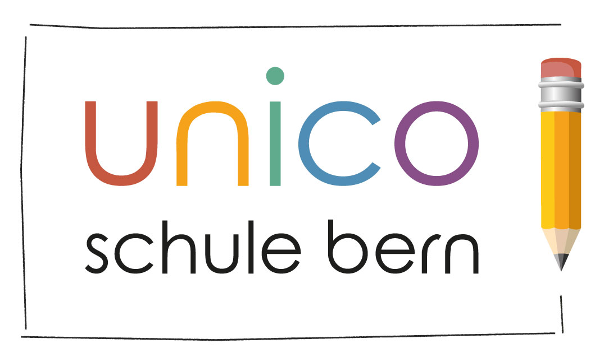

+++
title = "Unico-Schule Community-Treffen"
description = Wir eröffnen bald im Raum Bern eine Schule, in der Kinder frei und selbstbestimmt lernen und ihren Schulalltag mitbestimmen können. An unseren Community-Treffen können alle teilnehmen, die sich von unserem Leitbild und unserer Organisationsform angesprochen fühlen."
startdate = 2017-12-09T13:30:00Z
enddate = 2017-12-09T16:30:00Z
categories = [ "Community" ]
location = "Effingerstrasse 10, Bern"
address_link = "https://www.google.ch/maps/place/Effinger+-+Kaffeebar+%26+Coworking+Space/@46.94604,7.4336198,17z/data=!3m1!4b1!4m2!3m1!1s0x478e39bf613a53f7:0x30f7464656fbe3b2"
image = "unico.jpg"
+++

Im kommenden August - spätestens im Sommer 2019 – eröffnen wir im Raum Bern eine Schule, in der Kinder frei und selbstbestimmt lernen und ihren Schulalltag mitbestimmen können.

An unseren Community-Treffen können alle teilnehmen, die sich von unserem Leitbild und unserer Organisationsform (inspired by Effinger) angesprochen fühlen und mitreden und mitgestalten wollen.

Mehr auf [www.unico-schule.ch](https://www.unico-schule.ch/)

Am 9.12. steht unsere **Schnittstelle zum Homeschooling** zur Diskussion: 

> Sollen wir ein Angebot für Homeschooler bieten? Und wie könnte das aussehen? Was sind die Vor-, was die Nachteile? Und besteht überhaupt eine Nachfrage hierfür?

Wir freuen uns auf eine angeregte, farbige und lebendige Diskussion

*Simona, Isa und Aurelia*
