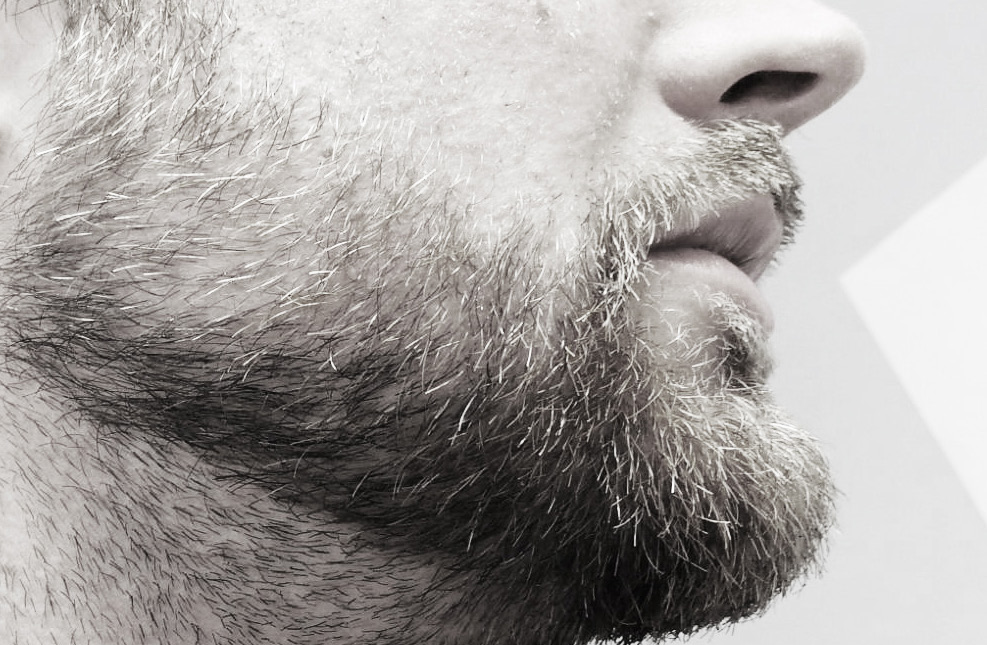

+++
title = "Bart-Workshop"
description = "Die Coiffeuse Anina vermittelt dir in diesem Workshop wie du deinen Bart pflegen und schneiden kannst. Du erfährst, welcher Bartschnitt mit deinem Gesicht harmoniert und wie du den Schnauz am besten passend zum Bart schneidest."
startdate = 2018-01-18T18:00:00Z
enddate = 2018-01-18T20:30:00Z
categories = [ "Atelier" ]
location = "Effingerstrasse 10, Bern"
address_link = "https://www.google.ch/maps/place/Effinger+-+Kaffeebar+%26+Coworking+Space/@46.94604,7.4336198,17z/data=!3m1!4b1!4m2!3m1!1s0x478e39bf613a53f7:0x30f7464656fbe3b2"
image = "bart-workshop.jpg"
[registration]
  max = 6
  close = 2018-01-18T18:00:00Z
+++

Die Coiffeuse Anina vermittelt dir in diesem Workshop wie du deinen Bart pflegen und schneiden kannst.

Du erfährst, welcher Bartschnitt mit deinem Gesicht harmoniert und wie du den Schnauz am besten passend zum Bart schneidest.

* **Dauer**: ca. 2.5h   
* **Preis**: CHF 50 (inkl. Bier/Süssgetränk und Snacks)   
* **Kursleitung**: Anina Tschirren  
* **Anmeldung**\*: Mit untenstehendem Formular   
* **Fragen an**: [graziella@effinger.ch](mailto:graziella@effinger.ch)

<small>*\*Die Anmeldung ist verbindlich. Bei einer Abmeldung wird der Teilnehmerbetrag in Rechnung gestellt. Es besteht allerdings die Möglichkeit, selber eine/n Ersatz-TeilnehmerIn zu organisieren, in diesem Fall entfallen die Kosten für die abgemeldete Person. Der Workshop wird ab mindestens 3 und mit max. 6 Teilnehmenden durchgeführt. Versicherung ist Sache der Teilnehmer.*</small>
