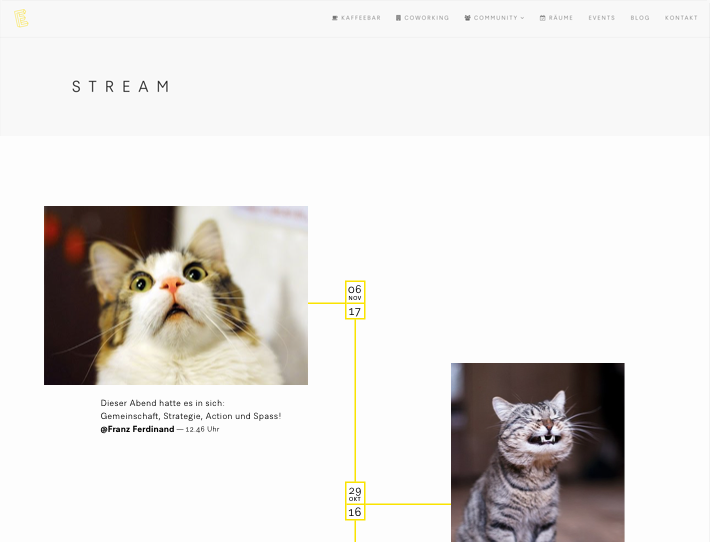

+++
title = "Hacknight: Effinger Website Stream"
description = "Dieser Workshop bietet eine Einführung in das Erstellen von Websites mit dem Static Site Generator Hugo."
startdate = 2017-12-20T19:00:00Z
enddate = 2017-12-20T21:00:00Z
categories = [ "Labor" ]
location = "Effinger UG"
image = "stream.png"
[registration]
  close = 2017-12-20T17:00:00Z
+++

# Effinger Stream

Der Effinger Stream ist ein neues Element der Effinger Seite, bei dem alle Community
Member aktuelle Fotos und Texte direkt auf die Website posten können. Über Slack
werden die Fotos und Texte eingespeist, der Rest läuft automatisch.

# Gemeinsamer Hack

Ein Prototyp besteht bereits. Gemeinsam entwickeln wir den Prototypen weiter,
damit dieser auf der Website live geschaltet werden kann.

Manuel leitet die Umsetzung des Designs in HTML und CSS leiten. Marco koordiniert
die Implmentierung des Backends.

---

**Kosten Community Member:** CHF 0.-   
**Kosten Externe:** CHF 0.-   
**Anmeldung:** Mit untenstehendem Formular   
**Fragen:** An [marco@effinger.ch](mailto:marco@effinger.ch)   
**Ort:** Der Workshop findet im Effinger UG (Lift -2) statt.
