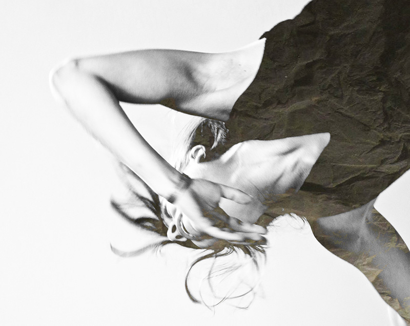

+++
title = "table conversations #3 / oued (1. Durchführung)"
description = "Zwei Tanzstücke, aufgeführt auf mehreren Stockwerken: table conversations #3 und oued. Dieser Abend findet im Rahmen des Beta Stage Festivals statt, ein Pop-up Festival der Berner Tanzszene."
startdate = 2018-02-23T18:30:00Z
enddate = 2018-02-23T19:45:00Z
categories = [ "Community" ]
location = "Effinger"
image = "tableconversations.jpg"

registration = true
registration_max = 30
registration_close = 2018-02-23T18:30:00Z
+++

<strong>Achtung:</strong> Die Tickets für diesen Event sind ausgebucht. Wir haben aber eine <strong>2.&nbsp;Durchführung</strong> aufgeschaltet: <a href="/events/100177/">table conversations #3 / oued (2. Durchführung)</a>

Zwei Tanzstücke, aufgeführt auf mehreren Stockwerken: <strong style="white-space: nowrap;">table conversations #3</strong> und <strong>oued</strong>. Dieser Abend findet im Rahmen des <a href="https://www.be-ta.ch/festival" style="color: #777;">Beta Stage Festivals</a> statt, ein Pop-up Festival der Berner Tanzszene.

## table conversations #3

Der Coworking Space Effinger steht für das Auflösen von festgefahrenen Strukturen. Das Haus arbeitet spartenübergreifend, vernetzend, community-bildend und bietet damit einen hervorragenden Standort für eine Performance, die auch als Coworking funkioniert.

Das Herzstück dieser Performance ist die Dialogform über den Tisch. Dieser dient als Plattform des Austausches, als Navigationsinstrument, als Miniaturbühne für ein Tanzstück, eine Installation. Tische und Stühle werden immer wieder neu platziert. Im Wechselspiel zwischen Performer und Publikum entsteht eine Reihe von “Table Conversations”.

Tanz und Choreografie: Sunita Asnani, Sandra Chatterjee, Chris Lechner

* https://vimeo.com/chrislechner
* https://vimeo.com/sunitaasnani
* http://www.sunitaasnani.com/

## oued

cosmos streaming through the valley into an open field of oceans   
interwoven landscapes   
in the detail a glade   
in the distance a shadow

Tanz: Gianna Grünig   
Musik: Hasan Nakhleh

Eine Produktion von: **t h r o u g h * n a t u r e**

Die Plattform through*nature steht für Begegnungen, Kreationen und Performances zwischen Kunstschaffenden aus den Sparten Tanz und Musik. Nach ‚membrane of a thought’, der letzten Zusammenarbeit von Gianna Grünig und Hasan Nakhleh, wird die gemeinsame Recherche des Dialoges welcher durch die Komposition im Moment entsteht vertieft und erweitert.

Die Improvisation ist das Handwerk zum Stück, wobei davon ausgegangen wird, dass das im Moment kreierte eine unveränderbare, hoch spezifische Realität ist, welche den Grund für jeden nächsten Moment legt. Es kristallisiert sich die Essenz des Stückes, wobei die Form veränderbar und immer neu (er)findbar bleibt.

## Anmeldung und Preis

Bitte per Formular unten anmelden. Der Preis kann am Abend selber gewählt werden (pay as you wish).

<strong>Achtung:</strong> Die Tickets für diesen Event sind ausgebucht. Wir haben aber eine <strong>2.&nbsp;Durchführung</strong> aufgeschaltet: <a href="/events/100177/">table conversations #3 / oued (2. Durchführung)</a>

