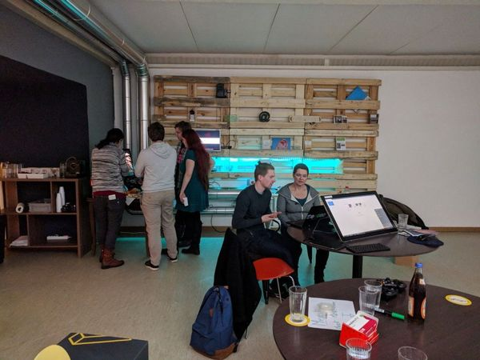
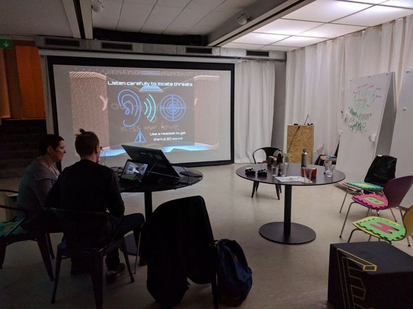

+++
title = "Meet. Make. Game! 0.2"
description = "Arbeite an einem einsteigerfreundlichen Projekt, um eine preiswerte Spielkonsole mit einem Raspberry Pi zu bauen. Wir installieren Retro-, Indie- und unsere eigene Spiele darauf. Und dann spielen wir natürlich!"
startdate = 2018-02-02T18:00:00Z
enddate = 2018-02-02T22:00:00Z
categories = [ "E-0010" ]
location = "Effinger im -2 UG"
image = "game.jpg"
+++

## Thema: Let's MAKE a RasPi arcade!

Triff dich mit Freunden auf einen einen Drink und arbeite an einem einsteigerfreundlichen Projekt, um eine preiswerte Spielkonsole mit einem Raspberry Pi zu bauen. Wir installieren Retro-, Indie-, Game-Jam-, und unsere eigene Spiele darauf. Und dann spielen wir natürlich!

## Worum es bei uns geht

Der Zweck dieser Gruppe ist es, gemeinsam den kreativen Prozess von Spielen zu erleben und Erfahrungen zu teilen, die wir auf unterschiedlichsten Plattformen machen (PC, Konsole, Brettspiel, Bücher...).

Wir diskutieren Themen wie Game Design, Story Writing, Kunst, Musik, World Building, etc. Es gibt auch die Gelegenheit, deine Ideen und Kreationen zu zeigen, sich zu treffen, sich zu vernetzen und ein paar Spiele zu spielen und hoffentlich zu einer starken Community zu werden.

Mit dieser Gruppe wollen wir auch die interdisziplinäre Vernetzung fördern und Diskussionen und Talente aus verschiedenen Bereichen (Grafik, Musik, Theater, Schriftsteller, Programmierer, Gamer...) miteinander vermischen.

Bitte beachte, dass wir uns bemühen werden, die Veranstaltungen in einer Sprache abzuhalten, die jeder verstehen kann. So kann es sein, dass einige Diskussionen/Präsentationen in Deutsch, Französisch oder Englisch gehalten werden.

## Preis

Für die Nutzung der gemeinsamen Infrastruktur im Effinger gelten folgende Preise:

* CHF 10.- für Nicht-Member
* CHF 0.- für [Effinger Community Member](/community/member-werden/)

## Meetup-Gruppe

Damit du auch bei weiteren Events eine Einladung erhältst, kannst du unserer [Meet. Make. Game! Meetup-Gruppe](https://www.meetup.com/de-DE/Meet-Make-Game/) beitreten.

