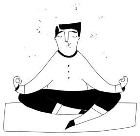
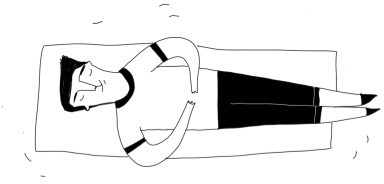

+++
title = "8-samkeit im Effinger"
description = "Durch die Achtsamkeitsangebote im Effinger lernst du, ungünstige Haltungsmuster des Körpers zu erkennen und im Alltag darauf zu reagieren. Damit kannst du Fehl-und Überlastung des Körpers vermeiden."
startdate = 2018-03-15T08:15:00Z
enddate = 2018-03-15T18:00:00Z
categories = [ "Coworking" ]
location = "Effinger Labor (UG -2)"
image = "achtsamkeit.jpg"
registration = false
+++

Die richtige Körperstellung zu finden, ist in der heutigen Zeit gar nicht so einfach. Ständiges Sitzen führt zu Verspannungen, die uns zu ungünstigen Schonhaltungen verleiten. Es ist ein Umdenken nötig, wenn wir unsere Gesundheit erhalten wollen. Statistiken belegen, dass die Mehrheit der Bevölkerung mindestens einmal unter Rückenschmerzen leidet.

Was würde sich ändern, wenn wir in unseren Büros und an unseren Arbeitsplätzen die einfache Methode der Achtsamkeit - wie z. B Schulung der Haltung und die bewusste Atmung - integrieren und üben würden?

Durch die Achtsamkeitsangebote im Effinger lernst du, ungünstige Haltungsmuster des Körpers zu erkennen und im Alltag darauf zu reagieren. Damit kannst du Fehl-und Überlastung des Körpers vermeiden.

**Wann?** Jeweils Donnerstags (konkrete Daten siehe [Effinger Events](/events/))   
**Wo?** Im Effinger Labor (UG - 2)

# Angebote

## 1. Check-in

**Dauer:** 30 Minuten   
**Zeit:** 8:15 - 8.45 Uhr   
**Ziele:** bewusste Atmung, sich Zentrieren   
**Methode:** bewegte Meditation, Mobilisation / Dehnen (Feldenkrais Methode)

Die Feldenkrais-Methode hilft, falsche Bewegungsmuster zu durchbrechen. Durch gezielte Übungen sollen die eigenen Bewegungsabläufe bewusster wahrgenommen werden. Man lernt, sich harmonischer und wirksamer zu bewegen, damit Fehlhaltungen vorgebeugt und das Körpergefühl verbessert werden kann. Durch Optimierung von Bewegungsabläufen sollen unnötige Muskelverspannungen vermieden werden

## 2. Time-out

**Dauer:** 30 Minuten   
**Zeit:** 12:30 - 12:55 Uhr   
**Ziele:** Relax, Powernap   
**Methode:** PMR = Progressive Muskelrelaxation

PMR ist eine körperorientierte Entspannungsmethode. Durch bewusstes Anspannen und Entspannen einzelner Muskelgruppen wird eine tiefe muskuläre Körperentspannung erreicht. Die Methode reduziert auch sämtliche stressbedingte Symptome wie Verspannungen, Kopfschmerzen, Migräne, Rückenschmerzen, Erschöpfung oder Müdigkeit.

## 3. Check-out

**Dauer:** 45 Minuten   
**Zeit:** 17:15 - 18:00 Uhr   
**Ziele:** Kräftigung der Muskulatur, Verbesserung der Körperhaltung, Beweglichkeit   
**Methode:** Pilates, Haltungsschulung
 
Die Pilates-Methode ist ein ganzheitliches Körpertraining, in dem vor allem die tief liegenden, kleinen und meist schwächeren Muskelgruppen angesprochen werden, die für eine korrekte und gesunde Körperhaltung sorgen. 

## 4. Massage

**Dauer:** Nach Wunsch   
**Zeit:**	Nach Wunsch   
**Ziel:** Lockerung und Dehnung der Muskulatur, Förderung der Stoffwechsel und der Durchblutung   
**Methode:** Klassische Massage

Die Massage ist eine der ältesten Heilmittel der Menschheit. Sie dient zur mechanischen Beeinflussung von Haut, Bindegewebe und Muskulatur durch Dehnungs-, Zug und Druckreiz. Die Wirkung erstreckt sich von der behandelten Stelle des Körpers über den gesamten Organismus und schliesst auch die Psyche mit ein. Massagen zielen auf die Regeneration des Körpers ab und beleben die Selbstheilungskräfte.

---

# Infos

* 8. und 15.März alle 8-samkeit –Angebote Schnuppern Preis : Give what you can. Danach besteht Möglichkeit zur einen Abo.
* Check-in und Time-out können in Alltagskleidern durchgeführt werden. Fürs Check-out (Pilates) sind Sportkleider empfehlenswert.
* Matten sind vorhanden
* Versicherung ist Sache der Teilnehmenden

---

# Abos

## Schnupper Abo

Beinhaltet alle 8-samkeits Angebote   
+ eine Massage à 15 Min.   
1 Monat gültig, pro Person nur einmal lösbar

Community Mitglieder: 	60.- CHF   
Nicht Mitglieder:	 	80.- CHF

## Abo 8-samkeit 

beinhaltet Check-in und Time-out   
2. Monate gültig

Community Mitglieder 	140.- CHF   
Nicht Mitglieder: 		180.- CHF

## Abo Check-out

Stempelkarte, 8x teilnehmen, 3 Monate gültig

Community Mitglieder	160.- CHF   
Nicht Mitglieder		200.- CHF

## Abo Massage

8x à 15 Min. /4x 30 Min. /2x60 Min.   
Stempelkarte, 6 Monate gültig

Community Mitglieder 	190.-   
Nicht Mitglieder 		195.-

## Abo 8-samkeit Plus

Beinhaltet alle 8-samkeits Angebote   
+ sechs Massagen à 15 Minuten   
3 Monate gültig

Community Mitglieder: 	240.- CHF   
Nicht Mitglieder: 		280.- CHF
