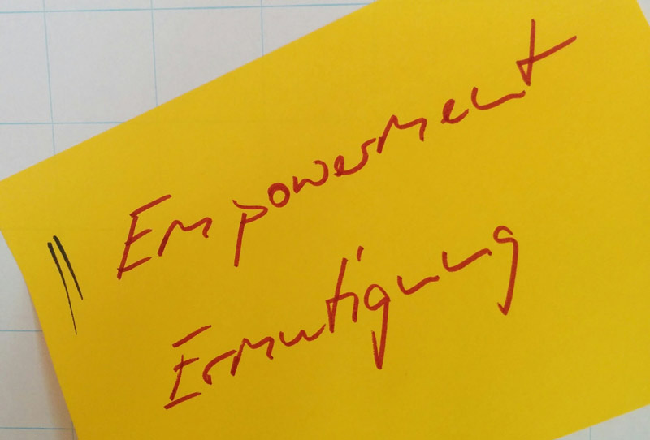

+++
title = "Treffen - Schule mutig gestalten"
description = "An der Gestaltung von Schulen interessiert? Nach vielen Treffen als 'Schule anders denken' wollen wir nun noch vermehrt Schule mutig gestalten!"
startdate = 2018-03-28T18:00:00Z
enddate = 2018-03-28T21:00:00Z
categories = [ "Community" ]
location = "Effinger 1. OG (Beginn in Kaffeebar)"
image = "empowerment.jpg"

registration = true
+++

An der Gestaltung von Schulen interessiert? Nach vielen Treffen als 'Schule anders denken' wollen wir nun noch vermehrt Schule mutig gestalten! 

Die Zeit und der Raum sollen vor allem dem Austausch von Anliegen und Ideen dienen. Es geht um Unterrichten und um das Anregen und Unterstützen von Lernen im weitesten Sinn. Wir denken nicht nur über Veränderungen von Lernsituationen nach, sondern wollen wieder vermehrt gemeinsam nach Wegen suchen, wie diese mutig gestaltet werden können. Erfahrungen aus dem Gestalten fliessen als Rückmeldung zurück in die Gruppe und regen wiederum andere an, Gleiches oder Ähnliches zu wagen. 

Seit 2015 ist eine Gruppe von Interessierten für die Bildung in den Schulen aktiv.

## Ablauf  der Treffen „Schulen mutig gestalten“

### Gemeinsames Ankommen in der Kaffeebar (18.00 Uhr)

Wer kann und will, trifft sich bereits um 18 Uhr zu einer Art Stammtisch unter aktiven Bildungsinteressierten in der Kaffeebar. Dies um uns auf das Treffen einzustimmen und Informationen zu aktuellen Ereignissen im Umfeld von THES im Effinger auszutauschen.

### Check-In (18.30 Uhr)

Das Check-In heisst anzukommen im 1. OG beim THES.

### A.) Bildungsthemen, Gesprächsrunden, Projekte (~80 Min.)

Es werden Fragen, Themen, Impulse, Inputs, Ideen zu Projekten aufgenommen, diskutiert, hinterfragt und es wird geklärt, in welcher Form eine mögliche Vertiefung erfolgen soll. 

### B.) Check-Out

Das Check-Out ist eine Aktivität, um gemeinsam das Treffen abzuschliessen.

## Anmeldung und Preis

Bitte per Formular unten anmelden. Der Preis für Gäste beträgt CHF 10.00, bitte ein gelbes Zehnernötli mitbringen.