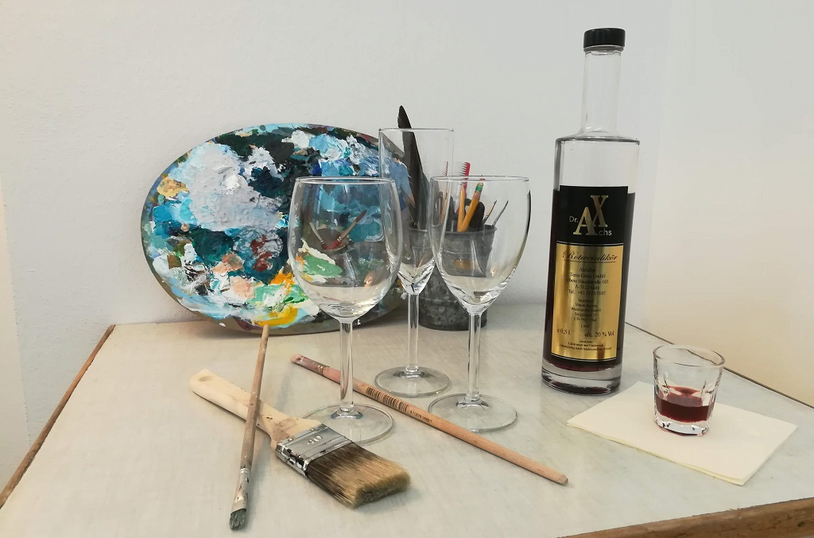

+++
title = "Einladung - Vernissage 'Der Weinmaler' - Eine Reise in den Genuss"
description = "Malen und Wein - Eine kreative Auseinandersetzung mit dem Genuss. Im Rahmen des 'offenen Kunstatelier' ist die Idee entstanden, diese beiden Bereiche miteinander zu verbinden. Bist du neugierig und willst deine Sinne aktivieren? Komm vorbein und lass dich inspirieren."
startdate = 2018-12-10T17:00:00Z
enddate = 2018-12-10T20:30:33Z
categories = [ "Community" ]
location = "Effinger im 1 OG - im Rosengarten"
image = "Bild_WeinMaler.jpg"

registration = true
registration_close = 2018-12-10T00:00:00Z
+++

Malen und Wein - Eine kreative Auseinandersetzung mit dem Genuss.  
Im Rahmen des 'offenen Kunstatelier' ist die Idee entstanden, diese beiden Bereiche miteinander zu verbinden. 
Bist du neugierig und willst deine Sinne aktivieren? Komm vorbein und lass dich inspirieren.

### Der Weinmaler – Eine kreative Auseinandersetzung mit dem Genuss
Im Jahr 2015 hat Markus Roos als Autodidakt begonnen zu malen. Daraus sind bis heute vier Bilder entstanden, die Landschaft und Naturverbundenheit zeigen.

Aber was hat das mit Wein und Genuss zu tun? – Bist du neugierig und willst deine Sinne aktivieren?

Im Rosengarten des Effingers sind seine Bilder ausgestellt und Markus lässt dich dazu Wein degustieren.
Spannende Fragen: 

* Wie finde ich den Zugang zum Malen?
* Wie wirkt das Ganze im Auge des Betrachters?
* Was bedeutet Aus-Blick, Aus-Schank und Aus-Tausch?

Du als Community-Member, FreundIn und Genuss-Interessierte(r) bist herzlich Willkommen.

### Anmeldung und Preis
**Kosten für Gäste:** CHF 10.- (Betrag bitte ein gelbes Zehnernötli mitbringen)   
**Anmeldung:** Mit untenstehendem Formular   
**Fragen:** An [markus@effinger.ch](mailto:markus@effinger.ch)  

