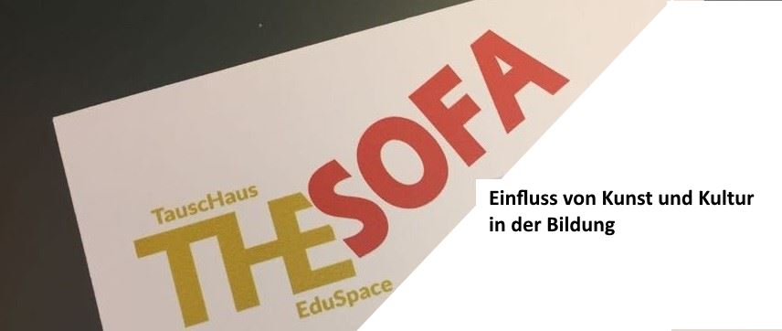

+++
title = "Diskussionsabend THESofa – „Einfluss von Kunst und Kultur“"
description = "Wir diskutieren in einer entspannten Sofarunde über die Entwicklung der Bildung und des Lernens: „Wie lassen sich aus der Begegnung mit Kunst und kulturellen Prozessen Anregungen für unsere Weiterbildungsanliegen gewinnen?“"
startdate = "2019-01-14T18:30:00"
enddate = "2019-01-14T21:00:00"
categories = [ "THES" ]
location = "Effinger im 1 OG - Beginn in Kaffeebar"
image = "thes_sofa_kunst_kultur.jpg"

registration = true
registration_close = 2019-06-18T00:00:00Z
+++

Wir diskutieren in einer entspannten Sofarunde über die Entwicklung der Bildung und des Lernens: „Wie lassen sich aus der Begegnung mit Kunst und kulturellen Prozessen Anregungen für unsere Weiterbildungsanliegen gewinnen?“

### Check-In (18.30 Uhr)
Ankommen, um sich auf die Diskussion einzustimmen.

### Diskussionsabend (19:00 Uhr)
Können uns Kunst und kulturelle Prozesse dazu anregen, damit wir uns im Umfeld des Lernens weiterentwickeln?“

* Wie können wir unsere inneren Bilder von Bildung erweitern?
* Wie können vermeintliche Grenzen meiner Haltung hinterfragt werden?
* Wie können konstruktive Irritationen ausgelöst werden?
* Wie können wir einen Perspektivenwechsel erreichen?
 
Diese Fragen werden durch die Runde aus unterschiedlichen Perspektiven von Lehrpersonen und Bildungsinteressierten beleuchtet. Anschliessend öffnen wir die Runde für Fragen und Rückmeldungen aus dem Publikum.

### Anmeldung und Preis
**Kosten für Gäste:** CHF 10.- (Betrag bitte ein gelbes Zehnernötli mitbringen)   
**Anmeldung:** Mit untenstehendem Formular   
**Fragen:** An [markus@effinger.ch](mailto:markus@effinger.ch)  

