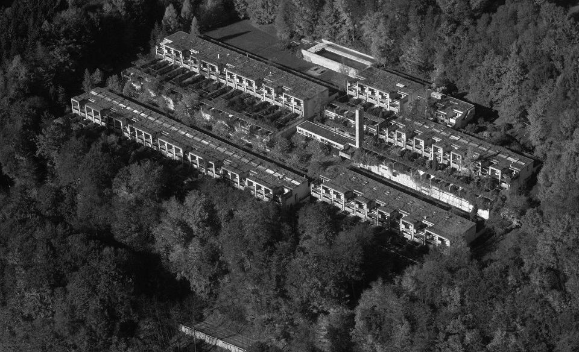

+++
title = "EXKURSION SIEDLUNG HALEN"
description = "Uns inspirieren lassen von Bestehendem. Eine Führung durch die Siedlung Halen bietet die Chance Einblick zu erhalten. Eine urbane Siedlung mitten im Wald, die durch einzigartige Architektur und clevere Vereinbarkeit von Individualität und Gemeinschaft besicht."
startdate = 2019-03-30T10:00:00Z
enddate = 2019-03-30T12:00:00Z
categories = [ "Community" ]
location = "Halensiedlung, Halen 26, 3037 Kirchlindach"
image = "halen_siedlung.jpg"

registration = true
registration_max = 20
registration_close = 2019-03-30T10:00:00Z
+++

Uns inspirieren lassen von Bestehendem. Eine Führung durch die Siedlung Halen bietet die Chance Einblick zu erhalten. Eine urbane Siedlung mitten im Wald, die durch einzigartige Architektur und clevere Vereinbarkeit von Individualität und Gemeinschaft besicht.

#### Kosten
Je nach Anzahl Teilnehmer CHF 15-20.- (bitte in bar mitnehmen)    
Nach der knapp 1.5h langen Führung werden wir gemeinsam einen Lunch vom Siedlungsladen essen.

**Anmeldung obligatorisch und Teilenehmerzahl begrenzt**    
Wir freuen uns auf deine Teilname    
Ramona, Fabian, Matthias, Ismael

Fragen an [ismael@effinger.ch](mailto:ismael@effinger.ch)  
