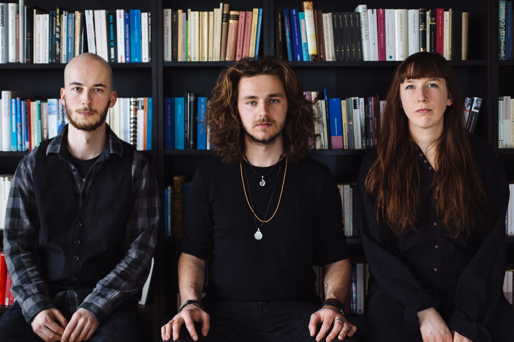

+++
title = "Konzert: Forlorn Elm (CH)"

startdate = 2016-10-21T20:30:00Z
enddate = 2016-10-21T20:30:00Z
categories = [ "Kaffeebar" ]
location = "Effingerstrasse 10, Bern"
# address = "46.945842, 7.435864"
address_link = "https://www.google.ch/maps/place/Effinger+-+Kaffeebar+%26+Coworking+Space/@46.94604,7.4336198,17z/data=!3m1!4b1!4m2!3m1!1s0x478e39bf613a53f7:0x30f7464656fbe3b2"
description = "Dort wo sich erdige Grooves und Melodien sanft wie der Wind treffen, wächst aus den Wurzeln von Rock, Modern Jazz und melancholischem Pop eine Ulme heran."
image = "forlorn-elm.jpg"
+++

> Dort wo sich erdige Grooves und Melodien sanft wie der Wind treffen, wächst aus den Wurzeln von Rock, Modern Jazz und melancholischem Pop eine Ulme heran.

* David Friedli, Gitarre & Komposition
* Johanna Pärli, Bass
* Luca Weber, Drums

<a href="https://www.facebook.com/forlornelm" target="_blank">Forlorn Elm auf Facebook</a>

Eintritt frei - Kollekte
