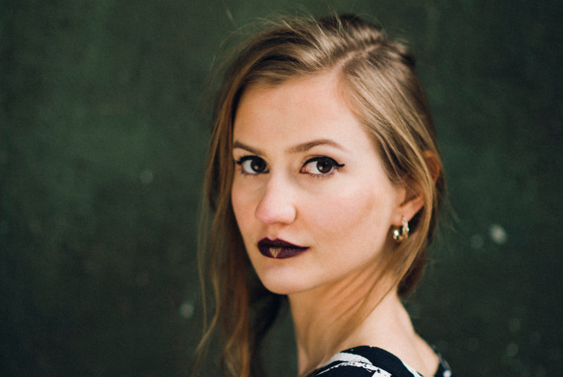

+++
title = "Konzert: UZU (CH)"

startdate = "2016-11-18T20:30:00"
enddate = "2016-11-18T20:30:00"
categories = [ "Kaffeebar" ]
location = "Effingerstrasse 10, Bern"
# address = "46.945842, 7.435864"
address_link = "https://www.google.ch/maps/place/Effinger+-+Kaffeebar+%26+Coworking+Space/@46.94604,7.4336198,17z/data=!3m1!4b1!4m2!3m1!1s0x478e39bf613a53f7:0x30f7464656fbe3b2"
description = "Uzu bezaubert und entführt an fremde Orte. Wo Bäume grummeln und französischer Toast über dem Feuer geröstet wird. Roh und ehrlich sind ihre Songs. Mit Melodien, die bleiben und verblüffen und Rhythmen, die mal fein, mal fesselnd und oft überraschend daherkommen."
image = "uzu.jpg"
+++

Uzu bezaubert und entführt an fremde Orte. Wo Bäume grummeln und französischer Toast über dem Feuer geröstet wird. Roh und ehrlich sind ihre Songs. Mit Melodien, die bleiben und verblüffen und Rhythmen, die mal fein, mal fesselnd und oft überraschend daherkommen.

* Ursula Bachmann p, voc
* Raphale Kalt, tr
* Philpp Saner, g
* Mischa Frei, b
* Marcio de Sousa, dr
* Tanja Zimmermann, bvoc

Eintritt frei - Kollekte

  <iframe class="embed-responsive-item" src="https://www.youtube.com/embed/ziDnfRBBB8g?rel=0" frameborder="0" allowfullscreen></iframe>

