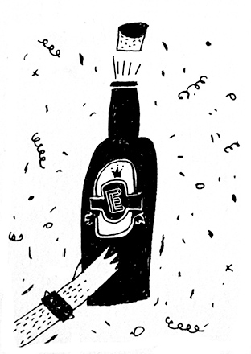

+++
title = "1 Jahr Effinger - Member Brunch"

startdate = 2017-03-18T10:00:00Z
enddate = 2017-03-18T12:00:00Z
categories = [ "Community" ]
location = "Effingerstrasse 10, Bern"
address_link = "https://www.google.ch/maps/place/Effinger+-+Kaffeebar+%26+Coworking+Space/@46.94604,7.4336198,17z/data=!3m1!4b1!4m2!3m1!1s0x478e39bf613a53f7:0x30f7464656fbe3b2"
image = "effinger-feier.jpg"
description = "Wir feiern 1 Jahr Effinger! Im März 2016 war die Eröffnung unserer Kaffeebar und des Coworking Spaces. Damit hat unserer Community hier im Effinger ihre Heimat gefunden."
+++

Wir feiern 1 Jahr Effinger! Im März 2016 war die Eröffnung unserer Kaffeebar und des Coworking Spaces. Damit hat unserer Community hier im Effinger ihre Heimat gefunden.

Dies wäre jedoch alles nicht möglich gewesen ohne die Unterstützung von Freunden und Familie. Besonders die Community Member und Darlehensgeber haben diesen Traum ermöglicht.

Deshalb möchten wir mit euch am **Samstag, 18. März 2017** dieses Jubiläum feiern damit auch danke sagen.

### Für Member und Darlehensgeber

Alle Community Member (oder wer es grad vor Ort werden will) und Darlehensgeber sind eingeladen. Partnerinnen und Partner dürfen gerne ebenfalls teilnehmen. Dabei sollt ihr hautnah erleben, sehen und hören, was dieses Jahr schon alles im und um den Effinger entstehen durfte. Neben dem, dass wir schon schwarze Zahlen schreiben durften, konnten wir von einem auf bald vier Stockwerke wachsen. Die Vielfalt wird grösser und die Herausforderungen wachsen ebenso.

### Programm

* 10.00 Uhr: Begrüssung und Jahresrückblick
* Brunch
* 11.15 Uhr: Geschichten aus dem Effinger
* 12.00 Uhr: Entscheidung über persönlichen Mitgliedschaftsbeitrag 2017
* Open End

### Anmelden

Die Anmeldung war nur bis zum  *12. März* möglich. Für Fragen zum Event wende dich an [events@effinger.ch](mailto:events@effinger.ch).

*Wir freuen uns auf deinen Besuch!*
