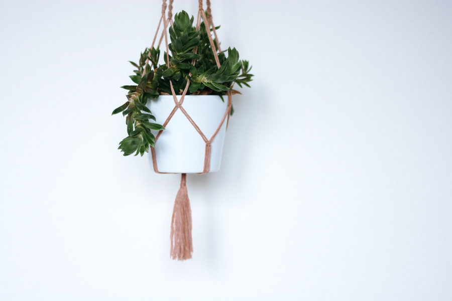

+++
title = "Makramee Workshop"

startdate = "2017-06-17T10:00:00"
enddate = "2017-06-17T12:00:00"
categories = [ "Atelier" ]
location = "Effingerstrasse 10, Bern"
address_link = "https://www.google.ch/maps/place/Effinger+-+Kaffeebar+%26+Coworking+Space/@46.94604,7.4336198,17z/data=!3m1!4b1!4m2!3m1!1s0x478e39bf613a53f7:0x30f7464656fbe3b2"
image = "makramee.jpg"
+++

Makramee - der Trend aus den Siebzigern ist zurück! Lerne im Workshop die Grundsätze des Makramee und knüpfe deinen eigenen Pflanzenhänger. Am Ende des rund zweistündigen Workshops kannst du deinen fertigen Pflanzenhänger mit Pflanze nach Hause nehmen. Zudem bist du ausgerüstet mit Wissen und Unterlagen, um munter eigene Projekte in Angriff zu nehmen.

Für diesen Workshop sind keine Vorkenntnisse nötig.

**Dauer**: ca. 2h  
**Preis**: 50.- (inkl. allen Materialien)    
**Kursleitung**: Damaris Berger   
**Anmeldung**\*: Unter <a href="http://www.dmrsbrgr.com/anmeldung" target="_blank">dmrsbrgr.com</a>

<small>*\*Die Anmeldung ist verbindlich. Bei einer Abmeldung wird der Teilnehmerbetrag in Rechnung gestellt. Es besteht allerdings die Möglichkeit selber eine/n Ersatz-TeilnehmerIn zu organisieren, in diesem Fall entfallen die Kosten für die abgemeldete Person. Versicherung ist Sache der Teilnehmer.*</small>
