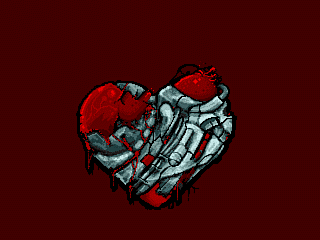
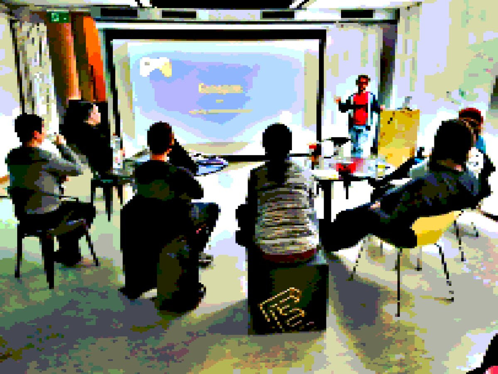

+++
title = "Demonight 004"

startdate = "2018-02-03T19:00:00"
enddate = "2018-02-04T00:00:00"
categories = [ "Labor" ]
location = "Effinger im -2 UG"
image = "demonight.jpg"
+++

Welcome back to the scene in 2018! Time for us to get back on tracks with the next edition of the <a href="https://blog.datalets.ch/031/">DEMONIGHTS</a>. <a href="https://blog.datalets.ch/010/">What is</a> the demoscene? A rich exposé of the power of generative code and audiovisual algorithms over the mind? A creative corner of the 'net? An electronic art that evades definition? You are invited to once again join us for a killing of all audio and lights.

## // / / / // / BEST OF 2017 // / / / //

Captain Obvious forced the agenda: a two-part demoshow with the subjective and/or objective best demoscene productions from 2017, following the infamous top lists from Pouët. Don't ruin the show with streaming: experience bleeding edge scene productions live on our monster computer!

## // / / / // SCENER SPACE // // / //

The Labor (E-0010) space in the undergrounds of Bern has been improved again, and now comes with a sweet new flooring, comfy furniture and even a kids corner if you feel like bringing your youngsters along - parental discretion advised. So get down to the demoshow and let's soak in the scene spirit!

## // // / ONE EFFECT COMPO // /// / /

As a Demonights firstie, we will hold a small contest. Watch and get inspired. Get creative, produce, compete! All submissions to this competition will be shown in order of $random and the audience votes on a winner. We will have a prize, too.
Your production must consist of 1 single audiovisual effect, one per participant. Pick your best one and submit, if and only if it is:

1. An original production, newly made for the compo.
2. To be shown during a maximum of 1 minute playtime.
3. Optionally accompanied by sound/music, overlays and text.
4. A Windows or Linux executable, a JavaScript thingie or GIF animation, or even something running on hardware you bring along.
5. Has no size limits, no platform limits. If your platform does not support HDMI, let us know beforehand so we can figure out how to show it on the bigscreen.

Furthermore:

* The compo crew reserves the right to disqualify entries that are too unserious, boring, bad, or contain racist, pornographic, disturbing or otherwise illegal content.
* Your submission will be released to the public after the Demonights, unless you clearly tell us not to.
* If the rules are too constraining for your idea, let us know and we'll discuss and/or improvise.

## // // STOP BABBLING ALREADY! / /

* When: Saturday, February, 3rd 2018
* Doors: 19:00 - Midnight
* Entrance: CHF 10.- to cover costs (please deposit in tip-jar)
* Where: Effingerstrasse 10, Bern. Underground -2

Ideally reachable by public transport, 5 minute walk from the main station in Bern; No parking on site: please use nearby designated city parking houses (City West).

We will have some drinks & snacks available (again via tip-jar) on location.

Please sign up and let us know you're coming on our [Facebook event page](https://www.facebook.com/events/139843283364771/) ~ or by email to info at echtzeitkultur.org

## // / §

This is a meetup and electronic arts performance organized by Echtzeit - Digitale Kultur, the Swiss association in support of the demoscene.
