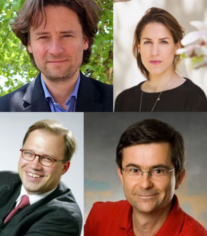

+++
title = "Open Debate: Direkte Demokratie verbindet"
description = "Open debate zum Thema 'Direkte Demokratie verbindet - Menschen, Vergangenheit und Zukunft'"
startdate = "2018-04-25T19:30:00"
enddate = "2018-04-25T21:30:00"
categories = [ "Community" ]
location = "Effinger 1. OG (Grosse Schanze)"
image = "direkte-demokratie.jpg"

registration = false
+++

Open debate zum Thema "Direkte Demokratie verbindet - Menschen, Vergangenheit und Zukunft".

### Gäste

- Laura de Weck ([Künstlerin](https://www.bzbasel.ch/kultur/buch-buehne-kunst/laura-de-weck-die-kuenstler-sind-politisch-mobilisiert-131194991))
- Prof. Dr. Alexander Trechsel (Politikwissenschaftler)
- Dr. René Roca ([Historiker](http://www.fidd.ch/))
- Dr. Andreas Walker ([Zukunftsforscher](https://weiterdenken.ch/))

### Moderation und Live-Visualisierung

- [Daniel Osterwalder](https://www.visualdynamics.ch/)  

## Inhalt

Direkte Demokratie ist ein spannungsgeladenes Thema. In Deutschland gibt es eine breite Bewegung, die für mehr direkte Demokratie kämpft. In der Schweiz gehört sie zwar zum fast unhinterfragbaren Kulturgut, gleichzeitig wird sie insbesondere in Zusammenhang mit kniffligen Volksinitiativen aber dennoch auch in Frage gestellt. Selten wird jedoch offen und tiefgründig über die Thematik diskutiert. Parolen wie «Das Volk hat immer recht» und die Angst vor der Mehrheitsdiktatur stehen sich meist unversöhnlich gegenüber.

Unsere Veranstaltung will hier einen Kontrapunkt setzen. Direkte Demokratie soll als komplexe politische Kultur verstanden werden, die Partizipation, Reflexion und Inklusion gewährleisten will. Zur direkten Demokratie im weiteren Sinn gehören eben nicht nur Referenden und Initiativen, sondern auch der Subsidiaritätsgedanken, der Non-Zentralismus, das Milizprinzip oder die ausgebaute Anhörungskultur. Es ist eine multidimensionale Machtteilung über die klassische Gewaltenteilung hinaus, die auch temporal und sozial wirkt. Es geht um Pluralismus und wie man die Vielfalt auch wieder auf gute Art zusammenbringt. Somit möchten wir direkte Demokratie dahingehend diskutieren wie sie Menschen, Vergangenheit und Zukunft integriert und damit die gesellschaftliche Inklusion fördern kann.

- Vergangenheit-Gegenwart-Zukunft
- Menschen-Bürger-Nichtbürger
- Ökonomie-Gesellschaft-Kunst-Politik
- Genossenschaftswesen-Liberalismus-Konservatismus
- Digitale Demokratie-postmoderne Arbeitsformen-Partizipation

Wir freuen uns auf euren Besuch und euren Beitrag...

*Eintritt frei - Kollekte*
